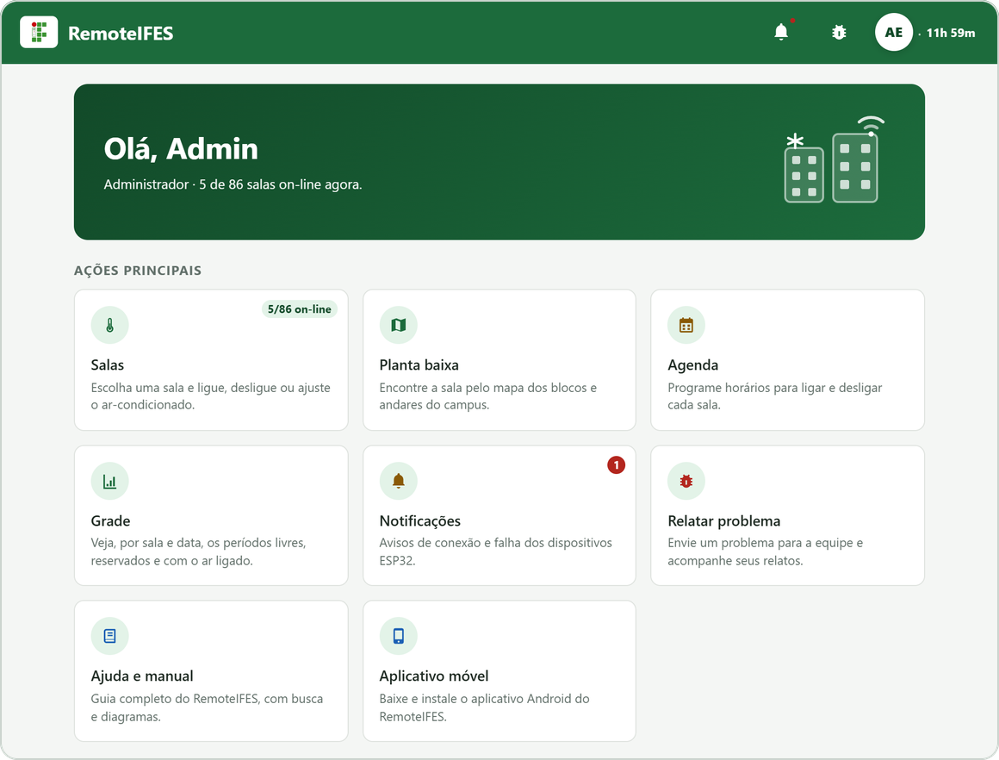
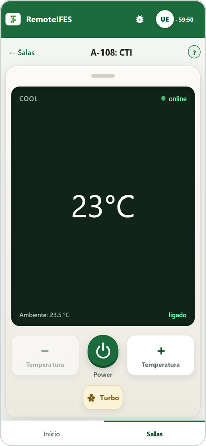
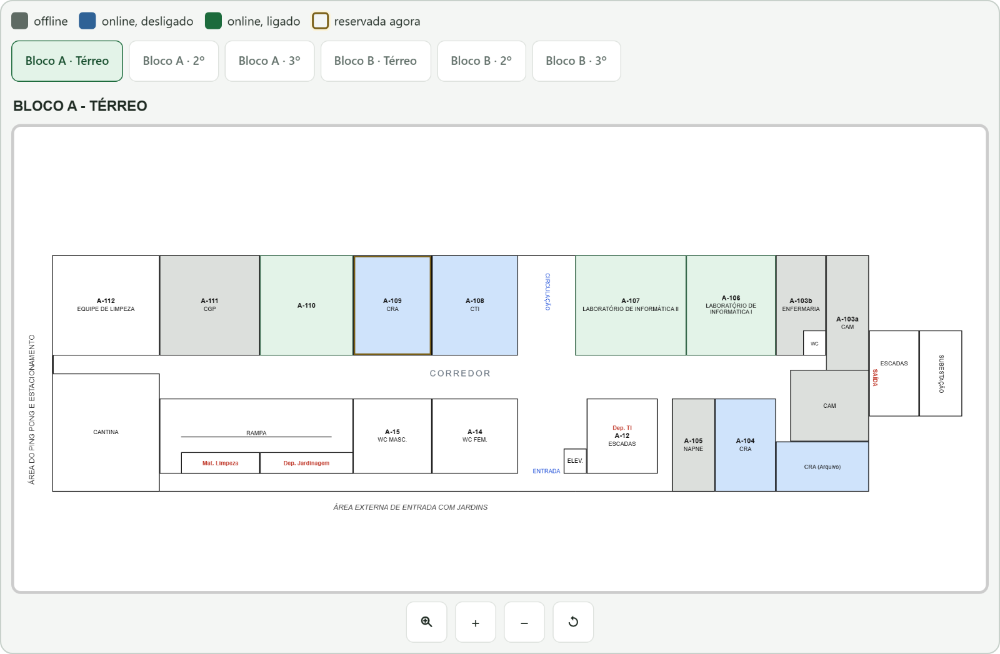
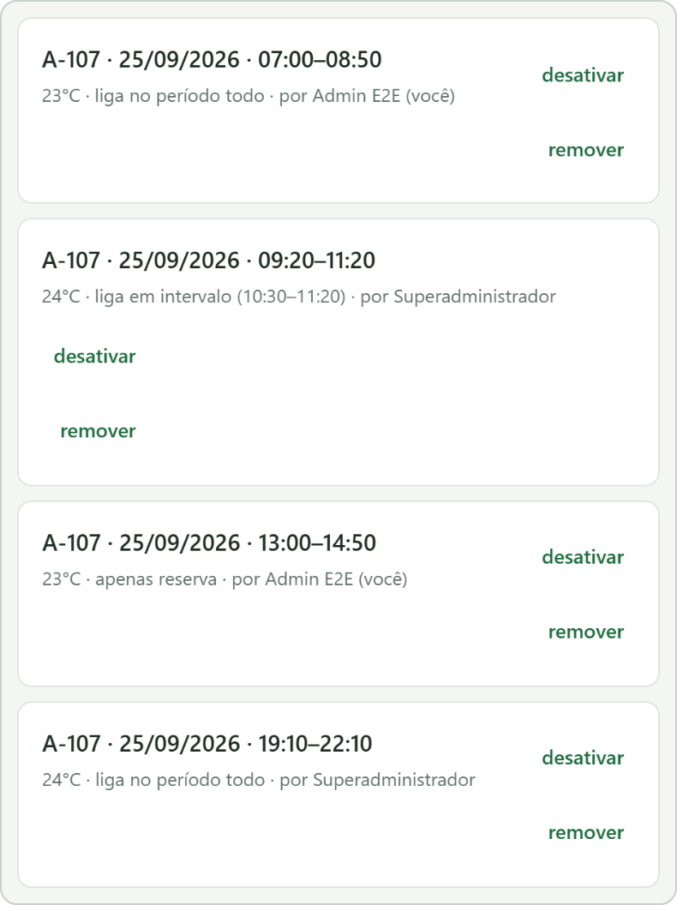
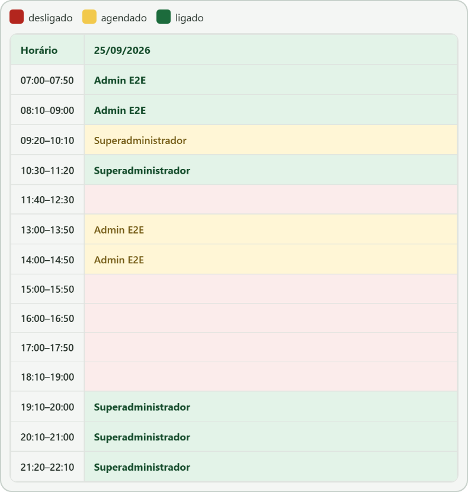
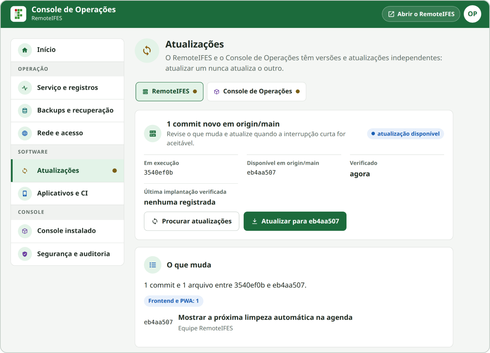
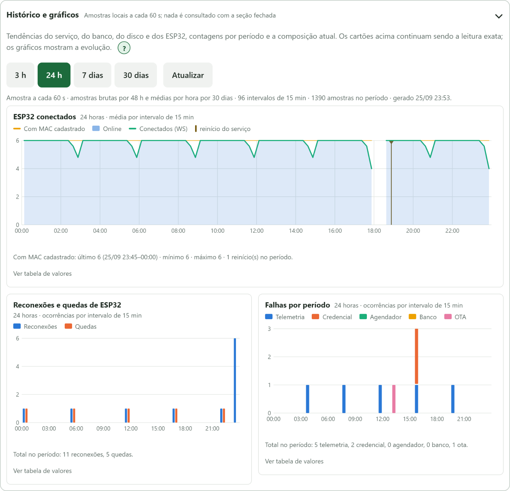

# RemoteIFES

Sistema de controle remoto de ar-condicionado para as salas do IFES: painel web acessível, agendamento diário, integração ESP32 por MAC ou credencial por dispositivo (com atualização de firmware por OTA), monitoramento operacional local e um servidor central em Node.js.


<p align="center">
  
  
</p>

## Início rápido

**Git** só precisa ser instalado se ainda não estiver (`git --version` responde quando já está):

Windows PowerShell:

```powershell
winget install --id Git.Git -e
```

Linux (Debian, Ubuntu, Raspberry Pi OS):

```bash
sudo apt update && sudo apt install -y git
```

Baixe o repositório e entre na pasta:

```bash
git clone https://github.com/SENAI4LIFE/RemoteIFES.git
```

```bash
cd RemoteIFES
```

Inicie o servidor e o Console de Operações:

Linux/macOS (inclui Raspberry Pi OS de 32 ou 64 bits):

```bash
./server.sh
./console.sh
```

Windows PowerShell:

```powershell
.\server.bat
.\console.bat
```

`server.sh` prepara o que faltar (Node.js, dependências, `.env`), inicia o servidor em primeiro plano (`Ctrl+C` encerra; rode o console em outro terminal) e mostra os endereços: **`http://localhost:8080`** e o da rede local. `console.sh` instala o [Console de Operações](#console-de-operações) na primeira vez e depois só o abre; no Linux com systemd, `sudo ./console.sh` instala também o socket e o auxiliar privilegiado. Rodar de novo não reinstala nem duplica nada. `--verificar` só confere; `--ajuda` lista as opções.

Requer Python 3.7+. O Node.js 22.13+ é instalado quando falta no Linux (x64, ARM64 ou ARMv7) e no macOS com Homebrew; no Windows, instale antes o [Node.js 22 LTS](https://nodejs.org/en/download).

Sem `SENHA_ADMIN_INICIAL`, o primeiro acesso é `superadmin`/`admin`, e o `.env` inicial é de desenvolvimento, sem restrição de rede. Produção, comandos manuais e detalhes: [referência técnica](#referência-técnica-inicialização-manual-e-produção).

## Acesso rápido

| Preciso… | Vá para |
|---|---|
| instalar e iniciar | [Início rápido](#início-rápido) (`./server.sh`, `./console.sh`) |
| operar em produção (serviço, proxy, redes autorizadas) | [Deploy](#deploy) e [Hospedagem em Raspberry Pi](#hospedagem-em-raspberry-pi) |
| manter o servidor, o host e a infraestrutura | [Console de Operações](#console-de-operações) |
| atualizar ou reverter uma versão | [Console de Operações](#console-de-operações) e [Atualização, versões e reversão](#atualização-versões-e-reversão) |
| fazer backup ou restaurar o banco | [Backup e restauração do banco](#backup-e-restauração-do-banco) |
| gravar, atualizar (OTA) ou autenticar um ESP32 | [Firmware ESP32](#firmware-esp32), [OTA](#atualização-de-firmware-por-ota-esp32) e [Credenciais por Dispositivo](#credenciais-por-dispositivo-e-migração) |
| diagnosticar um problema | [Solução de Problemas](#solução-de-problemas) e [Monitoramento Operacional](#monitoramento-operacional) |
| recuperar a senha do superadministrador | [Console de Operações](#console-de-operações) ou [Recuperação de emergência por terminal](#recuperação-de-emergência-por-terminal) |
| consertar com tudo fora do ar | [Recuperação de emergência por terminal](#recuperação-de-emergência-por-terminal) |
| entender o que o usuário vê | [Ajuda e Manual no App](#ajuda-e-manual-no-app) (guia por papel, dentro do próprio app) |

## Sumário

- [Início rápido](#início-rápido)
- [Visão Geral](#visão-geral)
- [Papéis e Permissões](#papéis-e-permissões)
- [Navegação e Seleção de Salas](#navegação-e-seleção-de-salas)
- [Controle de Acesso e Proprietários de Sala](#controle-de-acesso-e-proprietários-de-sala)
- [Agendamentos](#agendamentos)
- [Grade de Horários](#grade-de-horários)
- [Limites de Temperatura e Turbo](#limites-de-temperatura-e-turbo)
- [Desligamento Diário Automático](#desligamento-diário-automático)
- [Notificações](#notificações)
- [Relatos de Problema](#relatos-de-problema)
- [Sessões e Tempo de Inatividade](#sessões-e-tempo-de-inatividade)
- [Auditoria (Logs, Dispositivos e Acessos)](#auditoria-logs-dispositivos-e-acessos)
- [Restrição de Rede](#restrição-de-rede)
- [Segurança](#segurança)
- [Tempo Real (WebSocket)](#tempo-real-websocket)
- [Acessibilidade](#acessibilidade)
- [Ajuda e Manual no App](#ajuda-e-manual-no-app)
- [Requisitos](#requisitos)
- [Referência técnica: inicialização manual e produção](#referência-técnica-inicialização-manual-e-produção)
- [Configuração](#configuração)
- [Deploy](#deploy)
- [Console de Operações](#console-de-operações)
- [Recuperação de emergência por terminal](#recuperação-de-emergência-por-terminal)
- [Hospedagem em Raspberry Pi](#hospedagem-em-raspberry-pi)
- [Domínio Próprio e HTTPS](#domínio-próprio-e-https)
- [Painel dos ESP32, Protocolos IR e Failsafe (Administração > Dispositivos)](#painel-dos-esp32-protocolos-ir-e-failsafe-administração--dispositivos)
- [Atualização de Firmware por OTA (ESP32)](#atualização-de-firmware-por-ota-esp32)
- [Credenciais por Dispositivo e Migração](#credenciais-por-dispositivo-e-migração)
- [Monitoramento Operacional](#monitoramento-operacional)
- [Mapa de Calor Operacional](#mapa-de-calor-operacional)
- [Rede Mesh Opcional e Topologia](#rede-mesh-opcional-e-topologia)
- [Empacotamento como PWA e Aplicativo Nativo (Cordova)](#empacotamento-como-pwa-e-aplicativo-nativo-cordova)
- [Scripts Auxiliares](#scripts-auxiliares)
- [Testes e Integração Contínua](#testes-e-integração-contínua)
- [Figuras e capturas do README](#figuras-e-capturas-do-readme)
- [Uso da API do GitHub](#uso-da-api-do-github)
- [Estrutura de Pastas](#estrutura-de-pastas)
- [Solução de Problemas](#solução-de-problemas)

## Visão Geral

<picture>
  <source media="(prefers-color-scheme: dark)" srcset="docs/readme-assets/composed/architecture-overview-dark.png">
  
</picture>

O RemoteIFES tem três partes que conversam pela rede, e um serviço de manutenção ao lado.

- **Clientes.** O mesmo frontend roda no navegador, instalado como PWA ou empacotado como app Android/iOS. Ele fala com o servidor por HTTP(S) e pelo WebSocket `/ws`. Em produção o próprio servidor entrega o frontend, na mesma origem da API; o GitHub Pages serve só como [demonstração](#frontend-no-github-pages-opcional-para-demonstração).
- **Servidor central.** Guarda o banco SQLite, autentica, aplica as permissões, roda o agendador e fala com os ESP32 pelo WebSocket `/ws/dispositivo` e pelas rotas `/dispositivo/*`. Um [proxy reverso](#proxy-reverso) na frente é opcional.
- **Salas.** Cada ESP32 transmite infravermelho ao ar-condicionado e reporta o próprio estado, identificado pelo MAC ou por uma [credencial exclusiva](#credenciais-por-dispositivo-e-migração). O Wi-Fi direto é o padrão; placas sem cobertura chegam por um gateway da [rede mesh opcional](#rede-mesh-opcional-e-topologia). Uma única placa com receptor IR, o clonador oficial, aprende os sinais do controle original para a biblioteca de protocolos.
- **Console de Operações.** Serviço separado, no mesmo host, para manter o servidor: serviço, atualizações, backups e acesso de rede. Veja [Console de Operações](#console-de-operações).

O infravermelho não tem retorno. O sistema sabe o que foi pedido e o que a placa confirmou, mas não mede o aparelho; veja [Do pedido ao ar-condicionado](#do-pedido-ao-ar-condicionado).

| Pasta | Conteúdo |
|---|---|
| `remoteifes-web/` | frontend estático (HTML, CSS e JS, sem build) e PWA |
| `remoteifes-cordova/` | o mesmo frontend empacotado como app Android/iOS |
| `remoteifes-server/` | API Node.js + Express, WebSocket, agendador e banco SQLite |
| `remoteifes-console/` | Console de Operações, instalado fora do checkout |
| `remoteifes-esp32/` | firmware PlatformIO de cada sala, clonador e modos da malha |

## Papéis e Permissões

O sistema tem três níveis de usuário:

| Nível | Papel | Pode |
|---|---|---|
| 1 | Usuário comum | Ligar/desligar e ajustar a temperatura das salas liberadas para controle; enviar relatos de problema pelo ícone de inseto no topo |
| 2 | Administrador (`admin`) | Tudo do nível 1, além de agendamentos e grade de horários, contas de usuários comuns e proprietários de sala, os alertas dos ESP32 (`Dispositivos > Alertas`), os históricos de comandos, acessos, conexão dos ESP32 e sessões (`Sistema > Logs`, sem Auditoria) e `Sistema > Status` (Usuários ativos e Mapa, sem as abas Sistema e Topologia) |
| 3 | Superadministrador (`superadmin`) | Tudo do nível 2, além de alterar configurações globais, limites globais e por sala, função extra do Turbo, Auto-ON, consulta das redes autorizadas e do modo de teste (que só mudam pelo [Console de Operações](#console-de-operações) ou pelo terminal do servidor), cadastro de ESP32 por MAC, o painel avançado de cada ESP32 (`Administração > Dispositivos > Firmware / OTA`), o clonador e a biblioteca de protocolos infravermelhos (`Administração > Dispositivos > Protocolos IR`) e a gestão dos relatos de problema enviados pelos usuários — inclusive a exclusão permanente de um relato — em `Administração > Gestão > Relatos de problemas` |

A conta padrão do nível 3 usa o login `superadmin`, com nome exibido "Superadministrador". Instalações anteriores que usavam o login `admin` são migradas automaticamente para `superadmin` no primeiro boot após a atualização, preservando id, hash de senha, nível e permissões. O identificador interno do papel continua sendo `superadmin`.

A conta inicial só é criada num banco sem nenhuma conta. Renomear o login do superadministrador, ou personalizá-lo de qualquer forma, nunca faz o servidor recriar `superadmin` com a senha padrão em um reinício.

Uma instalação já estabelecida que, por qualquer motivo, fique sem conta de nível 3 não recebe uma credencial padrão silenciosa. O log mostra `seed-superadmin-ausente`, e a saída é `npm run reset-admin` (ou a recuperação de senha do Console): ele localiza a conta pelo nível e não pelo login e, se nenhuma conta tiver nível 3, devolve o nível ao login `superadmin` ou o recria, sem tocar numa conta `admin` de outra pessoa.

Além dos três níveis, existe uma permissão pontual, independente de nível: um usuário comum pode ser tornado **proprietário** de uma ou mais salas específicas, o que lhe permite conceder e revogar o acesso de controle de outros usuários apenas àquelas salas, sem se tornar administrador (veja [Controle de Acesso e Proprietários de Sala](#controle-de-acesso-e-proprietários-de-sala)).

Todas as permissões são impostas no backend (não apenas escondidas na interface): rotas administrativas exigem `exigirAdmin`, rotas/campos críticos exigem `exigirSuperAdmin`, e as rotas de proprietário de sala exigem que o usuário conste como dono daquela sala específica.

## Navegação e Seleção de Salas

### Início (hub)

Após o login o aplicativo abre no **Início** (`#/inicio`, também a aba "Início" e o logotipo no topo). É um painel visual que reúne as ações principais em cartões, na ordem de uso mais comum: selecionar sala, planta baixa, agenda e grade para administradores, notificações para administradores, relatar um problema, ajuda e manual, e aplicativo móvel. Os cartões respeitam o papel do usuário e apenas abrem telas já existentes, sem duplicar nenhuma função.

Abaixo das ações operacionais, administradores veem um atalho para cada função de **Administração**, identificado pelo grupo a que pertence, como `Dispositivos · Cadastro`. O superadministrador vê ainda uma faixa curta com o estado do banco, do armazenamento, dos ESP32 e dos backups, com link para `Sistema > Status > Sistema`.

No celular o hub vira uma lista de cartões de toque em coluna única. Ele não altera o roteamento: todos os endereços e o comportamento de refresh e histórico continuam iguais.

### Organização da Administração

A aba **Admin** organiza suas funções em três grupos, sempre em dois níveis (`Administração > Grupo > Função`), numa barra lateral (rolável em telas estreitas):

| Grupo | Conceito | Funções |
| --- | --- | --- |
| **Gestão** | quem são as pessoas e por quais salas respondem | Usuários, Relatos de problemas |
| **Dispositivos** | administração dos ESP32 e os avisos operacionais que eles geram | Cadastro, Firmware / OTA, Protocolos IR, Alertas |
| **Sistema** | o que está acontecendo agora, o que já aconteceu e como o sistema é configurado | Logs, Status, Configurações |

Em **Sistema**, **Status** é o que acontece agora e **Logs** é o histórico persistido. Três funções têm **abas internas**, dentro da própria tela:

| Função | Abas internas |
| --- | --- |
| **Gestão > Usuários** | **Contas** (criar, alterar, desativar e excluir contas) · **Proprietários de sala** (atribuir e revogar a responsabilidade por uma sala) |
| **Sistema > Logs** | **Comandos** · **Acessos** · **Dispositivos** · **Sessões** · **Auditoria** |
| **Sistema > Status** | **Usuários ativos** · **Mapa** · **Sistema** · **Topologia** |

A permissão vale **por aba interna**: o administrador comum vê **Dispositivos** só com Alertas, **Logs** sem Auditoria e **Status** sem Sistema e Topologia; as abas exclusivas do superadministrador nem aparecem, e o servidor recusa as chamadas de qualquer forma. Um grupo sem nenhuma função ao alcance do usuário não é exibido. `Alertas` é a mesma fila de notificações de dispositivo do sino.

Os endereços seguem a hierarquia: `#/admin/<função>` e, para uma aba interna que não seja a primeira, `#/admin/<função>/<aba>` (`#/admin/usuarios/proprietarios`, `#/admin/logs/sessoes`, `#/admin/status/mapa`). Endereços antigos continuam como apelidos do novo local: `#/admin/proprietarios`, `#/admin/sessoes`, `#/admin/dispositivos`, `#/admin/acessos`, `#/admin/ativos`, `#/admin/mapa`, `#/admin/auditoria` e `#/admin/monitoramento`.

### Formas de chegar a uma sala

O sistema oferece três formas de chegar até uma sala, todas equivalentes em funcionalidade:

- **Assistente simples**: três passos guiados por ícones grandes — bloco, andar e sala — pensados para toque em celular. É a navegação padrão de salas.
- **Planta baixa**: exibe a planta baixa real do campus (Bloco A e Bloco B, térreo/2º/3º pavimentos), com abas para alternar entre os seis setores e suporte a zoom. Cada sala com ar-condicionado controlado pelo sistema aparece destacada e colorida conforme seu estado:
  - cinza: offline (sem ESP32 reportando)
  - azul: online, desligado
  - verde: online, ligado
  - contorno amarelo: com agendamento ativo no momento

  "Online" é presença (a placa foi vista há pouco); "ligado/desligado" é o estado desejado guardado no servidor. A confirmação da placa aparece no painel da sala e em `Dispositivos > Firmware / OTA`; o efeito no aparelho não é medido (veja [Do pedido ao ar-condicionado](#do-pedido-ao-ar-condicionado)).
- **Lista tradicional** (`Bloco → Andar → Sala`): navegação simples em lista, sem elementos gráficos.



Qualquer usuário autenticado pode visualizar o estado de todas as salas — isso inclui salas às quais o usuário não tem permissão de controle, que aparecem marcadas como "visualização" e cujos controles ficam desabilitados no painel. Os três modos de navegação têm botões cruzados para alternar entre si a qualquer momento.

### Endereço, refresh e histórico

A tela atual fica no endereço como um **fragmento** (`#/inicio`, `#/sala/A-108`, `#/salas/planta/a-terreo`, `#/admin/logs/sessoes`, `#/ajuda/ota`…; vazio equivale a `#/inicio`). Recarregar mantém a tela, a aba e a sala abertas; **voltar/avançar** percorrem as seções visitadas (trocar só um filtro, como sala ou data na Agenda, não gera entrada); e qualquer seção abre por link direto, inclusive o **Abrir no manual** das ajudas e o `Ver no app` do manual. Apelidos curtos do manual são resolvidos (`#/ajuda/ota` → `#/ajuda/ota-credenciais`).

O **hash routing** foi escolhido no lugar da History API porque funciona igual, sem regra de reescrita, no servidor Node, atrás de proxy, na PWA, no GitHub Pages e no Cordova (`file://`), inclusive offline.

A restauração é deny-by-default: rota de Administração sem ser admin cai em Salas, sub-aba ou aba interna exclusiva cai na primeira autorizada, e sala inexistente cai em Salas. O endereço só escolhe a tela, nunca concede acesso, e não guarda senha, token, credencial nem conteúdo de formulário. Sair limpa o endereço.

As 86 salas cadastradas por padrão vêm diretamente da planta baixa fornecida (`remoteifes-server/src/db/salasCampus.js`). A cada partida, o servidor cria as salas desse arquivo cujo código ainda não existe no banco; mudar o nome de uma sala já criada, trocar o código dela ou retirá-la do arquivo não altera nem apaga a que está no banco. Um código de sala pode representar duas salas físicas controladas pelo mesmo ESP32 (ex.: `B-105-B-106`); nesse caso a interface exibe as duas etiquetas empilhadas no mesmo bloco do mapa.

## Controle de Acesso e Proprietários de Sala

Além da permissão geral "pode controlar" (nível de usuário), existem dois mecanismos para restringir e delegar o controle de salas individuais:

### Acesso restrito por sala

Em `Administração > Dispositivos > Cadastro` (ou em `Administração > Gestão > Usuários > Proprietários de sala`), o superadministrador pode marcar uma sala como **acesso restrito**:

1. Isso impede que qualquer usuário comum a controle, mesmo com a permissão geral ativa — exceto os usuários explicitamente autorizados para aquela sala e os proprietários dela.
2. Usuários autorizados são concedidos/revogados individualmente, por sala.
3. Administradores (níveis 2 e 3) sempre podem controlar qualquer sala, independentemente de restrição.

A verificação é feita no backend (`aplicarComando`), então mesmo chamadas diretas à API respeitam a restrição — a interface apenas reflete o estado (desabilitando os controles e mostrando um aviso de "somente leitura") para dar feedback imediato ao usuário.

### Proprietários de sala

Qualquer administrador pode tornar um usuário comum **proprietário** de uma sala específica, em `Administração > Gestão > Usuários > Proprietários de sala`. Um proprietário:

- Ganha acesso a uma aba própria ("Config.", intitulada "Configurações de sala") onde vê apenas as salas das quais é dono.
- Pode, nessa aba, conceder e revogar o acesso de controle de outros usuários comuns à(s) sua(s) sala(s) — sem precisar de privilégios administrativos e sem enxergar o restante do painel de administração.
- Controla a própria sala mesmo com acesso restrito, como um usuário autorizado, sem precisar constar na lista de acessos; a permissão geral "pode controlar" e as reservas de outras pessoas continuam valendo.
- Só tem efeito prático se a sala estiver marcada como **acesso restrito**; caso contrário, todos os usuários com permissão geral já controlam a sala normalmente e a tela do proprietário mostra um aviso lembrando disso.

Um administrador pode remover um proprietário a qualquer momento (o usuário perde o acesso imediatamente) e também pode revogar diretamente qualquer acesso concedido por ele. Administradores não podem ser tornados proprietários de sala, pois já têm acesso total.


## Agendamentos

Agendamentos são **diários**: cada agendamento vale para uma única data (sem recorrência semanal), sempre o dia atual no fuso horário de Brasília (`America/Sao_Paulo`), independentemente do fuso configurado no servidor. Apenas administradores podem criar, listar e gerenciar agendamentos — usuários comuns não têm acesso a essa funcionalidade, nem na interface nem na API.

Cada agendamento reserva a sala durante um período (`horaInicio`–`horaFim`) e pode ser criado em um de três modos:

| Modo | Comportamento |
|---|---|
| `reserva` | Apenas bloqueia a sala para outros usuários no período; não liga o ar-condicionado automaticamente |
| `ligar_completo` | Reserva a sala e liga o ar-condicionado durante todo o horário definido (padrão) |
| `ligar_intervalo` | Reserva a sala no período, mas o ar-condicionado só liga dentro de um intervalo menor, definido dentro do período reservado |

Os três modos num mesmo dia, na Agenda da sala e na [Grade](#grade-de-horários):

<p align="center">
  
  
</p>

Regras do agendador, que verifica os agendamentos ativos a cada minuto:

- **Período `[horaInicio, horaFim)`**: no minuto de `horaFim` a reserva já não vale e o desligamento é aplicado; uma reserva seguinte que comece nesse minuto assume a sala sem intervalo. Nenhuma ação (ligar ou desligar) se repete no mesmo dia.
- **Só desliga quem ligou**: criado ou reativado com o intervalo de ligar em andamento, o agendamento liga em até um minuto e desliga no fim. Um agendamento que não chegou a ligar (criado depois do intervalo, ou perdido inteiro numa queda do servidor) não liga nem desliga nada, e nunca desliga um aparelho ligado à mão; sua reserva continua bloqueando a sala.
- **Ajustes e desativação**: um ajuste manual dentro do período não cancela o desligamento do fim. Desativar ou remover um agendamento em curso libera a reserva e cancela esse desligamento, mas o que ele já ligou continua ligado. Um agendamento desativado fica salvo; o autor ou qualquer administrador pode reativá-lo, o que é recusado se houver conflito com outra reserva ativa na mesma sala e data.
- **Queda do servidor**: se ele parar depois de ligar e só voltar no dia seguinte, o desligamento pendente é aplicado uma única vez ao iniciar, antes de qualquer ESP32 reconectar, a menos que uma intenção mais nova (comando manual, outro agendamento ou OFF local) tenha surgido depois da hora devida. Agendamentos desativados não são recuperados e nenhuma execução registrada se repete.
- **Usuários comuns** não veem Agenda nem Grade: a reserva aparece como contorno na lista e na planta e como aviso no painel, e o servidor recusa seus comandos numa sala reservada por outra pessoa.

## Grade de Horários

A aba **Grade** (visível apenas para administradores) mostra, para uma sala e data escolhidas, uma grade com os períodos de aula fixos do campus (07:00 às 22:10, em blocos de aproximadamente 50 minutos), indicando para cada período se a sala está livre, apenas reservada ou com o ar-condicionado ligado, e por quem. É útil para identificar rapidamente conflitos de horário ou janelas livres antes de criar um novo agendamento.

## Limites de Temperatura e Turbo

O controlador possui somente as ações fixas necessárias: diminuir temperatura à esquerda, ligar/desligar ao centro, aumentar temperatura à direita e Turbo abaixo do botão de energia. A disposição não pode ser arrastada nem editada.

**Auto-ON** é uma opção global (`Administração > Sistema > Configurações`, só do superadministrador), **ativada por padrão**. Ativa, ajustar a temperatura ou ligar o Turbo num aparelho desligado o liga já com o novo estado, e `Logs > Comandos` registra antes um `ligar` com valor `automatico`. Desativada, a temperatura só fica guardada e o Turbo só muda com o aparelho ligado. Desativar o Turbo nunca liga o aparelho, e só o Power desliga. A mudança da opção é auditada e chega aos painéis abertos pelo WebSocket.

O superadministrador configura os limites globais de temperatura, inicialmente 23 °C e 25 °C. Cada sala pode substituir apenas o mínimo, apenas o máximo ou os dois em `Administração > Dispositivos > Cadastro`; um campo deixado vazio herda seu valor global correspondente. Os limites efetivos são aplicados aos comandos manuais, agendamentos e testes de infravermelho. Ao estreitar um intervalo, temperaturas alvo e agendadas existentes são ajustadas para o novo intervalo.

O Turbo transmite o modo turbo suportado pelo protocolo IR da sala. Em `Administração > Sistema > Configurações`, o superadministrador também pode configurar o Turbo para acionar simultaneamente a oscilação vertical, ou deixá-lo sem função adicional.

## Desligamento Diário Automático

O superadministrador pode configurar em `Administração > Sistema > Configurações` um **desligamento diário automático** (desativado por padrão): um horário do dia, no horário de Brasília (por exemplo `00:00`), e o escopo — **todas as salas** (inclusive as criadas depois) ou **salas selecionadas**. Nenhum outro papel vê ou altera essa opção.

É um único comando de desligar por dia, e não um toque de recolher:

- no horário configurado, cada sala do escopo que estiver ligada recebe a intenção de desligar (o estado desejado passa a desligado e a versão do estado avança); salas já desligadas não são tocadas;
- quem religar a sala depois do horário mantém o aparelho ligado até o desligamento do dia seguinte;
- se o servidor estava parado no horário, o desligamento perdido é aplicado **uma única vez** quando ele volta (o mais recente devido, do dia ou da véspera), e reinícios repetidos não o repetem;
- um comando manual, de agendamento ou de outro desligamento posterior ao horário vale mais que um desligamento aplicado com atraso: a sala é mantida como está;
- uma sala mantida ligada por um agendamento em curso no horário (o agendamento já ligou e ainda não desligou) é poupada — o desligamento do próprio agendamento encerra; agendamentos que começam depois do horário não são afetados;
- ativar a opção ou mudar horário ou salas vale a partir da próxima ocorrência do novo horário, nunca retroativamente;
- ESP32 offline no horário recebem o desligamento quando reconectam, pelo mesmo estado desejado que o servidor já guarda. Como em qualquer comando, a submissão ao socket não prova que o aparelho recebeu o infravermelho: a confirmação continua sendo o eco da placa.

Cada sala processada fica registrada com o resultado (desligada, já desligada, mantida por comando posterior ou mantida por agendamento) na mesma transação da mudança de estado, de modo que uma queda no meio não marca como feito o que não foi feito nem repete o que já foi. A execução gera um evento de auditoria (`desligamento_diario_executado`) com a contagem por resultado, e cada desligamento aparece em `Logs > Comandos` com origem `desligamento_diario`. A tela de Configurações mostra o próximo horário e o resumo da última execução.

## Notificações

O topo da interface tem dois indicadores com significados distintos, cada um com seu rótulo acessível:

- **Sino** — notificações de dispositivos/ESP32, visível apenas a administradores. O sistema gera notificações automáticas quando um ESP32 que estava online fica offline (timeout de heartbeat), quando uma atualização de firmware por OTA conclui ou falha, e quando o [monitoramento operacional](#monitoramento-operacional) detecta uma condição de alerta (disco baixo, backup atrasado, ESP32 instável etc.), sem repetir o mesmo alerta dentro de 6 horas. O painel permite ver a lista mais recente com data/hora, marcar uma notificação como lida (ao clicar nela) e marcar todas de uma vez. O ponto vermelho no sino reflete a contagem de não lidas. A mesma fila aparece em `Administração > Dispositivos > Alertas`.
- **Inseto (bug)** — relatos de problema enviados pelos usuários (veja a seção abaixo).

## Relatos de Problema

Qualquer usuário autenticado envia um **relato de problema** pelo ícone de inseto no topo: título, categoria, sala opcional e descrição. O servidor anexa só contexto não sensível (autor, horário, página, tamanho da tela, `User-Agent` e idioma), valida e limita o conteúdo, e ignora cliques repetidos no envio. O mesmo painel mostra os **próprios** relatos e o status de cada um.

A gestão fica em **`Administração > Gestão > Relatos de problemas`**, exclusiva do superadministrador: contadores e filtros por situação (novos, abertos, em análise, resolvidos), detalhes de cada relato, as ações de marcar em análise, resolver ou reabrir com uma resposta visível ao autor, e a **exclusão permanente** atrás de uma confirmação em duas etapas. Abrir um relato `novo` o marca como `aberto`. `DELETE /superadmin/relatos/:id` registra só metadados (`relato-removido`), nunca o texto. A lista global, os relatos de terceiros e a exclusão exigem `exigirSuperAdmin` no backend; um usuário comum recebe `403`.

## Sessões e Tempo de Inatividade

O servidor registra cada login como uma sessão (token, horário de início, último uso e, ao sair, horário de logout). Isso alimenta duas funções da Administração:

- **`Administração > Sistema > Status > Usuários ativos`**: usuários com uma sessão em aberto, com um cronômetro de tempo de sessão em tempo real e um status calculado a partir do último uso — `online` (dentro do limiar configurado), `inativo` (sessão aberta, mas sem uso recente) ou `offline`.
- **`Administração > Sistema > Logs > Sessões`**: histórico de logins/logouts, com duração de cada sessão, filtrável por data e removível (por data ou por completo).

O servidor encerra sessões sem atividade e continua sendo a autoridade sobre o prazo, inclusive para REST e WebSocket. A interface mostra uma contagem regressiva junto às iniciais da conta, atualizada localmente a partir do prazo informado pelo servidor, sem consultas a cada segundo. Clique, mouse, tecla ou toque renovam o prazo pelo mecanismo de sessão existente; o aviso prévio permite continuar conectado. Atividade, logout e expiração são sincronizados entre abas. Os padrões são 60 minutos para usuários e 720 minutos para administradores e superadministrador. Qualquer sessão também termina 12 horas depois do login, mesmo em uso (`SESSAO_MAX_HORAS`, até 168). Além disso, **toda reinicialização do servidor encerra as sessões em aberto**: depois de um restart, os usuários precisam entrar novamente.

## Auditoria (Logs, Dispositivos e Acessos)

O histórico fica nas abas internas de **`Administração > Sistema > Logs`**, todas filtráveis por data. Os registros são gravados em UTC, mas exibidos, filtrados e excluídos pelo **dia de Brasília** (um registro das 22:30 pertence àquele dia, não ao dia UTC seguinte); o mesmo vale para a auditoria e a conectividade em `Administração > Sistema > Status`.

| Aba | O que registra | Exclusão |
|---|---|---|
| `Administração > Sistema > Logs > Comandos` | cada ligar, desligar ou ajuste de temperatura: quem pediu (ou `sistema`, sem conta por trás) e a origem, `manual`, `agendamento` ou `esp32_local` (registro da própria placa, como o failsafe OFF ou a abertura do AP pelo switch) | sim |
| `Administração > Sistema > Logs > Acessos` | acessos à antiga interface web local dos ESP32, com o IP. O firmware atual não serve página local; a aba guarda o histórico e aceita registros de firmware anterior | sim |
| `Administração > Sistema > Logs > Dispositivos` | cada ESP32 que fica online ou offline (veja abaixo) | não |
| `Administração > Sistema > Logs > Sessões` | logins e logouts ([Sessões e Tempo de Inatividade](#sessões-e-tempo-de-inatividade)) | sim |
| `Administração > Sistema > Logs > Auditoria` | só superadministrador, paginada: contas, papéis, configurações (inclusive Auto-ON), clonador e modo clone, protocolos IR e failsafe OFF, e os intervalos de indisponibilidade de cada controlador. Só metadados, nunca senhas, tokens ou segredos | retenção de 7 dias, ajustável de 1 a 365 |

O fechamento do WebSocket de um ESP32 marca a sala offline **na hora**. Se a conexão cair sem fechamento, o ping/pong do servidor (a cada 15 s) a derruba em até 30 s, com a mesma transição. O prazo de 90 s sem heartbeat só vale para placas no heartbeat HTTP.

### Manutenção automática do banco

O servidor roda uma rotina de retenção a cada 6 horas (e uma vez na inicialização) que remove linhas antigas das tabelas de histórico para o banco não crescer indefinidamente em uma operação de longo prazo (ex.: Raspberry Pi):

| Tabela | Retenção padrão | Ajuste |
|---|---|---|
| `comandos_log`, `esp_eventos`, `esp_acessos`, `notificacoes` (apenas lidas) | 180 dias | `RETENCAO_DIAS_LOGS` |
| `notificacoes` (qualquer, lida ou não) | 365 dias | `RETENCAO_DIAS_NOTIFICACOES` |
| `sessoes` (apenas já encerradas) | 90 dias | `RETENCAO_DIAS_SESSOES` |
| `agendamentos_execucoes` | 90 dias | `RETENCAO_DIAS_EXECUCOES` |
| `agendamentos` com data já passada (o agendamento é sempre do dia; após esse prazo já cumpriu seu efeito) e as execuções ligadas a eles | 90 dias | `RETENCAO_DIAS_AGENDAMENTOS` |
| `esp_detectados` sem vínculo com sala | 30 dias sem nova detecção | `RETENCAO_DIAS_DETECCOES` |
| `auditoria_eventos`, `esp_indisponibilidades` | 7 dias | Administração, de 1 a 365 dias |
| `relatos` **apenas com status `resolvido`** | desligado (`0`); defina para ativar | `RETENCAO_DIAS_RELATOS_RESOLVIDOS` |

O histórico de monitoramento segue a mesma rotina. `monitoramento_amostras` guarda 48 horas, com limite de 6 000 linhas, e `monitoramento_horas` guarda 30 dias, com limite de 1 000 linhas, sempre consolidando as horas fechadas antes de apagar amostras.

Usuários, salas, agendamentos do dia atual, configurações e relatos de problema não resolvidos nunca são removidos por essa rotina. A retenção de relatos resolvidos vem desligada e só apaga relatos já marcados como `resolvido` quando `RETENCAO_DIAS_RELATOS_RESOLVIDOS` recebe um número de dias. Notificações não lidas sobrevivem a `RETENCAO_DIAS_LOGS`, mas não a `RETENCAO_DIAS_NOTIFICACOES` (365 dias por padrão), para que uma caixa esquecida não cresça sem limite.

As tabelas de histórico têm índices por data e hora, então a limpeza e as consultas por faixa de tempo continuam baratas com o banco cheio. Depois de uma limpeza o servidor trunca o WAL.

### Limites de crescimento e hardware mínimo

O servidor foi pensado para rodar por anos em hardware classe **Raspberry Pi 3** (1 GB de RAM, quatro núcleos ARM, cartão SD). O que poderia crescer sem limite está contido:

- **Banco e agendador**: retenção por tempo e índices por data (acima); o agendador só carrega os agendamentos **do dia**, e há um teto por usuário (`AGENDAMENTOS_MAX_ATIVOS_POR_USUARIO`).
- **Notificações de ESP32 offline**: suprimidas se a mesma sala já tem uma não lida na última hora.
- **OTA**: estados terminais saem de `estados-ota.json` depois de 7 dias, e só uma imagem `.bin` fica publicada.
- **Backups**: rotação por contagem (`BACKUP_RETENCAO`, 14; pré-restaurações, 5); temporários órfãos são varridos em 10 minutos.
- **APK**: só o release publicado em `data/releases/mobile/` fica em disco.
- **Memória**: mapas por sala (no máximo 20 capturas de IR por sala) e por conexão (`WeakMap`, limpos no `close`); as listas administrativas usam `LIMIT` (300–500 linhas).
- **Navegadores**: a lista de salas só é retransmitida quando muda algo que ela mostra, e a telemetria vai só para quem está com a sala aberta; sem isso, o custo cresceria com salas × navegadores. O reforço de 30 s continua.
- **Logs**: vão para `stdout`/`stderr`, e a rotação é do `journald` quando instalado por `install-service.sh`.

Três ferramentas sobem uma instância isolada, com banco temporário e placas simuladas pelo protocolo real, sem tocar no banco de produção. Medem o servidor e o protocolo, não as placas nem o rádio:

| Comando | Para que serve |
|---|---|
| `npm run carga -- --salas 86 --minutos 2` | dimensionar no seu hardware: memória, latência, tráfego por navegador e entrega de comandos |
| `npm run ensaio -- --diretas 50 --gateways 2 --nos-por-gateway 8 --ciclos 10 --ciclo-s 30 --json resultado.json` | procurar crescimento sem limite: ciclos de telemetria, comandos, quedas e mudanças de rota na malha; falha se memória, sockets, sessões, filas ou banco não voltam à linha de base |
| `npm run latencia -- --dispositivos 1,10,50,100 --amostras 60` | cronometrar cada etapa de um comando (mediana, p95, p99, máximo) em regime estável, em rajada e na reconexão. São números de loopback; a etapa dominante é o commit durável da intenção no SQLite, feito antes de o quadro sair, para que um comando confirmado sobreviva a uma queda de energia |

**O servidor não roda num ESP32.** Os ESP32 são o alvo do *firmware* (`remoteifes-esp32/`, placa `esp32dev`). O servidor depende de Node.js e V8, do `node:sqlite`, de dois `WebSocketServer` e de TLS por software para dezenas de conexões; nem um ESP32-S3 (cerca de 512 KB de RAM interna e 8–16 MB de flash) comporta isso, sem falar de backups e da imagem de OTA. O piso prático é algo como um Raspberry Pi Zero 2 W.

### Backup e restauração do banco

O banco inteiro é um único arquivo SQLite (`remoteifes-server/data/remoteifes.db`). Cada backup é gerado com o servidor no ar por `VACUUM INTO`: um `.db` autônomo e transacionalmente íntegro, com o WAL incluído. Em seguida ele é reaberto somente-leitura e validado (`PRAGMA integrity_check`, `PRAGMA foreign_key_check` e as tabelas essenciais); um backup reprovado é descartado.

- **Automático** (ligado por padrão só em produção; fora dela, `BACKUP_AUTOMATICO=true`): na partida e a cada `BACKUP_INTERVALO_HORAS`, em `BACKUP_DIR`, mantendo os `BACKUP_RETENCAO` mais recentes. `data/` está no `.gitignore`.
- **Manual**: em `remoteifes-server`, `npm run backup` grava um backup verificado e imprime o caminho; aceita um rótulo, `npm run backup -- pre-migracao`.
- **Restauração**: normalmente pelo [Console de Operações](#console-de-operações), em **Dados e recuperação**, que para o serviço, restaura e religa. Pelo terminal, com o servidor parado, `npm run restore` lista os backups e `npm run restore -- <arquivo>` restaura um deles (nome em `BACKUP_DIR` ou caminho completo; `--sim` pula a confirmação). O comando recusa se o servidor ainda responder, verifica o backup, guarda uma cópia do banco atual (`pre-restauracao-<data>.db`) e revalida o resultado.
- **Banco atual corrompido**: a restauração normal é recusada sem tocar em nada; use `npm run restore -- <arquivo> --recuperar-corrompido`. O banco danificado e seus `-wal` e `-shm` são renomeados para `remoteifes.db.corrompido-<data>-<id>`, nunca apagados, e um banco íntegro nunca vai para quarentena.

Durante a troca, o aviso `remoteifes.db.restauracao`, com o PID da restauração, impede qualquer processo do RemoteIFES de abrir o banco: um servidor que suba nesse intervalo termina com "restauração do banco em andamento" e o serviço volta sozinho depois. Um aviso órfão (processo inexistente ou mais de 30 minutos) é ignorado. Pelo console, a restauração também confirma pelo lock exclusivo do SQLite que nenhum escritor está aberto.

As credenciais dos ESP32 estão no banco. Uma restauração anterior a uma rotação, substituição ou revogação pode deixar a NVS da placa e o banco em versões diferentes; nesse caso, emita uma credencial de substituição e informe-a no portal de setup da placa. O atualizador (`deploy.sh`, `rollback.sh`) nunca restaura o banco: faz o backup pré-atualização e, se preciso, reverte só o código.

`npm run ensaio-recuperacao` percorre o caminho inteiro numa instância isolada, com os mesmos `backup-db.js` e `restore-backup.js` de produção: banco apagado, banco corrompido (recusado sem a opção, em quarentena com ela), nove tipos de backup inválido e o aviso de restauração, reiniciando o servidor e conferindo `/health`, dados, contas e a credencial de uma placa a cada vez. A CI roda o mesmo simulado (`test/recovery-drill.test.js`), e `test/recovery-failure-injection.test.js` injeta falhas de disco e de troca de arquivo em cada etapa.

| Variável | Padrão | Descrição |
|---|---|---|
| `BACKUP_AUTOMATICO` | `true` em produção, `false` nos demais | Liga/desliga o backup periódico do agendador |
| `BACKUP_INTERVALO_HORAS` | 24 | Intervalo entre backups automáticos (1 a 8760) |
| `BACKUP_RETENCAO` | 14 | Quantos backups manter; os mais antigos são apagados |
| `BACKUP_DIR` | `data/backups` | Pasta onde os backups são gravados |

## Restrição de Rede

Em produção (`NODE_ENV=production`), a API e o WebSocket dos navegadores só aceitam as faixas de IP autorizadas da rede do IFES, em CIDR IPv4 como `10.0.0.0/8`. O **modo de teste** libera o acesso de fora dessas faixas para homologação e vem desativado numa instalação nova. Em `NODE_ENV=development` a restrição não se aplica.

Ficam fora dela, de propósito: os arquivos estáticos do frontend (sem dados), o `GET /health`, as rotas `/dispositivo/*` e o WebSocket `/ws/dispositivo` dos ESP32, que se autenticam pela credencial ou pelo MAC, e o acesso pelo próprio host (`127.0.0.1`, como num túnel SSH ou pelo Console). Atrás de um proxy reverso no mesmo host, `TRUST_PROXY` precisa declarar o proxy ([Configuração](#servidor-remoteifes-serverenv)); com o padrão `0`, em produção e com o modo de teste desligado, uma requisição que chega do loopback trazendo `X-Forwarded-For`, `Forwarded` ou `X-Real-IP` não herda a liberação do loopback: é julgada só pelas faixas e, salvo se o próprio loopback estiver nelas, recusada, em vez de abrir o sistema a todos que passam pelo proxy. Um proxy que não envia nenhum desses cabeçalhos, ou um `TRUST_PROXY` menor que o número real de proxies, fica fora dessa proteção.

As faixas e o modo de teste decidem quem alcança a API e o tempo real dos navegadores, então são infraestrutura e não se editam pelo site: o caminho normal é o [Console de Operações](#console-de-operações), em **Rede e domínio › Acesso à aplicação**; sem o console, `npm run redes` no terminal ([Recuperação de emergência por terminal](#recuperação-de-emergência-por-terminal)).

Pelo console, a mudança exige reautenticação, é serializada com implantação e restauração, grava as duas chaves e o evento de auditoria numa transação (`configuracao_alterada`, autor `console:<operador>`) e vale na requisição seguinte, sem reiniciar. O console não passa pela restrição de rede da aplicação, então continua disponível para desfazer uma faixa errada. Em `Administração > Sistema > Configurações` o superadministrador só **consulta** esses valores; o servidor recusa com `403` qualquer tentativa do site de mudá-los, sem afetar as demais configurações.

## Segurança

Resumo das medidas do servidor central; os detalhes ficam nas seções indicadas.

- **Senhas e sessões**: senhas com hash `bcrypt` (mínimo de 8 caracteres). O `bcrypt` só lê 72 bytes, então uma senha mais longa é reduzida antes com HMAC-SHA-256 e conta inteira. Um hash gravado antes desse formato vale pelos 72 primeiros bytes até a senha ser trocada, e uma versão anterior a ele não reconhece uma senha longa gravada nele: depois de um rollback para ela, redefina essa senha. O token de sessão é aleatório (`crypto.randomBytes`) e o banco guarda só o hash SHA-256 dele (`sessoes.token`), então um vazamento do banco não sequestra sessões. Veja [Sessões e Tempo de Inatividade](#sessões-e-tempo-de-inatividade).
- **Autorização**: papéis e permissões pontuais (proprietário, acesso restrito) são checados no backend em cada rota.
- **ESP32**: sem vínculo, uma placa só se registra como detectada; vinculada a uma sala em `Administração > Dispositivos > Cadastro`, ela precisa do mesmo MAC ou, se a sala tiver uma, da **credencial exclusiva**, obrigatória em instalações novas. Como MACs podem ser imitados, prefira a credencial, mantenha servidor e placas numa rede administrada e use HTTPS fora dela. Veja [Credenciais por Dispositivo e Migração](#credenciais-por-dispositivo-e-migração) e [HTTPS entre o ESP32 e o servidor](#https-entre-o-esp32-e-o-servidor).
- **Administração do ESP32**: configuração, captura e reset são autorizados pela sessão do superadministrador no servidor; a placa não tem senha administrativa. O papel de clonador é decidido pelo servidor e vinculado ao MAC e à credencial da placa ([Protocolos IR](#administração--dispositivos--protocolos-ir)).
- **Ponto de acesso de configuração**: a rede `RemoteIFES-Setup` é criada apenas no modo AP de provisionamento ou por dez minutos depois de um **clique curto no switch físico**. Após salvar e reiniciar, o ESP32 opera em modo STA, encerra o AP e não serve frontend local durante a operação normal. As rotas do portal só atendem pela interface do AP. A rede é aberta por padrão; **Exigir senha na rede de configuração dos ESP32** a protege com a senha padrão do firmware, `remoteifes`, que é pública e igual em todas as placas: afasta a conexão casual, não quem conhece o projeto. Com o portal aberto, quem está ao alcance do rádio pode reconfigurar a placa, inclusive apontá-la para outro servidor, que passaria a receber a credencial dela. Abra o portal só com alguém junto da placa e mantenha o botão fisicamente protegido. Veja [Provisionamento e reprovisionamento](#provisionamento-e-reprovisionamento).
- **OTA**: SHA-256 conferido pela placa, gravação no slot ocioso e reversão pelo bootloader ([Atualização de Firmware por OTA](#atualização-de-firmware-por-ota-esp32)).
- **Limites de taxa**: por usuário autenticado ou pela identidade que o dispositivo declara nos cabeçalhos (60 comandos/min por usuário, 120 chamadas/min por dispositivo, 15 relatos/10 min), com um teto por IP vinte vezes maior, para que um campus atrás de NAT não esgote um orçamento pequeno. O login tem proteção contra força bruta por IP (20 falhas em 15 min; logins bem-sucedidos não contam). O WebSocket tem limite de mensagens por janela e de tamanho por frame (8 KiB para navegadores, 256 KiB para dispositivos), e uma conexão recusada que manda um quadro inválido é descartada sem afetar o servidor. O firmware também impõe um intervalo mínimo entre comandos ao ar-condicionado.
- **Detecção de ESP32**: não é autenticada, porque uma placa nova ainda não tem credencial. O servidor guarda no máximo 500 anúncios sem sala e só registra como IP informado um endereço IP válido; veja [Detecção automática](#detecção-automática-de-esp32-na-rede).
- **Relatos**: validados, limitados e sem caracteres de controle no backend; exibidos sempre como texto (`textContent`), nunca como HTML; os logs guardam só metadados.
- **HTTP**: `X-Content-Type-Options`, `X-Frame-Options`, `Referrer-Policy`, `Content-Security-Policy` e `Permissions-Policy` em todas as respostas, inclusive as recusadas por CORS ou por corpo inválido, e `Strict-Transport-Security` nas respostas HTTPS em produção. Erros nunca expõem stack trace.
- **CORS**: em produção, só a própria origem e as listadas em `CORS_ORIGIN`. As duas origens de exemplo que o `.env.example` antigo trazia ativas (`https://exemplo.com` e `https://outro-exemplo.com`) são ignoradas, com aviso no log, mesmo que ainda estejam no `.env`; o Console de Operações também não as usa como endereço nem como domínio da aplicação.
- **Rede**: [Restrição de Rede](#restrição-de-rede); na [malha](#rede-mesh-opcional-e-topologia), cada placa se autentica com a própria credencial e o tráfego vai cifrado de ponta a ponta.
- **HTTP sem TLS na rede local**: é suportado (`lan-setup.sh`), mas senhas, tokens de sessão e credenciais dos ESP32 trafegam sem cifra; a confidencialidade passa a depender da rede local. Fora de uma rede administrada, use HTTPS ([Domínio Próprio e HTTPS](#domínio-próprio-e-https)).

## Tempo Real (WebSocket)

Os navegadores usam o WebSocket `/ws`, uma conexão por aba. O token de sessão vai no campo `Sec-WebSocket-Protocol` do handshake, nunca na URL, para não ficar nos logs de acesso de um proxy.

- **Salas**: o cliente recebe a lista de salas e o status da sala que observa a cada mudança (comando, agendamento ou relato da placa), com um reforço a cada 30 s. Esse canal alimenta o assistente, a lista, a planta e o painel da sala.
- **Administração**: gravar o vínculo de um MAC com uma sala envia o estado já persistido a todas as sessões administrativas, e `Administração > Dispositivos > Cadastro` se atualiza sem recarregar.
- **Reconexão**: o frontend reconecta com espera crescente. Como um aparelho que suspende ou troca de rede pode deixar o socket aberto e mudo, ao voltar ao primeiro plano (ou se o reforço de 30 s não chegar) ele pede uma prova de vida e recicla a conexão que não responde, em vez de exibir o último estado como atual.

Toda chamada REST do frontend (`js/api.js`, compartilhado com o Cordova) tem prazo de 15 s até o corpo da resposta, e 120 s no download do APK. Uma consulta sem resposta é só uma falha de leitura. Uma mutação sem resposta, ou com corpo perdido ou inválido (`respostaIncompleta`), tem **desfecho desconhecido**: a mensagem pede para conferir antes de repetir, e o painel da sala relê o estado autoritativo em vez de repetir o comando. Só um 4xx do próprio servidor conta como recusa, e nenhuma mutação é repetida automaticamente.

Um proxy reverso configurado à mão precisa propagar os cabeçalhos `Upgrade` e `Connection`; `lan-setup.sh` e `https-setup.sh` já fazem isso.

## Acessibilidade

O frontend inclui um widget de acessibilidade (botão flutuante, disponível em todas as telas) com ajustes persistidos no navegador (`localStorage`) entre sessões: escala de fonte, tipo de fonte (incluindo uma fonte voltada para leitores com dislexia), espaçamento entre letras, altura de linha, largura máxima de parágrafo, alinhamento de texto, cor de fonte e de texto, destaque de links, alto contraste e opção de ocultar imagens.

Os ícones da interface vêm de um sprite SVG único (`index.html`) e são pintados por `currentColor`, sem emoji, fonte de ícones ou biblioteca externa. A cor de cada glifo diz a função do ícone, não o decora:

- verde para operação: salas, controles, mapas e saúde;
- azul para informação e referência: ajuda, manual e aplicativo;
- âmbar para agenda, alertas e manutenção;
- vermelho para problemas e ações críticas;
- roxo para gestão, sistema e configuração;
- azul-petróleo para os dispositivos ESP32: cadastro, firmware e IR.

As classes `tom-*` e as variáveis `--icone-*` de `css/style.css` são o único ponto de ajuste. O alto contraste troca a paleta por tons claros, exceto nas superfícies que continuam claras, que são as opções do portal e os selos das dicas de login.

Ficam fora do sistema de tons os ícones da barra superior, que usam a cor do texto sobre o verde (`--texto-sobre-destaque`, branca no tema claro e preta no alto contraste), os selos de estado de `ui-status.js`, que já carregam semântica própria, e os glifos sobre fundos coloridos de estado, como o botão Power e os blocos do assistente simples. `e2e/specs/icons-audit.spec.js` verifica o contraste de cada glifo colorido nos dois modos.

## Ajuda e Manual no App

O ícone **?** ao lado do título de cada tela abre uma ajuda curta daquela página, com um atalho para a seção correspondente do manual. O botão **Precisa de ajuda?**, no canto inferior, abre um menu rápido com a ajuda da página atual, o manual completo do RemoteIFES, a solução de problemas, o envio de relato e a página do aplicativo móvel. O menu da conta, no avatar com iniciais, traz apenas **Aplicativo móvel** e **Sair**: ajuda e manual ficam exclusivamente na interface de ajuda dedicada.

O manual é uma página de documentação dedicada, com sumário por assunto, busca, fluxos ilustrados e links "Ver no app". Reabrir o manual sempre parte do sumário completo com a busca limpa, e um tópico aberto por link ou ajuda contextual fica marcado no sumário. A documentação comum fica no app-shell e funciona offline.

Conteúdo administrativo é entregue por `/documentation` somente após validar a sessão no servidor. O administrador recebe apenas operação administrativa, e o superadministrador recebe também ESP32, OTA, credenciais, monitoramento, backup, implantação e manutenção. A resposta usa `private, no-store`, então esses textos não ficam nos assets públicos nem no cache compartilhado da PWA e do Cordova.

A divisão entre os dois documentos é deliberada: este README é a referência de instalação, arquitetura, implantação e desenvolvimento; a **Ajuda no app** é o guia operacional de uso, escrito por papel e verificado contra a interface real. Procedimentos de terminal e infraestrutura aparecem na Ajuda apenas para o superadministrador, e sem repetir o conteúdo detalhado daqui.

## Requisitos

### Software

- Navegador ou WebView com Chromium 108+, Safari 15.4+ (iOS 15.4+) ou Firefox 121+ para o frontend (site, PWA e aplicativo Cordova); abaixo disso a página mostra **Navegador desatualizado** em vez de carregar — veja [Cordova (Android/iOS)](#cordova-androidios)
- Node.js 22.13 ou superior (usa o módulo `node:sqlite` nativo, ainda experimental) — em Linux (incluindo Raspberry Pi OS), `./server.sh` o instala pelo `remoteifes-server/setup.sh` quando falta, sem depender do pacote do sistema
- Python 3.7 ou superior para os scripts de início, só com a biblioteca padrão
- [PlatformIO](https://platformio.org/) (Core CLI ou a extensão para VS Code), com a plataforma `espressif32`, para compilar e gravar o firmware — `remoteifes-esp32/flash.sh` automatiza a instalação do PlatformIO Core (prefere `pipx`, com fallback para `pip --user`) e chama `pio run` para compilar, gravar o sistema de arquivos `data/` (LittleFS) e o firmware
- Bibliotecas do firmware, resolvidas pelo PlatformIO a partir de `remoteifes-esp32/platformio.ini` com versões fixadas: plataforma `espressif32@7.0.1`, [IRremoteESP8266](https://github.com/crankyoldgit/IRremoteESP8266) 2.9.0, `WebSockets` (Links2004) 2.7.3, `ArduinoJson` 7.4.3, `DHT sensor library` 1.4.7 e `Adafruit Unified Sensor` 1.1.15. O servidor só atribui a uma sala os protocolos que o `IRac` dessa versão sabe transmitir; uma captura com outro identificador fica como sinal RAW genérico

### Hardware

- Um servidor para rodar `remoteifes-server`, acessível pela rede do IFES e pelos ESP32 — de uma VM a um **Raspberry Pi** (3, 4, 5 ou Zero 2 W, inclusive com Raspberry Pi OS de 32 bits); veja [Hospedagem em Raspberry Pi](#hospedagem-em-raspberry-pi)
- Um ESP32 com emissor infravermelho (GPIO 4) por sala (ou por par de salas adjacentes, quando um único equipamento cobre as duas), um switch momentâneo no GPIO 26, um buzzer ativo no GPIO 27 e um sensor DHT opcional (GPIO 14) para leitura de temperatura
- Uma única placa adicional (ou uma das placas de sala) com **receptor infravermelho no GPIO 15**, definida como clonador oficial em `Administração > Dispositivos > Protocolos IR`

## Referência técnica: inicialização manual e produção

Os scripts do [Início rápido](#início-rápido) só encadeiam os mecanismos abaixo; esta seção é a referência para produção, reparo e uso sem eles. [Hospedagem em Raspberry Pi](#hospedagem-em-raspberry-pi) e [Deploy](#deploy) apontam para cá.

### O que os scripts de início conferem

- **Arquitetura** pelo userland, não pelo kernel: um Pi com kernel de 64 bits e Raspberry Pi OS de 32 bits usa o Node armv7l, como o `setup.sh`. Sem Node utilizável, ARMv6 e x86 de 32 bits, que não têm Node.js 22 oficial, são recusados antes de qualquer download.
- **Node.js**: o primeiro 22.13+ (de `engines` no `package.json`) que executa no host, mesmo atrás de um mais antigo no `PATH`; só nesta execução ele vai à frente do `PATH`, para o npm e o `setup.sh` também. `REMOTEIFES_NODE=<caminho>` fixa um binário. Nada usa `--force`/`--forcar`.
- **Preparação** só do que falta: `setup.sh` (no Windows, `npm install` e cópia do `.env.example`); no console, `npm ci --omit=dev` (como o dono do checkout, sob `sudo`) e `instalacao/instalar.js` apenas sem instalação, que nunca é rebaixada pelo checkout.
- **Partida**: o script `start` do `package.json` direto no Node, que substitui o processo do script no Linux e no macOS. Não inicia com o RemoteIFES já no ar, com outro programa na porta ou num checkout do `remoteifes.service`. Sem interface gráfica ou como root, `console.sh` usa `--iniciar`; as outras opções do lançador passam direto.

### Comandos manuais

macOS/Linux:

```bash
cd remoteifes-server
bash setup.sh
npm start
```

Windows:

```powershell
cd remoteifes-server
npm install
copy .env.example .env
npm start
```

`setup.sh` instala o Node.js 22.13+ quando falta (no Linux, o binário oficial x64, ARM64 ou ARMv7, conferido pelo SHA-256 publicado pelo nodejs.org antes de extrair; no macOS, pelo Homebrew), instala as dependências e cria o `.env` a partir de `.env.example` sem sobrescrever um existente; com o Node já instalado, `npm run setup` faz o mesmo. Depois, a partida é só `npm start`; rode o `setup.sh` de novo quando as dependências mudarem. `npm run dev` reinicia o processo ao alterar o servidor; não deixe os dois sobre o mesmo banco. O `.env.example` é o **modo de desenvolvimento** (`NODE_ENV=development`): sem restrição de rede, com CORS aberto a qualquer origem e, sem `SENHA_ADMIN_INICIAL`, com a conta `superadmin`/`admin`; não deixe o servidor assim numa rede compartilhada.

Banco e migrações são aplicados na partida, sem comando separado. A primeira cria as 86 salas do campus (offline até os ESP32 reportarem), os [limites globais](#configurações-globais-banco-de-dados-via-administração--sistema--configurações) e, sem `SENHA_ADMIN_INICIAL`, o superadministrador `superadmin`/`admin`, com um aviso persistente que leva à troca da senha.

### Produção

Antes do primeiro startup, revise o `.env`: `NODE_ENV=production`, `SERVIR_FRONTEND=true`, `SENHA_ADMIN_INICIAL` e as redes autorizadas. `./server.sh` ou `npm start` à mão servem só para validação ou operação supervisionada; o frontend usa a URL pela qual foi aberto, então nada depende de `localhost`. Veja [Configuração](#configuração) e [Deploy](#deploy).

### Linux com systemd

```bash
cd remoteifes-server
bash setup.sh
sudo bash install-service.sh
```

É o startup persistente canônico para Linux e Raspberry Pi: instala e habilita `remoteifes.service` e o watchdog, grava a configuração de produção e pergunta as redes autorizadas. Depois disso o dia a dia é pelo [Console de Operações](#console-de-operações); os comandos `systemctl` e `journalctl` equivalentes ficam em [Recuperação de emergência por terminal](#recuperação-de-emergência-por-terminal).

### Proxy reverso

Depois do serviço, `sudo bash lan-setup.sh` coloca o Nginx na porta 80 da rede local, sem Certbot nem DNS; `sudo bash https-setup.sh <dominio> <email>` faz o mesmo com HTTPS e um certificado Let's Encrypt. HTTPS, por esse script ou por outro proxy com certificado válido, é obrigatório para expor o sistema fora da rede local ou instalar a PWA. Sem HTTPS, senhas, sessões e credenciais dos ESP32 dependem da confidencialidade da própria rede local. Os dois scripts instalam o Nginx se preciso (via `apt`), assumem um host dedicado (o site padrão na porta 80), encaminham tudo a `127.0.0.1:<PORTA>` com o upgrade de `/ws` e `/ws/dispositivo`, e gravam `TRUST_PROXY=1` e `BIND_ADDR=127.0.0.1` no `.env`, para que a `PORTA` interna não seja alcançada diretamente nem se falsifique `X-Forwarded-For`. O `https-setup.sh` também liga a renovação automática (`certbot.timer`).

### Frontend em origem separada (desenvolvimento opcional)

O Live Server serve só para desenvolver o frontend isolado: mantenha a API em `http://localhost:8080` e sirva `remoteifes-web` pelo Live Server em `localhost`, e `js/config.js` resolve o backend local sozinho, aceito pelo CORS aberto de `NODE_ENV=development`. Fora de `localhost`, configure a URL do servidor deliberadamente e, em produção, inclua a origem em `CORS_ORIGIN`. Não use esse modo para validar a implantação integrada, a PWA, o proxy ou os ESP32, e não edite `js/config.js` para o fluxo integrado nem para o Cordova, que recebe a origem por `REMOTEIFES_SERVER_URL` no build.

### Firmware ESP32

O firmware é um projeto [PlatformIO](https://platformio.org/) padrão (`remoteifes-esp32/platformio.ini`). O código-fonte fica em `src/`, e o portal local de provisionamento em `data/*.html`, gravado separadamente no sistema de arquivos LittleFS do dispositivo.

As peças de cada placa e os pinos que o firmware usa (`src/main.ino`):

<picture>
  <source media="(prefers-color-scheme: dark)" srcset="docs/readme-assets/composed/esp32-hardware-dark.png">
  
</picture>

O caminho automatizado é o recomendado:

```bash
cd remoteifes-esp32
bash flash.sh
```

`flash.sh` instala o PlatformIO Core se faltar (por `pipx`, ou `pip --user` sem ele), compila e grava o sistema de arquivos `data/` e o firmware no ESP32 conectado por USB. Com mais de uma porta serial, informe-a: `bash flash.sh /dev/ttyUSB0` no Linux e no Raspberry Pi, ou `bash flash.sh /dev/cu.usbserial-XXXX` no macOS.

Os mesmos passos à mão, com o PlatformIO Core ou os alvos Build, Upload Filesystem Image, Upload e Monitor da extensão do VS Code:

```bash
cd remoteifes-esp32
pio run                       # compila o firmware
pio run --target uploadfs     # grava data/ (LittleFS) no dispositivo
pio run --target upload       # grava o firmware
pio device monitor -b 115200  # acompanha os logs de série do ESP32 (Ctrl+C para sair)
```

O monitor serial mostra o boot, o IP, a conexão com o servidor e os erros em tempo real; com mais de uma porta, `pio device monitor -b 115200 -p /dev/ttyUSB0` (ou `-p /dev/cu.usbserial-XXXX` no macOS), e `pio device list` lista as portas.

Apagar a flash é destrutivo: remove Wi-Fi, servidor, credencial, configuração da malha e failsafe da NVS, e a placa volta ao `RemoteIFES-Setup`. Faça-o só de propósito, com os dados de reprovisionamento em mãos, antes de gravar firmware e `data/` de novo:

```bash
cd remoteifes-esp32
pio run --target erase
```

#### Provisionamento e reprovisionamento

O mesmo firmware serve para qualquer sala, para o clonador e para os modos de malha: nada é fixado na compilação. O portal `RemoteIFES-Setup` recebe a rede Wi-Fi, o endereço do servidor, a credencial do dispositivo quando já provisionada e a [rede do módulo](#rede-mesh-opcional-e-topologia):


Depois de salvar, o servidor detecta o MAC para o superadministrador vinculá-lo à sala em `Administração > Dispositivos > Cadastro`. Em falhas de Wi-Fi o firmware tenta reconectar a cada 30 segundos, sem reiniciar. Para reprovisionar uma placa em operação, prefira o clique curto no switch, que não derruba a operação; **Resetar Wi-Fi** apaga a rede e o endereço do servidor (preservando a credencial, o failsafe e o modo da malha) e reinicia a placa: no Wi-Fi direto ou num gateway ela volta ao portal e fica fora de operação até ser reprovisionada no local, mas um nó da malha volta direto à malha. A senha padrão do AP, quando exigida, também aparece no console serial.

#### Versão e partições

A versão do firmware é definida por `-DFW_VERSAO` em `platformio.ini` (atualmente `4.3.1`) e é reportada ao servidor na telemetria e no heartbeat.

A partição `min_spiffs.csv` tem dois slots de aplicação de cerca de 1,9 MB; o firmware ocupa cerca de 76% de um, com a malha incluída, e o outro fica ocioso para a [atualização por OTA](#atualização-de-firmware-por-ota-esp32). A gravação por USB é o caminho de recuperação: regrava o slot ativo sem depender do estado do OTA.


## Configuração

### Servidor (`remoteifes-server/.env`)

| Variável | Descrição |
|---|---|
| `NODE_ENV` | `development` ou `production`. Em produção, ativa a restrição de rede, o CORS restrito e o serviço do frontend pelo próprio servidor |
| `PORTA` | Porta HTTP (e WebSocket, no mesmo servidor) do servidor (padrão 8080) |
| `BIND_ADDR` | Interface em que o servidor escuta. Padrão `0.0.0.0` (todas), o que o acesso direto em `http://<ip>:8080` e os ESP32 sem proxy exigem. `lan-setup.sh` e `https-setup.sh` gravam `127.0.0.1`, para que só o proxy alcance a `PORTA` |
| `SERVIR_FRONTEND` | Servir o `remoteifes-web` pelo próprio servidor, na mesma origem da API (operação same-origin). Padrão: ligado em desenvolvimento e produção. Desative apenas no desenvolvimento intencional do frontend em outra origem. Com o frontend servido assim, `CORS_ORIGIN` deixa de ser necessário |
| `FRONTEND_DIR` | Caminho da pasta do frontend a servir (padrão: `../remoteifes-web` relativo ao projeto do servidor) |
| `REMOTEIFES_DATA_DIR` | Dados persistentes: banco, backups, imagem de firmware, versões e log de deploy. Padrão `data/` no projeto do servidor; aponte para fora do checkout (ex.: `/var/lib/remoteifes`) para que atualizações de código nunca toquem nos dados. Scripts e servidor resolvem o valor pelo mesmo `src/config/paths.js`; `REMOTEIFES_DB_PATH`, `BACKUP_DIR` e `REMOTEIFES_FIRMWARE_DIR` sobrescrevem caminhos individuais |
| `CORS_ORIGIN` | Lista de origens permitidas, separadas por vírgula, quando `NODE_ENV=production` — necessária **apenas** quando o frontend é servido de outra origem (ex.: GitHub Pages). Vale tanto para a API HTTP quanto para as conexões WebSocket, e cada origem listada lê as respostas da API pelo navegador de quem está numa rede autorizada: liste só origens que a instituição controla. O `.env.example` a traz comentada; `https://exemplo.com` e `https://outro-exemplo.com`, que o modelo antigo deixava ativas, são ignoradas pelo servidor e pelo Console |
| `SENHA_ADMIN_INICIAL` | Opcional; define a senha do usuário `superadmin` criado no primeiro boot. Quando vazia, usa `admin` e mostra ao superadministrador um aviso persistente para alterá-la |
| `SESSAO_MAX_HORAS` | Opcional. Duração máxima de uma sessão desde o login, mesmo com uso contínuo (padrão `12`, de 1 a 168 horas); o tempo de inatividade continua em `Administração > Sistema > Configurações` |
| `TRUST_PROXY` | Quantos proxies reversos confiar ao ler o IP real em `X-Forwarded-For`; **padrão `0`**. `lan-setup.sh` e `https-setup.sh` gravam `1`, o valor certo para um único Nginx na frente. Um valor maior que o número real de proxies deixa o cliente falsificar o IP e contornar o limite de login e a restrição de rede. Com `0` atrás de um proxy no mesmo host, o que ele encaminha com `X-Forwarded-For`, `Forwarded` ou `X-Real-IP` é recusado pela restrição de rede ([Restrição de Rede](#restrição-de-rede)), e o limite de login passa a ser um só para todos os clientes. Aceita de `0` a `32`; outro valor vale como `0`, com aviso no log |
| `RETENCAO_DIAS_LOGS` / `RETENCAO_DIAS_SESSOES` / `RETENCAO_DIAS_EXECUCOES` / `RETENCAO_DIAS_DETECCOES` | Opcionais. Dias de retenção das tabelas de histórico antes da limpeza automática (padrões: 180 / 90 / 90 / 30). Veja [Manutenção automática do banco](#manutenção-automática-do-banco) |
| `RETENCAO_DIAS_NOTIFICACOES` / `RETENCAO_DIAS_AGENDAMENTOS` | Opcionais. Dias até descartar qualquer notificação (mesmo não lida) e até apagar agendamentos com data já passada e suas execuções (padrões: 365 / 90) |
| `RETENCAO_DIAS_RELATOS_RESOLVIDOS` | Opcional. **Desligado por padrão (`0`).** Quando recebe um número de dias, a rotina apaga relatos **já resolvidos** mais antigos que esse prazo; relatos não resolvidos nunca são tocados |
| `AGENDAMENTOS_MAX_ATIVOS_POR_USUARIO` | Opcional. Teto de agendamentos ativos por usuário (padrão `300`); evita que um único autor infle a varredura do agendador |
| `BACKUP_AUTOMATICO` / `BACKUP_INTERVALO_HORAS` / `BACKUP_RETENCAO` / `BACKUP_DIR` | Opcionais. Backup periódico do banco SQLite (em produção, ligado por padrão). Veja [Backup e restauração do banco](#backup-e-restauração-do-banco) |

Para a operação de produção local (na rede da instituição), veja [Deploy](#deploy): o servidor entrega o frontend na mesma origem e um proxy reverso HTTP (`lan-setup.sh`) funciona, desde que a rede local seja administrada, porque nela senhas, sessões e credenciais dos ESP32 trafegam sem cifra. HTTPS (por exemplo com `https-setup.sh` e um domínio próprio) é obrigatório para expor o sistema fora da rede local ou para instalar a PWA, que o navegador só oferece em HTTPS; o app Cordova também aceita um build HTTP para a implantação local (veja [Origem e segurança](#origem-e-segurança)).

### Configurações globais (banco de dados, via `Administração > Sistema > Configurações`)

Estas configurações são armazenadas no banco (tabela `configuracoes`). A aba **Configurações** só é visível e acessível ao superadministrador — nenhum outro administrador pode ver ou alterar esses valores.

| Configuração | Padrão | Descrição |
|---|---|---|
| Limite de temperatura | 23 °C a 25 °C | Intervalo permitido para qualquer comando de temperatura, manual ou agendado (aceita de 16 a 30 °C) |
| Função adicional do Turbo | nenhuma | Opcionalmente ativa também a oscilação vertical enquanto o Turbo estiver ligado |
| Desligamento diário automático | **desativado** | Horário diário (Brasília) e escopo (todas as salas ou salas selecionadas) em que o servidor desliga uma vez os aparelhos ainda ligados; religar depois do horário vale até o dia seguinte (veja [Desligamento Diário Automático](#desligamento-diário-automático)) |
| Auto-ON | **ativado** | Ajustar a temperatura ou ativar o Turbo num aparelho desligado o liga; instalações que ainda não têm a chave assumem ativado (veja [Limites de Temperatura e Turbo](#limites-de-temperatura-e-turbo)) |
| Modo de teste | desativado em produção nova | Quando ativo, desliga a restrição de rede do IFES em produção, permitindo acessar o sistema de qualquer rede para fins de teste; deve permanecer desativado na operação definitiva. **Somente leitura no site**: altere no Console de Operações ou pelo terminal (veja [Restrição de Rede](#restrição-de-rede)) |
| Redes autorizadas | vazia | Lista de faixas de IP em CIDR (ex.: `10.0.0.0/8`) liberadas quando o modo de teste está desativado. **Somente leitura no site**: altere no Console de Operações ou com `npm run redes` |
| Tempo de inatividade de usuários | 60 minutos | Limite de inatividade aplicado pelo servidor a usuários normais |
| Tempo de inatividade administrativo | 720 minutos | Limite de inatividade aplicado a administradores e superadministrador |
| Aviso de logout automático | 60 segundos | Duração da contagem regressiva exibida antes do logout por inatividade |
| Limiar de presença online | 5 minutos | Minutos sem uso após os quais um usuário com sessão aberta passa de "online" para "inativo" na aba Ativos |
| Exigir senha na rede de configuração dos ESP32 | **desativado** | Só vale para a rede `RemoteIFES-Setup` enquanto o [portal de provisionamento](#provisionamento-e-reprovisionamento) está aberto: aberta quando desativado, com a senha padrão do firmware (`remoteifes`) quando ativado. Chega aos ESP32 conectados pelo WebSocket e vale na próxima abertura do portal. **Não tem relação com a autenticação do ESP32 no servidor**, a opção seguinte |
| Exigir credencial por dispositivo em todos os ESP32 | ativado em instalações normais novas | Nenhum ESP32 se conecta só pelo MAC: provisione a credencial da sala no painel e informe `deviceId` e segredo no portal junto com o Wi-Fi. Para controladores antigos, veja a [migração](#credenciais-por-dispositivo-e-migração). Os testes automatizados começam com a opção desativada, para exercitar também o modo legado |

### ESP32 por MAC e limites por sala (via `Administração > Dispositivos > Cadastro`)

O superadministrador cadastra o endereço MAC de cada ESP32 autorizado para uma sala — manualmente ou vinculando um dispositivo já detectado na rede (veja [Detecção automática de ESP32 na rede](#detecção-automática-de-esp32-na-rede)). Isso:

1. Associa a sala ao dispositivo sem salvar o código da sala no firmware.
2. Numa sala ainda só por MAC, faz o servidor rejeitar comunicações que declarem a sala com outro MAC; numa sala com [credencial](#credenciais-por-dispositivo-e-migração), quem identifica a placa é a credencial.
3. Permite definir um mínimo, um máximo ou ambos especificamente para a sala; cada campo vazio continua herdando o valor global correspondente.

Na mesma tela, o superadministrador também define se uma sala tem **acesso restrito** e quais usuários específicos podem controlá-la — veja [Controle de Acesso e Proprietários de Sala](#controle-de-acesso-e-proprietários-de-sala). O MAC e o endereço registrados no cadastro das placas são do superadministrador: a lista de salas que o administrador usa nos filtros e em Proprietários de sala vem sem eles.

## Deploy

A produção é **local, na rede da instituição, e não depende da Internet nem do GitHub Pages**: o servidor Node entrega o `remoteifes-web` na **mesma origem** da API, sem CORS entre os dois, e o WebSocket usa a origem da página.

### Servidor central

A instalação é a de [Linux com systemd](#linux-com-systemd). O `install-service.sh`:

- grava `NODE_ENV=production` e cria `remoteifes.service` (`Restart=always`, `After=network-online.target`, partida no boot, limite de reinícios contra laço de falha);
- confina o serviço ao que o servidor usa: sem dispositivos, parâmetros e módulos do kernel, log do kernel, relógio, nome do host, namespaces nem setuid; só sockets `AF_UNIX`/`AF_INET`/`AF_INET6`; `UMask=0077`, `NoNewPrivileges`, `PrivateTmp` e `ProtectSystem=full`. O banco fica legível só pelo usuário do serviço. Rodar `sudo bash install-service.sh` de novo aplica a unidade atual sem tocar nos dados;
- instala o **watchdog** `remoteifes-health.timer`, que checa o `/health` a cada 2 minutos e reinicia o serviço depois de 3 falhas seguidas;
- pergunta as faixas de IP da rede local a autorizar.

O sistema passa a responder em `http://<ip-do-servidor>:<PORTA>/` (padrão 8080), com `/ws` e `/ws/dispositivo` na mesma porta, ou atrás do [proxy reverso](#proxy-reverso). Com o modo de teste desligado, o acesso fica bloqueado até as faixas serem cadastradas ([Restrição de Rede](#restrição-de-rede)); as rotas `/dispositivo/*` dos ESP32 e o acesso por `localhost` (útil num túnel SSH) nunca dependem delas. Numa rede isolada e confiável o modo de teste pode ficar ligado, mas cadastrar as faixas é o recomendado.

### Atualização, versões e reversão


A atualização de rotina é pelo [Console de Operações](#console-de-operações), em **Atualizações**. O GitHub é a origem do código, mas nada depende de Actions nem do Pages; os comandos de terminal equivalentes estão em [Recuperação de emergência por terminal](#recuperação-de-emergência-por-terminal).



O console mostra separadamente o que um número de versão esconderia: o commit do processo em execução (lido do `/health`, não do disco), o HEAD do checkout e se há alterações locais, o ramo e o upstream, o último `origin/main` observado e a última implantação verificada em `deploy.log`.

O console usa a própria implementação, em JavaScript (`remoteifes-console/src/implantacao.js`), que roda também no Windows e no macOS. `deploy.sh`, `rollback.sh` e `verificar-versao.sh` ficam no servidor como o caminho de emergência por terminal, que funciona sem o console. Os dois usam a mesma trava `.deploy-lock` e resolvem dados e banco pelo mesmo `src/config/paths.js` do servidor, e ambos:

- recusam alterações não commitadas em arquivos versionados, tanto para atualizar quanto para reverter. No terminal, `--force` passa por cima, e numa reversão essas alterações são descartadas. O console nunca usa `--force` e recusa também arquivos não versionados ou ignorados que a troca de versão sobrescreveria;
- gravam um backup verificado antes de mexer no código: `pre-update` ao atualizar, `pre-rollback` ao reverter;
- rodam `npm ci --omit=dev` só se `package.json` ou `package-lock.json` mudaram, e tratam uma falha dele como operação inválida;
- reiniciam o serviço e consultam o `/health` até 20 vezes, com 2 s entre as consultas (cerca de 40 s quando ele responde logo; uma consulta sem resposta espera ainda alguns segundos), até que ele informe em `commit` exatamente o commit alvo. Um processo antigo que sobreviveu a um reinício falho não conta; uma versão alvo anterior ao campo `commit` só é aceita se `uptimeSegundos` mostrar um processo que subiu depois do reinício, e o `deploy.log` registra `identidade não confirmada`;
- numa **atualização** sem essa confirmação, voltam sozinhos à versão anterior, com a mesma verificação. Numa **reversão** sem confirmação não há volta automática: o código fica no alvo, o `deploy.log` registra `FALHOU` e a próxima decisão é do operador;
- gravam `previous-version` e `current-version` em `<REMOTEIFES_DATA_DIR>` e o desfecho em `deploy.log`.

Com o HEAD já no alvo (atualização interrompida, `git pull` manual, `--no-restart`), o processo em execução é consultado antes de responder "nada a fazer". A interrupção é curta mas existe: a partida encerra as sessões dos usuários e os ESP32 reconectam.

Reverter troca só o código. Se a versão revertida migrou o esquema (`src/db/schema.js` pode adicionar e remover colunas e tabelas), a anterior pode não funcionar com o banco migrado; restaurar o backup `pre-update` é então uma decisão explícita, nunca automática.

Marcar uma versão é trabalho da máquina de desenvolvimento, não do host de produção:

```bash
cd remoteifes-server
bash release.sh 3.1.0        # ajusta a versão no package.json, cria o commit e a tag v3.1.0, e (com confirmação) faz o push
```

### Recuperação e verificação de saúde

**`GET /health`**, sem autenticação, informa o banco, o tempo de processo e o commit carregado: `200` com `{"ok":true,...}` quando o banco responde e `503` quando não; nenhum ESP32 afeta o resultado. `npm run health` checa `127.0.0.1:<PORTA>/health`. O `commit` é lido do `.git` uma vez, na partida (`src/config/release.js`), então identifica o código em execução mesmo depois de o checkout mudar; é `null` sem repositório.

**Reinícios.** `remoteifes.service` tem `Restart=always` e sobe no boot (mantenha `REMOTEIFES_DATA_DIR` em disco persistente). O `remoteifes-health.timer` roda `health-watchdog.sh` como o usuário do serviço a cada 2 minutos e, depois de 3 falhas seguidas, aciona `remoteifes-recover.service`, uma unidade `root` cujo único comando é `systemctl restart remoteifes.service`; nenhum script do checkout roda como root. A restauração do banco está em [Backup e restauração do banco](#backup-e-restauração-do-banco).


## Console de Operações

O **Console de Operações** (`remoteifes-console/`) é um serviço local, separado do RemoteIFES, para manutenção do servidor, do host e da infraestrutura. A operação do prédio continua no próprio RemoteIFES. O console resume a saúde dessas áreas e leva até elas, sem duplicar seus editores.

<picture>
  <source media="(prefers-color-scheme: dark)" srcset="docs/readme-assets/composed/management-boundaries-dark.png">
  
</picture>

A política de acesso de rede (modo de teste e faixas autorizadas) é a exceção: decide quem alcança o site, então só se edita aqui e no terminal ([Restrição de Rede](#restrição-de-rede)). **Rede e domínio** e **Aplicativo e CI** só consultam; `lan-setup.sh` e `https-setup.sh` continuam como procedimento de terminal, com decisão humana, porque instalam pacotes e reescrevem o Nginx e o `.env`. Abrir o console não inicia nem reinicia o servidor: ele só reinicia a aplicação quando a operação exige e o operador aceita o impacto.

### Por que é um serviço separado

A aplicação encerra as sessões a cada reinício, a autenticação dela vive no SQLite e o banco pode ser justamente o que quebrou: uma ferramenta de recuperação embutida nela não estaria disponível quando necessária. E administrar a aplicação não pode dar acesso irrestrito ao host.

O console também não fica residente. No Linux ele é ativado por socket do systemd: sobe na primeira conexão e sai sozinho depois de `CONSOLE_OCIOSIDADE_S` (padrão 900 s) sem uso, o que num Pi 3 de 1 GiB troca RAM ociosa por uma partida de processo. No Windows e no macOS, sem socket equivalente, o lançador sobe o console sob demanda (no macOS pelo launchd, com `launchctl kickstart` sem `-k`), então status, reinício e desinstalação agem sempre sobre o mesmo processo. No Linux o serviço roda como o dono do checkout, nunca `root`; o único caminho privilegiado é o auxiliar descrito em [Modelo de segurança do console](#modelo-de-segurança-do-console).

### Sistemas e arquiteturas suportados

| Sistema | Arquitetura | Controle do serviço da aplicação | Partida em segundo plano | Registros do sistema |
|---|---|---|---|---|
| Linux com systemd (Raspberry Pi OS, Debian, Ubuntu) | arm64, armv7, x64 | `systemctl` pelo auxiliar privilegiado | socket do systemd | `journalctl` |
| Linux sem systemd | arm64, armv7, x64 | **não aplicável**, com o motivo exibido | lançador sob demanda | não aplicável |
| Windows 10/11, Server 2019+ | x64, arm64 | SCM, quando o serviço `RemoteIFES` existir | lançador sob demanda (+ tarefa `ONLOGON` opcional) | `Get-WinEvent` |
| macOS 12+ | arm64, x64 | `launchctl`, quando o agente existir | `LaunchAgent` com `RunAtLoad=false` | `log show` |

Suportado não é o mesmo que executado na CI. O que a CI instala e roda, e o que ela só constrói:

| Plataforma | Na CI | Como |
|---|---|---|
| Linux arm64 | **instalado e executado** | testes do servidor, pacotes do console e o ensaio de implantação com systemd num runner Ubuntu 24.04 ARM64 |
| Linux x64 | **instalado e executado** | testes do console, pacotes, o servidor sob os testes E2E e o ensaio de implantação num Ubuntu 22.04 com o Node mínimo |
| Windows x64, macOS arm64 | **instalado e executado** | testes do servidor e do console, instalação e execução dos pacotes |
| Pacote do console em Linux armv7, Windows arm64 e macOS x64 | construído, **não executado** | o payload é o mesmo JavaScript das outras arquiteturas; só o Node do host muda |
| Userland armhf do Raspberry Pi OS Lite (Pi 3, 32 bits) | **instalado e executado** | a cada mudança do servidor ou dos scripts de início: `./server.sh` instala o Node armv7l pelo `setup.sh`, e o servidor roda com placas simuladas, backup e restauração, sob emulação de userland (qemu-user); o kernel é o do runner |
| Userland arm64 do Raspberry Pi OS Lite | **executado sob demanda** | workflow manual *Virtual Hardware Validation*: o ensaio de implantação completo num runner ARM64 nativo (contêiner com systemd, 1 GiB, 2 CPUs) |
| Raspberry Pi físico com Raspberry Pi OS | **não executado** | nenhum runner é um Pi: kernel, boot, cartão SD, energia e desempenho de um Pi não são exercidos |

O Node mínimo declarado (22.13.0) roda nos testes Linux do servidor e do console e no ensaio de implantação mais antigo; os demais usam o 22.x mais recente.

Onde uma capacidade falta, a aba **Programa** diz por quê ("não instalado", "sem permissão", "indisponível", "não se aplica" ou "não suportado aqui"), e o servidor do console recusa a operação de verdade. O artefato é escolhido por `process.arch`, não por `uname -m`: um Pi 3 pode ter kernel de 64 bits e userland de 32, e o console mostra hardware, kernel, userland e runtime separados. Um Pi 3 com sistema de 32 bits (armv7/armhf) segue suportado enquanto o Node 22 tiver suporte, até **2027-04-30**; depois, migre para 64 bits. O console exibe esse horizonte.

### Onde a instalação mora

O programa instalado fica fora do checkout. `deploy.sh` e `rollback.sh` trocam o checkout inteiro, e um rollback para uma revisão anterior ao console apagaria o diretório de onde ele estaria rodando.

O layout é o mesmo nos três sistemas:

```
<raiz>/console-bootstrap.js      camada estável (o pacote é dono dela; nenhuma atualização a reescreve)
<raiz>/launcher-bootstrap.js     lançador, na mesma camada estável
<raiz>/estado-instalacao.json    ponteiro da versão ativa
<raiz>/versoes/<versao>/         payload imutável
```

| Sistema | Programa | Estado |
|---|---|---|
| Linux (sistema) | `/opt/remoteifes-console` | `/var/lib/remoteifes-console` |
| Linux (usuário) | `~/.local/share/remoteifes-console` | `~/.local/state/remoteifes-console` |
| Windows (usuário) | `%LOCALAPPDATA%\Programs\RemoteIFES Console` | `%APPDATA%\RemoteIFES Console` |
| macOS (usuário) | `~/Applications/RemoteIFES Console.app/Contents/Resources` | `~/Library/Application Support/RemoteIFES Console` |

### Instalar

No checkout, use `./console.sh` ([Início rápido](#início-rápido)). Por baixo está o instalador portátil, o mesmo nos três sistemas, que só exige o Node 22.13+. Sem checkout, pelos artefatos do release: no **Windows**, `remoteifes-console-<versão>-windows-<arco>-instalador.exe` instala por usuário, sem elevação, e repara a instalação se executado de novo; em silêncio, para todos os usuários ou pelo `.zip`:

```powershell
remoteifes-console-<versão>-windows-x64-instalador.exe /S /D=C:\Programas\RemoteIFES Console
.\instalar.ps1                     # na pasta descompactada do .zip
.\instalar.ps1 -Escopo sistema     # todos os usuários, em console elevado
```

Chamado direto, depois de `npm ci --omit=dev` em `remoteifes-console` (o `console.sh` faz os dois):

```bash
cd remoteifes-console
sudo node instalacao/instalar.js --escopo sistema     # Linux com systemd
node instalacao/instalar.js                           # macOS, ou Linux por usuário
```

A instalação só termina depois de carregar o lançador instalado; se ele não carrega, falha e mostra o comando de reparo. No Linux com `--escopo sistema`, grava o auxiliar privilegiado como `root:root`, uma regra de `sudo` restrita a ele (validada com `visudo`) e as unidades `remoteifes-console.socket` e `.service`. Em todos os sistemas cria o atalho e o segredo de uso único `bootstrap-token` no diretório de estado, legível só por quem administra o host.

#### Pelo pacote `.deb`

Informe o checkout que o console administra na própria instalação. O pacote provisiona estado, segredo, unidades, auxiliar e regra de sudo pelo mesmo instalador, com o serviço rodando como o dono do checkout:

```bash
sudo CONSOLE_CHECKOUT_DIR=/home/pi/RemoteIFES apt install ./remoteifes-console_<versão>_all.deb
```

Sem o checkout, a instalação prepara estado e segredo e imprime o único comando que conclui o provisionamento. `apt remove` retira a integração e preserva operadores e auditoria; `apt purge` apaga também o estado.

#### Primeiro operador

Com interface gráfica, abra o console com `./console.sh` ou o atalho, com a conta que administra o host: o lançador troca o segredo por um convite de uso único, válido por 10 minutos, e abre o formulário de primeiro acesso sem que o convite passe por argumento de processo ou histórico. Sem interface gráfica, o caso normal de um Pi por SSH, use `sudo ./console.sh --criar-operador` (sem checkout: `sudo node /opt/remoteifes-console/launcher-bootstrap.js --criar-operador`); nome e senha são pedidos no terminal. A tela de primeiro acesso também aceita o segredo digitado de `bootstrap-token`, e a instalação manual, fora do pacote, o exibe uma vez no terminal. Criado o operador, segredo e convites deixam de valer; reparar ou reinstalar preserva os operadores.

#### Remover

No Windows, use Programas e Recursos; nos outros sistemas, o desinstalador, que infere raiz, estado e escopo da própria instalação:

```bash
node instalacao/desinstalar.js --simular   # mostra o que sairia, sem mutar nada
node instalacao/desinstalar.js --sim
```

Sem `--apagar-estado`, operadores, auditoria e histórico ficam. A remoção encerra o console em execução pela prova de identidade (não pelo PID, que é reciclado), recusa qualquer caminho que não prove ser uma instalação do console e nunca toca no checkout do RemoteIFES.

### Acessar

O console escuta só em loopback (`CONSOLE_BIND` aceita apenas `127.0.0.1` ou `::1`), então de outra máquina é preciso um túnel SSH: o `localhost` do seu computador não é o do Pi.

```bash
ssh -L 8099:127.0.0.1:8099 <usuario>@<host-do-pi>
```

Feito o túnel, abra `http://127.0.0.1:8099`; o socket do systemd sobe o console na primeira conexão. No próprio host:

```bash
./console.sh            # abre o console (sem interface gráfica, só o inicia e mostra o túnel)
./console.sh --iniciar  # sobe o console e sai, sem abrir navegador
./console.sh --status   # estado do console, da aplicação e da versão do programa
```

Sem o checkout, as mesmas opções valem para `node <raiz>/launcher-bootstrap.js`; `--iniciar` é o caminho que a CI exercita. Antes de abrir o navegador, o lançador desafia quem responde na porta e exige a resposta HMAC derivada do segredo que só o console em execução conhece; se outro processo tomou a porta, nada é aberto. Nenhuma credencial reutilizável viaja em URL, argumento ou atalho.

### Atualizar o programa

A versão do console é independente do commit do RemoteIFES. O console se atualiza sozinho, em segundo plano, duas vezes por dia (ou na hora, por **Atualizar o Console de Operações**): baixa o release, confere a atestação de proveniência do GitHub e o SHA-256, instala ao lado da versão atual e troca o ponteiro, que vale no próximo início. Reverter é voltar o ponteiro, sem rede. Nada disso usa `git` nem o checkout da aplicação.

Sem Internet, a versão instalada fica como está e as tentativas se espaçam até uma por dia; um campus isolado importa a pasta do release de uma mídia com `node bin/atualizar-console.js --importar <pasta>`, com a mesma verificação.

Uma versão que nem carrega é descartada na hora. Uma que carrega e cai fica em observação até se manter 20 s no ar; se iniciar duas vezes sem confirmar, a terceira partida volta à anterior e a aba **Programa** mostra "Atualização revertida automaticamente". Uma versão saudável interrompida duas vezes por reinícios do host também seria revertida, e depois de confirmada uma falha é relatada, não revertida.

**Proveniência.** Não existe chave de assinatura. Um release é aceito porque o workflow `.github/workflows/console-release.yml`, na etiqueta `console-v<versão>`, atestou os bytes de cada arquivo pelo Sigstore; o console confere com `@sigstore/verify` o repositório e o dono, o workflow, a etiqueta, o commit do manifesto, o gatilho `push`, o executor hospedado e o ambiente `console-release`. Publicar é subir a versão em `remoteifes-console/package.json` na `main` e enviar a etiqueta; o workflow testa, constrói em Linux e Windows exigindo resultados idênticos, atesta, confere e publica. Os executáveis ainda não têm assinatura de código Windows nem notarização Apple (`assinaturaDeCodigo: false` em `proveniencia.json`), então o SmartScreen avisa ao abrir o instalador. O modelo completo está em [`remoteifes-console/DISTRIBUICAO.md`](remoteifes-console/DISTRIBUICAO.md#5-confiança-da-atualização).

### O que o console faz

| Área | Operações |
|---|---|
| **Visão geral** | estado da aplicação, do serviço, do watchdog e do host, com o que exige atenção em primeiro lugar |
| **Serviço** | reiniciar, parar (desligando o watchdog junto) e iniciar o RemoteIFES; ler o journal das unidades |
| **Atualizações** | comparar versão em execução, checkout e `origin`; implantar um commit revisado; reverter |
| **Dados e recuperação** | backup verificado, restauração com o serviço parado e senha do superadministrador |
| **Aplicativo e CI** | consulta: versões de servidor, PWA, Cordova e Android, APK publicado e execuções do GitHub Actions |
| **Rede e domínio** | acesso à aplicação (modo de teste e faixas autorizadas, único editor desses valores); consulta de interfaces, rotas, resolvedor, portas em escuta, proxy, DNS e validade do certificado |
| **Programa** | versão do próprio console, atualização e reversão do programa, capacidades da plataforma com o motivo de cada indisponibilidade, e onde a instalação mora |
| **Avançado** | elevação, auditoria do console, histórico de operações e Terminal Expert |

Antes de uma operação que interrompa o serviço, o console avalia o impacto, de novo no instante da execução: bloqueia com OTA em qualquer fase ativa (inclusive `validando`), rollout ativo, outra manutenção ou disco insuficiente, e avisa quando não consegue observar a atividade dos ESP32 em vez de supor que é zero.

### Operações longas

Cada operação longa roda sob um supervisor próprio, em grupo de processos separado, que guarda a saída em arquivo, aplica o prazo máximo, mantém a trava de manutenção e grava o código de saída. Se o console cair, sair por ociosidade ou for atualizado no meio de uma restauração ou implantação, a operação continua (`KillMode=process`), e o console seguinte a acompanha ou lê o desfecho gravado. Um supervisor que sumiu sem gravar desfecho fica como desfecho desconhecido, nunca como sucesso.

### Modelo de segurança do console

- **Identidade própria**, com senha `scrypt` guardada em `/var/lib/remoteifes-console/operadores.json`. Nunca reutiliza `SENHA_ADMIN_INICIAL` nem `superadmin/admin`.
- **Sessão** em cookie `HttpOnly`, `SameSite=Strict`, com prazo absoluto e de ociosidade. Operações sensíveis exigem reautenticação, válida por poucos minutos e revogada no logout e na troca de senha.
- **CSRF** por token em cabeçalho próprio, `Origin` exato e `Host` conferido contra lista fechada, o que fecha DNS rebinding. `CONSOLE_HOSTS` só amplia essa lista e não expõe o console na rede. CORS não é tratado como defesa. Portas não isolam cookies, por isso a sessão não vale nada sem o cabeçalho.
- **Privilégio** por um único auxiliar `root` em `/usr/local/lib/remoteifes/console-helper.sh`, com verbos fixos e alvo fixo. Não há git, npm, shell, unidade, caminho ou ambiente arbitrários, e não existe endpoint genérico de comando. O auxiliar recusa executar se ele ou qualquer diretório acima dele for gravável por quem não é root.
- **Segredos** como o token do GitHub e senhas nunca voltam por API, log, auditoria ou diagnóstico. O console informa presença e validade, jamais o valor.
- O serviço do console não usa `NoNewPrivileges=yes`, ao contrário de `remoteifes.service`, porque isso quebraria o `sudo` do auxiliar. O endurecimento aplicado está no arquivo de unidade e é explícito sobre esse ponto.

Um operador autorizado que use `sudo` tem o alcance que o host lhe der, inclusive alterar o próprio console, seus registros e o sistema. Software na mesma máquina não consegue se tornar imutável diante do root. O objetivo do desenho é impedir acesso não autorizado e uso acidental.

### Terminal Expert

O terminal do console exige destravamento explícito e reautenticação, tem autorização curta, relock automático, limite de sessões e limpeza da árvore de processos, e é auditado só por metadados, sem transcrição. Ele depende do módulo nativo `node-pty`, que não vem instalado: sem ele, o console declara o terminal indisponível e mostra como habilitá-lo, sem oferecer substituto (um terminal sem PTY real quebra em `vim`, `less` e `htop`), e o shell continua sendo por SSH. A saída não é filtrada: um arquivo com credenciais aberto no terminal aparece na tela.

### Custo de recursos e testes

Meça, não presuma. Os dois comandos abaixo são de desenvolvimento e rodam no próprio checkout do console.

```bash
cd remoteifes-console
npm run medir            # ou: node test/measure-resources.js --json
npm test
```

`npm run medir` mede, no host onde roda, a partida do processo, o RSS, o custo de uma atualização de status, de uma leitura de registros e de uma manutenção representativa. Ele diz explicitamente quando não está num Raspberry Pi, em vez de extrapolar.


## Recuperação de emergência por terminal

Referência **única** para quando o console, a aplicação, a autenticação, a rede ou o banco estiverem quebrados. Funciona sem console e sem login na aplicação; exige apenas acesso ao host.

**Serviço e diagnóstico**

```bash
sudo systemctl status remoteifes.service
sudo journalctl -u remoteifes.service -f
npm run health
```

```bash
sudo systemctl start remoteifes.service
sudo systemctl stop remoteifes.service
sudo systemctl restart remoteifes.service
```

Ao parar o serviço por mais de alguns minutos, pare também o watchdog (`sudo systemctl stop remoteifes-health.timer`), senão ele reinicia a aplicação após 3 falhas seguidas do `/health`. Religue-o ao terminar.

**Backup e restauração.** Execute em `remoteifes-server`. A restauração exige o servidor parado.

```bash
npm run backup
npm run backup -- pre-migracao
```

```bash
npm run restore
npm run restore -- <arquivo>
```

**Atualização e reversão.** Execute em `remoteifes-server`.

```bash
bash deploy.sh
bash deploy.sh v3.1.0
bash deploy.sh --offline
```

```bash
bash rollback.sh
bash rollback.sh v3.0.0
```

`deploy.sh` já faz o `git fetch` sozinho, exceto com `--offline`, então não é preciso `git pull` antes. Os dois recusam alterações não commitadas em arquivos versionados; `--force` passa por cima e, no `rollback.sh`, as descarta. Uma trava `.deploy-lock` só é tratada pelos scripts como resíduo quando tem mais de 30 minutos e o processo registrado nela não existe mais (no Linux ela guarda também o boot e o início do processo, então um PID reaproveitado depois de uma queda ou de um reinício não passa pelo dono; no Git Bash o PID gravado é o do Windows, o mesmo que o console verifica); cada execução libera só a própria trava, a retomada de uma trava residual é serializada entre os scripts e o console, e o watchdog respeita a trava enquanto o processo vive. A do console é renovada a cada minuto enquanto a operação vive, e o console reconcilia sozinho a trava de um processo que não existe mais. Não a apague à mão enquanto o PID registrado estiver vivo, por mais antiga que ela pareça. Quem faz a retomada se registra no diretório `.deploy-lock.reclamacao`; se morrer no meio, a retomada seguinte assume o diretório sozinha: de imediato quando o processo registrado não existe mais, ou depois de 10 minutos quando não há registro (versões anteriores não se registram).

**Conta do superadministrador**

```bash
read -rsp 'Nova senha: ' SENHA && echo && printf '%s' "$SENHA" | npm run reset-admin -- --stdin; unset SENHA
npm run reset-admin
```

A primeira forma lê a senha da entrada padrão, sem que ela passe pela linha de comando, pelo histórico do shell ou pelo `ps`; uma entrada vazia ou fora de 8 a 128 caracteres não altera nada. A forma antiga, `npm run reset-admin -- <senha>`, continua aceita, mas deixa a senha nesses lugares. Sem argumento, a senha volta a um valor público e fraco: entre imediatamente e troque-a. O caminho equivalente no console não tem esse fallback e também recebe a senha por entrada padrão.

**Redes autorizadas**, quando uma faixa errada bloqueou o próprio acesso:

```bash
npm run redes -- 10.10.0.0/16 192.168.0.0/16
npm run redes
sudo systemctl restart remoteifes.service
```

As rotas `/dispositivo/*` e o acesso por `localhost` nunca dependem dessa lista, o que é justamente o que salva um túnel SSH. O caminho gerenciado equivalente é `Rede e domínio › Acesso à aplicação`, no Console de Operações, que também liga e desliga o modo de teste.

**Reparo do console**

```bash
sudo systemctl status remoteifes-console.socket
sudo journalctl -u remoteifes-console.service -e
sudo node /opt/remoteifes-console/versoes/<versao>/instalacao/instalar.js --escopo sistema --forcar
```

Reinstalar o console não toca no `remoteifes.service` nem no banco. Para removê-lo sem afetar o RemoteIFES, rode `sudo node /opt/remoteifes-console/versoes/<versao>/instalacao/desinstalar.js --sim`. O estado em `/var/lib/remoteifes-console` é preservado.

## Hospedagem em Raspberry Pi

Um Raspberry Pi 3, 4, 5 ou Zero 2 W, com Raspberry Pi OS de 32 ou 64 bits, basta para o servidor: o `node:sqlite` é nativo do Node.js, então nada é compilado no Pi. Nenhum runner de CI é um Pi físico; o que a CI e o workflow manual cobrem está em [Sistemas e arquiteturas suportados](#sistemas-e-arquiteturas-suportados).

Clone o repositório, valide com `./server.sh` (que instala o Node.js ARMv7 ou ARM64 oficial quando falta) e siga [Linux com systemd](#linux-com-systemd) e, se quiser Nginx, [Proxy reverso](#proxy-reverso). Defina `REMOTEIFES_DATA_DIR=/var/lib/remoteifes` no `.env` antes do primeiro boot, para manter os dados fora do checkout. Depois, a rotina é pelo [Console de Operações](#console-de-operações): redes autorizadas, reinício após editar o `.env` (ou `systemctl restart`), e [atualizações e reversões](#atualização-versões-e-reversão), que funcionam também sem rede (`--offline`). O Pi hospeda só o servidor; cada sala continua com o próprio ESP32.

### Antes de deixar o Pi exposto sem supervisão

Um Pi alcançável pela Internet e sem ninguém observando é um alvo permanente. Antes de deixá-lo assim:

- **Defina `SENHA_ADMIN_INICIAL`** antes de criar o banco; sem ela a conta inicial é `superadmin`/`admin`.
- **Mantenha o modo de teste desativado** e as faixas autorizadas cadastradas (Console › `Rede e domínio › Acesso à aplicação`).
- **Exponha só o proxy**: a porta 80 com `lan-setup.sh`; 80 e 443 com `https-setup.sh`, porque a 80 redireciona para HTTPS e atende a renovação do certificado. Nunca a `PORTA` do Node, que contornaria o TLS e o `TRUST_PROXY`. Com o `ufw`, libere a porta do SSH antes de ativá-lo, para não perder o acesso ao Pi (`ufw allow OpenSSH` cobre a porta padrão), depois `ufw allow 80` (e `ufw allow 443`), e só então `ufw enable`, sem regra para a `PORTA`.
- **Atualize o sistema sozinho**: `sudo apt install unattended-upgrades && sudo dpkg-reconfigure unattended-upgrades`.
- **Troque a senha do usuário do sistema** (`pi`/`raspberry`, se ainda for a padrão) e prefira SSH por chave pública.
- **Vincule cada ESP32 à sua sala com a credencial exclusiva** (`Administração > Dispositivos > Cadastro`): as rotas `/dispositivo/*` não passam pela restrição de rede, porque os controladores precisam alcançá-las.
- **Confira os backups** em `<REMOTEIFES_DATA_DIR>/backups/`, copie a pasta para fora do Pi periodicamente e teste a restauração ao menos uma vez num ambiente separado ([Backup e restauração do banco](#backup-e-restauração-do-banco)).

### Frontend no GitHub Pages (opcional, para demonstração)

Em produção o próprio servidor entrega o `remoteifes-web`; o GitHub Pages é só vitrine, publicada pelo workflow `.github/workflows/pages.yml` só depois que a CI passa num push em `main`: ele publica exatamente o commit validado, e só quando as mudanças validadas alteram `remoteifes-web` ou o próprio workflow (**Actions > Pages > Run workflow** publica à mão). Ative-o em **Settings > Pages > Source: GitHub Actions** (a primeira publicação pode exigir rodar **Actions > Pages** à mão); o endereço (`https://SEU-USUARIO.github.io/NOME-DO-REPOSITORIO/`) aparece ali. Como o frontend fala com a origem da própria página (`servidorPadraoDoNavegador()` em `remoteifes-web/js/config.js`), a demonstração exige trocar `const serverUrl = …` pela origem HTTPS do servidor e incluir a origem do Pages em `CORS_ORIGIN`; o mesmo arquivo é entregue pelo servidor em produção, então aponte-o só para o próprio servidor e avance a versão do frontend.

## Domínio Próprio e HTTPS

O servidor central ganha HTTPS com domínio próprio pelo `https-setup.sh` ([Proxy reverso](#proxy-reverso)). Como o WebSocket herda o esquema da página (`wss://` sob `https://`), o tempo real não pede configuração extra. Para a vitrine do GitHub Pages num domínio próprio:

1. Crie `remoteifes-web/CNAME` só com o domínio (ex.: `remoteifes.ifes.edu.br`), ou preencha "Custom domain" em **Settings > Pages**.
2. Aponte um registro `CNAME` (ou `A`, num domínio raiz) para o GitHub Pages, conforme a [documentação do GitHub](https://docs.github.com/pages/configuring-a-custom-domain-for-your-github-pages-site).
3. Ative "Enforce HTTPS" em **Settings > Pages** assim que o certificado sair: navegadores móveis bloqueiam chamadas HTTP a partir de uma página HTTPS.
4. Mantenha o servidor central também em HTTPS e inclua o domínio do frontend em `CORS_ORIGIN`.

### HTTPS entre o ESP32 e o servidor

O transporte de cada placa é escolhido no campo "Conexão com o servidor" do [portal de provisionamento](#provisionamento-e-reprovisionamento):

- **HTTPS com certificado válido (recomendado)**: valida o certificado do servidor contra a cadeia raiz pública da Let's Encrypt (embarcada no firmware); use quando o servidor estiver atrás do `https-setup.sh` (Nginx + Certbot) ou de qualquer outro certificado emitido por essa autoridade.
- **HTTPS sem validar certificado — desenvolvimento**: criptografa a conexão mas não confirma a identidade do servidor; use apenas de forma explícita em uma rede local controlada com certificado autoassinado.
- **HTTP sem criptografia — desenvolvimento**: comportamento mantido para compatibilidade e testes em LAN controlada; credenciais e OTA ficam expostos a um invasor presente na rede.

Depois do `https-setup.sh`, o Certbot faz a porta 80 do Nginx redirecionar para HTTPS os pedidos ao domínio (os demais costumam receber 404): placas que chegam ao servidor por ele usam um dos modos HTTPS, na porta 443 e apontadas para o domínio do certificado.

Configurações ausentes ou inválidas usam o modo CA validado; não há downgrade automático. Um modo inseguro previamente escolhido é preservado por compatibilidade e gera aviso no console serial até o dispositivo ser reconfigurado.

## Painel dos ESP32, Protocolos IR e Failsafe (Administração > Dispositivos)

O firmware separa o **provisionamento local** (portal `RemoteIFES-Setup`, só no modo AP) da **administração operacional**, feita inteiramente pelo servidor. Cada placa tem um **papel** decidido pelo servidor e enviado pelo WebSocket a cada conexão:

| Papel | Quem | O que faz |
|---|---|---|
| **Transmissor IR** (`transmitter`) | todo ESP32 de sala | envia comandos pelo LED infravermelho (GPIO 4), reporta telemetria e guarda o failsafe OFF na NVS; nunca captura sinais |
| **Clonador IR** (`cloner`) | a única placa com receptor infravermelho (GPIO 15), definida pelo superadministrador em `Administração > Dispositivos > Protocolos IR` | além de transmitir, entra no **modo clone** (`config_clone`) para capturar em tempo real os sinais do controle original |

O tipo da placa não é escolhido no `RemoteIFES-Setup` nem gravado no firmware. Só existe **um clonador oficial ativo por vez**; o servidor guarda, junto com a sala, o MAC e a credencial da placa no momento da definição e recusa capturas de qualquer outra sala, de uma placa fora do modo clone ou de um ESP32 que tenha sido substituído (novo MAC em `Cadastro`, credencial substituída ou revogada) — nesse caso a tela avisa e o superadministrador precisa confirmar a clonadora novamente.

### Administração > Dispositivos > Firmware / OTA

Um cartão por ESP32 com MAC cadastrado, só para o superadministrador, atualizado em tempo real:

- **estado**: Wi-Fi e conexão com o servidor (independentes), papel, modo (`operation`, `config_idle`, `config_clone`), temperatura e umidade, RSSI, protocolo IR da sala, **failsafe OFF gravado na NVS** e o último comando IR transmitido;
- **Resetar Wi-Fi** ([provisionamento](#provisionamento-e-reprovisionamento));
- **versão** instalada e publicada, com a [OTA](#atualização-de-firmware-por-ota-esp32) avulsa e a distribuição em etapas;
- **credencial** exclusiva: provisionar, rotacionar, substituir e revogar ([Credenciais por Dispositivo e Migração](#credenciais-por-dispositivo-e-migração)).


Essa aba não tem controles de captura: o modo clone é controlado exclusivamente em Protocolos IR.

### Administração > Dispositivos > Protocolos IR

O caminho de um sinal, do controle original ao ar-condicionado da sala:

<picture>
  <source media="(prefers-color-scheme: dark)" srcset="docs/readme-assets/composed/ir-cloning-dark.png">
  
</picture>

Biblioteca central de sinais infravermelhos, persistida na tabela `protocolos_ir` do SQLite e exclusiva do superadministrador:

- **Clonador oficial**: escolha a ESP32 equipada com receptor IR e salve. O servidor passa a tratá-la como clonadora (e todas as demais como transmissoras) e envia o papel à placa na hora. A definição, a troca e a remoção do clonador são auditadas.
- **Modo clone**: um único botão entra e sai do modo. Ao entrar, o receptor IR fica em captura contínua; a placa recusa OTA enquanto estiver nesse modo. Ao sair, volta à operação normal. Firmware anterior a 4.1.0 recebe a sequência compatível de comandos, mas só a versão atual entende o papel enviado pelo servidor.
- **Captura em tempo real**: cada sinal recebido pela clonadora aparece em "Última captura" com o protocolo reconhecido pela biblioteca `IRremoteESP8266` (ou como sinal RAW genérico), o código hexadecimal, o número de pulsos e a portadora. A captura pode ser **testada** pela ESP32 de destino antes de ser guardada. O servidor mantém um histórico limitado (20) das capturas recentes da clonadora, que sobrevive a uma reconexão da placa; ao salvar, o navegador referencia a captura pelo identificador desse histórico, nunca envia o RAW.
- **Salvar com nome**: o label tem de 2 a 80 caracteres, é normalizado (espaços repetidos, Unicode NFKC) e é único sem diferenciar maiúsculas de minúsculas. O RAW aceita de 1 a 1024 pulsos com valores de 0 a 65535 e portadora entre 20 e 60 kHz (padrão 38 kHz). Sinais RAW genéricos também são guardados e podem ser testados e retransmitidos, mas não viram protocolo operacional de sala.
- **Lista**: para cada protocolo, **transmitir** pela ESP32 de destino (`send_raw`), **aplicar** como protocolo operacional de uma sala (somente protocolos reconhecidos: grava `irProtocolo` e o registro da biblioteca na sala, reenvia o estado desejado e sincroniza o failsafe), **configurar/recapturar o failsafe OFF**, **remover o failsafe**, **renomear** e **excluir**. Excluir um protocolo mantém o protocolo operacional já gravado nas salas, mas apaga o failsafe vinculado dos ESP32.
- **Failsafe OFF (opcional)**: com a clonadora em modo clone, use "configurar failsafe OFF" no protocolo e transmita ao receptor **somente o botão de desligar** do controle original; a próxima captura fica anexada ao protocolo como RAW de desligamento em vez de virar um novo protocolo. Quando o protocolo é aplicado a uma sala, o servidor envia `failsafe_raw_set` ao ESP32 transmissor, que grava o RAW na NVS (o registro único `fsRec`, descrito em [Switch físico e buzzer](#switch-físico-e-buzzer)) e confirma com `failsafe_status`. A sincronização é refeita **a cada reconexão** da placa, ao definir ou remover o failsafe do protocolo e ao excluí-lo; aplicar um protocolo sem failsafe, ou trocar o protocolo da sala por um que não veio da biblioteca, envia `failsafe_raw_clear` para que um código de outro equipamento não fique na placa. O firmware compara o RAW recebido com o gravado e só regrava a NVS quando há diferença.


Tudo isso passa pelo WebSocket dos dispositivos, `/ws/dispositivo`, que o próprio ESP32 abre como cliente: a conexão, associada à sala pelo MAC ou pela credencial, leva telemetria, comandos, papel, failsafe e OTA sem abrir portas na placa. Depois de cada reconexão o servidor reaplica o papel, o failsafe e o estado desejado. A placa não serve página local em operação; a recuperação é pelo monitor serial, pelo clique curto no switch, por **Resetar Wi-Fi** e pela gravação USB.

### Switch físico e buzzer

Cada placa usa um único botão momentâneo normalmente aberto ligado entre o **GPIO 26** e o **GND**. O firmware configura o GPIO 26 como `INPUT_PULLUP` (ativo em nível baixo), portanto não é preciso resistor externo e o botão não deve receber 3,3 V ou 5 V; em um push-button tátil de quatro terminais, use um terminal de cada lado oposto. O debounce é de 40 ms. Um temporizador do sistema amostra o botão a cada 10 ms, independentemente do `loop()`, que pode ficar segundos preso numa chamada de rede quando o servidor não responde; o `loop()` executa a ação reconhecida, inclusive no modo AP e durante o modo clone. Se o temporizador não puder ser criado no boot, o firmware registra isso no console serial e passa a ler o botão pelo `loop()`, sem essa garantia. Com a rede travada, o failsafe pode sair alguns segundos depois de completados os 5 s, mas a pressão não se perde.

| Ação | Efeito |
|---|---|
| **Clique curto** (solto antes de 5 s) | abre o AP temporário `RemoteIFES-Setup` por dez minutos sem derrubar a operação ([provisionamento](#provisionamento-e-reprovisionamento)); numa placa sem configuração o AP já está no ar e o clique não faz nada |
| **Manter pressionado por 5 s** | transmite **uma única vez** o failsafe OFF gravado na NVS, sem servidor nem Wi-Fi, e soltar depois disso **não** abre o AP; um novo disparo exige soltar e pressionar de novo. Sem failsafe gravado, nada é transmitido |

O failsafe OFF fica na NVS como **um único registro versionado** (magia, versão, pulsos, portadora, id do protocolo e CRC32, seguidos do RAW), gravado de uma vez: uma queda de energia deixa o registro anterior ou o novo, nunca uma mistura, e um CRC inválido é ignorado até o servidor reenviar. O formato antigo, de quatro chaves, migra sozinho no primeiro boot do firmware 4.2.0. Qualquer RAW (failsafe ou `send_raw`) dura no máximo 2 s, limite que o servidor também aplica ao salvar.

**Trava do OFF local.** O disparo pelo switch grava uma trava na NVS: até um comando explícito do servidor (`send_known_state` ou `send_raw`), a placa reporta `ligado=false` e `failsafeLatched=true`, mesmo depois de reiniciar. Na reconexão, o servidor adota o desligamento local em vez de reenviar o "ligado" que guardava (`failsafe_off_local`, origem `esp32_local`, valor `mantido_na_reconexao`), e o cartão em `Firmware / OTA` mostra "OFF local em vigor até o próximo comando". Qualquer comando de controle limpa a trava. O estado reaplicado na reconexão vai marcado `restauracao: true`, e a partir do firmware **4.3.0** a placa travada o ignora e responde com `failsafe_status`, que o servidor adota (`adotado_em_operacao`), mesmo se o `info` chegar depois da espera de 3 s; o servidor só sincroniza por tempo esgotado depois de processar qualquer `info` já recebido. No firmware 4.2.0 um `info` atrasado ainda recebe o estado guardado, e o 4.1.0 não reporta a trava: atualize a frota por OTA. Durante um download de OTA o botão e o buzzer continuam atendidos a cada bloco.

Um **buzzer ativo** no **GPIO 27** soa a cada transmissão infravermelha (comando, teste, retransmissão ou failsafe): liga logo antes do envio e o `loop()` o desliga depois de no mínimo 60 ms, sem `delay()` antes do sinal.

### Do pedido ao ar-condicionado


Presença, canal de comandos, estado desejado, envio e confirmação são coisas distintas:

- **Presença.** `online` no status de uma sala quer dizer que a placa foi vista há pouco, pelo WebSocket ou só pelo heartbeat HTTP, que o firmware usa enquanto o WebSocket está caído. Não diz que a sala é controlável.
- **Canal de comandos.** `canalComandos` diz se há um socket de comandos aberto para a sala; só por ele um comando chega à placa. Uma sala `online` sem canal aparece no painel como "online, sem comandos".
- **Estado desejado.** `POST /comando` responde `ok: true` quando a intenção foi **persistida**. Cada mudança de intenção avança `salas.estadoVersao`.
- **Envio.** `enviadoAoDispositivo` diz se a mensagem foi **submetida ao socket** da placa, não se ela a executou, e a resposta repete `canalComandos` para dizer por que nada foi submetido. Sem canal, o comando recebe o aviso de que **não foi entregue**; o estado fica salvo e é restaurado quando a placa reconectar. Na malha, "enviado" quer dizer entregue ao gateway.
- **Confirmação.** Todo `send_known_state` leva a versão como `versao`. O firmware 4.3.0 ecoa essa versão em `info`, `telemetria` e `failsafe_status`, e o `status` da sala traz `dispositivoConfirmou`: `true`, `false` ou `null` sem placa ou protocolo, conforme a placa conectada já tenha **reportado** o estado vigente. O painel mostra reticências até a confirmação e avisa se ela passar de 12 s.
- **Aparelho.** Nem a confirmação da placa prova que o ar-condicionado recebeu o sinal infravermelho.

Um relato atrasado nunca sobrescreve a intenção. É atrasado o relato que ecoa uma versão anterior ou, no firmware 4.2.0, cujo último comando IR relatado não bate com a intenção. O `ligado` da telemetria e do heartbeat é só o eco do último comando processado e não é gravado como estado desejado.

A trava de failsafe relatada em operação só é adotada quando o relato comprovadamente reflete a intenção vigente: versão ecoada igual à atual ou, sem eco, depois que a mesma conexão confirmou a intenção. Um comando explícito enviado logo após a conexão, antes de o `info` inicial chegar, prevalece. Esse `info` descreve a placa de antes do comando, não adota a trava, não apaga a intenção nova e dispensa a restauração.

Os testes IR administrativos (`teste/estado`, `teste/raw` e transmitir um protocolo da biblioteca) não alteram a intenção nem a versão, mas invalidam a confirmação até uma intenção nova ser enviada: o eco da versão anterior ao teste deixa de contar. Alterações de configuração que mudam o estado IR (limites globais de temperatura, função extra do turbo) e os limites por sala avançam a versão na mesma transação que ajusta o alvo, e nada é submetido à placa antes do commit. O agendador grava a execução de um agendamento na mesma transação da mudança de estado, então uma falha entre os dois nunca repete o comando no minuto seguinte.

### Detecção automática de ESP32 na rede

Todo ESP32 se apresenta ao servidor pelo MAC ao entrar na rede e, mesmo sem sala, é registrado como detectado. Em `Administração > Dispositivos > Cadastro`, "ESP32 detectados na rede" lista os 100 vistos mais recentemente (MAC, IP, última vez visto; uma placa sem sala se reapresenta a cada 15 s) e vincula cada um a uma sala com um clique, com busca e seletor de planta. A placa recebe o vínculo na próxima consulta, sem reconfiguração.

A detecção não é autenticada, porque uma placa nova ainda não tem credencial: qualquer cliente que alcance `/dispositivo` pode anunciar um MAC. O servidor guarda no máximo 500 anúncios sem sala e só registra como IP informado um endereço IP válido. Confira o MAC na etiqueta ou no monitor serial da placa antes de vincular; numa instalação que exige credencial, um MAC anunciado por outro não dá acesso sem o segredo da sala.

O vínculo gravado aparece em todas as sessões administrativas abertas **sem recarregar a página nem reabrir a aba**; um cadastro recusado não aparece. Cadastrado e online são estados distintos, com selos separados: um ESP32 recém-cadastrado costuma aparecer offline até abrir a própria conexão.

## Atualização de Firmware por OTA (ESP32)

O firmware é atualizado pela rede no modelo **A/B com reversão automática**: a imagem nova vai para o slot ocioso, só vira o slot de boot depois de conferida por hash, e roda um autoteste em até 90 s; se ele falhar, o bootloader volta à versão anterior.

<picture>
  <source media="(prefers-color-scheme: dark)" srcset="docs/readme-assets/composed/esp32-ota-dark.png">
  
</picture>

**Publicar uma imagem no servidor** (na máquina do servidor, dentro de `remoteifes-server`):

```bash
pio run -d ../remoteifes-esp32                         # gera .pio/build/esp32dev/firmware.bin
npm run firmware                                        # mostra a imagem publicada, se houver
npm run firmware -- ../remoteifes-esp32/.pio/build/esp32dev/firmware.bin 4.3.1 "nota opcional"
```

A imagem é validada (byte mágico `0xE9`, tamanho plausível) e gravada com seu SHA-256 em `<REMOTEIFES_DATA_DIR>/firmware/`, com um `manifesto.json`; só uma fica publicada. O número de versão tem de ser o `-DFW_VERSAO` compilado nela, e o servidor não confere isso: com outro número, a placa roda a imagem mas volta com uma versão inesperada e a OTA termina como falha. Uma oferta em andamento continua servindo a imagem ofertada em `/dispositivo/firmware`, mesmo que outra versão seja publicada no meio; o binário antigo só sai do disco quando nenhuma transferência o usa. Republicar a **mesma** versão com outro conteúdo é recusado durante uma oferta dela.

**Atualizar uma sala:** em `Administração > Dispositivos > Firmware / OTA`, o botão **Atualizar firmware (OTA)** de cada dispositivo online, com barra de progresso, ou `POST /admin/esp32/:sala/ota` (superadministrador). Garantias:

- **Validação antes de instalar:** a placa baixa de `/dispositivo/firmware`, autenticada, e confere SHA-256 e tamanho contra a oferta; divergência, interrupção ou imagem maior que o slot abortam sem tocar no firmware em uso. Se a imagem da oferta sumiu do disco, a rota responde 409 em vez de servir outra.
- **Sem concorrência:** uma segunda oferta para a mesma sala é recusada e o total de atualizações simultâneas é limitado; a placa ignora ofertas durante outra atualização ou em modo de configuração.
- **Interrupções:** um erro relatado pela placa é definitivo, e ela fica na versão atual. Queda de conexão ou tempo esgotado marca uma falha só **presumida**, que permite reofertar: até o firmware 4.3.0 o download roda dentro do callback do WebSocket e pode perder o socket enquanto a placa segue gravando, então uma evidência de boot posterior dessa tentativa desmente a falha e conclui a OTA.
- **Reinício do servidor:** o andamento fica em `<REMOTEIFES_DATA_DIR>/firmware/estados-ota.json`; a reconexão e a versão reportada concluem ou registram a reversão, e estados sem retorno expiram pelo mesmo prazo.
- **Evidência de boot (firmware 4.2.0+):** a oferta leva um identificador de tentativa que a placa guarda ao gravar. Reportar a versão nova põe a OTA em `validando`, e ela só conclui quando a placa, depois do autoteste (`esp_ota_mark_app_valid_cancel_rollback`), envia `ota_validado` com a mesma tentativa, o SHA-256 e a versão; o servidor reconfirma relatórios repetidos (`ota_validacao_ok`), ignora os de outra tentativa ou placa e, sem evidência em 4 minutos, falha a tentativa (`validacao`). Voltar com a versão anterior, mesmo depois de concluída, é registrado como reversão comprovada. Antes do 4.2.0, a versão reportada conclui a OTA.
- **Configuração preservada:** a OTA grava só a aplicação; NVS e vínculo da sala não mudam. A gravação por USB continua sendo a recuperação de uma placa que não aceite mais OTA.

### Distribuição em etapas para vários ESP32

Para atualizar um conjunto de salas, o mesmo painel traz **Distribuição em etapas**, também só do superadministrador. Ela orquestra a OTA avulsa, sem duplicá-la, sem mudar o protocolo do ESP32 (`ota_oferta`, `ota_progresso`, `ota_resultado` e a versão de `telemetria`/`info`) e sem exigir firmware novo:


- **Canário:** por padrão o primeiro apto da seleção, ou outro escolhido. Canário que falha, reverte, não volta ou não pôde ser atualizado interrompe tudo; uma reversão comprovada em qualquer dispositivo, mesmo já validado, também interrompe, e uma reversão depois do fim fica registrada (`reversoesTardias`) em vez de a distribuição constar como sucesso.
- **Lotes:** dentro de um lote vale o mesmo teto de duas atualizações simultâneas da OTA avulsa, e um lote só começa quando o anterior terminou.
- **Pausar** impede que novos dispositivos comecem, mas quem já baixa ou grava segue até o fim; **retomar** segue do lote seguinte; **cancelar** marca só o que não começou e acompanha o resto até o desfecho.
- **Estados:** `na fila`, `atualizando`, `reiniciando para validar`, `validando o boot`, `validado`, `falhou` (erro, conexão perdida ou prazo na transferência), `revertido` (volta comprovada à versão anterior), `sem confirmação` (sem retorno, versão inesperada sem evidência de boot ou prazo de validação esgotado), `não atualizado` e `cancelado`. Download concluído ou gravação confirmada não bastam.
- **Reinício do servidor:** o andamento fica em `<REMOTEIFES_DATA_DIR>/firmware/rollout-ota.json`. Ao voltar, o servidor reconcilia cada dispositivo pelo estado de OTA persistido: quem gravava segue acompanhado, quem não tinha recebido a oferta volta à fila e quem a recebeu sem desfecho registrado fica `sem confirmação`. Ninguém recebe uma segunda oferta porque a memória do processo se perdeu.

A reversão é feita pela própria placa; o servidor não guarda a imagem anterior. Ele detecta e registra o desfecho de cada dispositivo e para antes de espalhar uma imagem ruim. Uma versão defeituosa se corrige publicando uma versão maior e rodando outra distribuição, ou regravando por USB quem não voltou. Pela API, só para o superadministrador:

```text
GET  /admin/esp32/rollout                 estado atual, limites e aptidão de cada dispositivo
POST /admin/esp32/rollout                 {"salas":["A-101","A-102"],"canario":"A-101","tamanhoLote":2}
POST /admin/esp32/rollout/pausar
POST /admin/esp32/rollout/retomar
POST /admin/esp32/rollout/cancelar
```

O modelo evita adulteração acidental e publicação inconsistente com SHA-256, autenticação do dispositivo e controle exclusivo do superadministrador. Assinatura assimétrica de firmware continua uma opção para quem considere comprometido o próprio servidor, fora do fluxo normal porque exigiria gerar, proteger, rotacionar e recuperar chaves.

## Credenciais por Dispositivo e Migração

Além da identificação por MAC, cada sala pode ter uma **credencial exclusiva** de dispositivo: um `deviceId` (`esp_…`) e um segredo aleatório de 256 bits. O servidor não guarda o segredo em texto: guarda o hash SHA-256 dele e a chave da malha derivada dele (veja a [segurança da malha](#segurança-1)). O valor em texto é exibido uma única vez, no momento em que é gerado, e nunca aparece em logs nem em respostas de estado.

Gestão em `Administração > Dispositivos > Firmware / OTA` (apenas superadministrador), ou pela linha de comando na máquina do servidor:

```bash
npm run credencial -- A-101 --provisionar   # cria a credencial e imprime deviceId + segredo uma vez
npm run credencial -- A-101 --rotacionar    # novo segredo pendente; o atual segue valendo até a placa provar o novo
npm run credencial -- A-101 --substituir    # novo deviceId + segredo (troca de placa); preserva a associação da sala
npm run credencial -- A-101 --revogar       # invalida a credencial e derruba a conexão atual
npm run credencial -- A-101                 # mostra o estado (sem expor o segredo)
```

O ESP32 envia a credencial nos cabeçalhos `X-Device-Id` e `X-Device-Secret`, no handshake do WebSocket e nas rotas `/dispositivo/*`. Ela é informada no portal de setup ou, numa placa já conectada por MAC, **enviada pelo servidor pela própria conexão** ao provisionar ou rotacionar: a placa grava na NVS e reconecta autenticada, sem visita ao local. Há uma exceção conhecida e não corrigida: se a energia cair entre as duas gravações na NVS de uma credencial provisionada por uma conexão só por MAC, a placa é recusada ao voltar, porque a sala já exige a credencial, e a recuperação exige uma visita ao local com a credencial exibida ao superadministrador. Resetar Wi-Fi, reconfigurar Wi-Fi e servidor ou deixar vazios os campos de dispositivo no portal preserva a credencial.

**A rotação tem duas fases.** Rotacionar cria uma geração **pendente**, e o segredo atual continua valendo, sem prazo. O novo segredo vai à placa conectada ou fica só em memória até ela reconectar com o atual ("rotação pendente: será entregue quando a placa conectar"). A geração só é **ativada** quando a placa a usa, por WebSocket ou heartbeat; aí o segredo anterior ganha 24 h de tolerância e, ao fim delas, as conexões ainda autenticadas com ele caem, pelo Wi-Fi direto ou pela malha. Como o pendente nunca é persistido em texto, um reinício do servidor impede a reentrega: o painel avisa e basta rotacionar de novo. Substituir ou revogar descarta o pendente. O firmware 4.1.0 já suporta o mecanismo.

<picture>
  <source media="(prefers-color-scheme: dark)" srcset="docs/readme-assets/composed/credential-rotation-dark.png">
  
</picture>

**Ativar prova que a placa apresentou o segredo, não que ele sobreviveu a um reinício.** Desde o firmware 4.3.0 a placa só troca de credencial depois de gravar as duas chaves na NVS e relê-las; uma gravação falha é desfeita, a credencial atual segue em uso e a placa reporta `credencial=falha_nvs` (em `Logs > Comandos`, origem `esp32_local`), deixando a geração pendente reentregável. Para firmware anterior e para uma queda de energia antes do próximo boot, o servidor guarda em memória o segredo ativado durante a tolerância e o reentrega a uma placa que volte com o anterior (`atualReentregavel`); depois de um reinício do servidor, rotacione de novo com a placa conectada. A durabilidade real da NVS em queda de energia não é verificada por software.

**Revogar** mantém a exigência de credencial na sala, mesmo com a opção global desligada: o MAC sozinho não recupera o acesso, e é preciso provisionar ou substituir. **Substituir** (troca de placa) nunca envia a nova credencial à conexão da placa antiga: o servidor invalida o `deviceId` anterior, encerra a sessão e mostra o novo par uma vez, para o portal da placa nova.

**Migração de controladores que ainda entram só pelo MAC.** Uma instalação nova já exige a credencial em todos os ESP32 ([Configurações globais](#configurações-globais-banco-de-dados-via-administração--sistema--configurações)). Para migrar controladores antigos sem desligá-los:

1. Com **Exigir credencial por dispositivo em todos os ESP32** desligada, uma sala **sem** credencial aceita conexão só por MAC, e uma sala **com** credencial já a exige.
2. Provisione cada sala; o painel marca as que ainda estão "só MAC", e o resumo aparece em `GET /admin/esp32/migracao` e no [Status](#monitoramento-operacional).
3. Com todas provisionadas, ligue a opção global. A mudança é reversível.

## Monitoramento Operacional

`Administração > Sistema > Status > Sistema` (e `GET /admin/monitoramento`), só do superadministrador, reúne a saúde da instalação a partir de fontes **locais e baratas**, sem serviços externos e sem mudar o `/health`. Cada bloco tem um selo de estado (disponível, temporariamente indisponível, desativado por configuração ou falha):

- **Serviço:** ambiente, tempo no ar, memória (RSS), carga de 1 minuto, versão do Node e PID.
- **Banco de dados:** se responde e em quanto tempo, tamanho do arquivo e do WAL.
- **Armazenamento:** espaço livre e total do sistema de arquivos que contém o **banco de dados** (`statfs` no diretório de `REMOTEIFES_DB_PATH`), com alerta abaixo de 10%; quando `BACKUP_DIR` está em outro dispositivo, o volume dos backups é medido e rotulado separadamente, com alerta próprio.
- **Backups:** se o backup automático está ligado, quantos existem, o nome e a idade do último frente ao intervalo configurado.
- **ESP32:** quantos têm MAC cadastrado, quantos estão online, quantos com WebSocket ativo, quantos com MAC mas offline, reconexões na última hora (com alerta para salas que "piscam"), OTA em andamento e OTA com falha pendente.
- **Credenciais:** provisionadas, ainda só por MAC, revogadas, e se a exigência global está ligada.
- **Contadores de falha desde a partida** (em memória): comandos **não entregues ao ESP32** (`comandoNaoEntregue`: sem socket ou falha de envio), persistência de telemetria, agendador e agendamentos, OTA, credenciais inválidas e reconexões anormais. Entregue ao socket não quer dizer executado pelo ar-condicionado ([Do pedido ao ar-condicionado](#do-pedido-ao-ar-condicionado)).

A cada 5 minutos o servidor reavalia os indicadores e gera uma **notificação** (`tipo` `monitoramento`, no sino) por condição de alerta ativa, sem repeti-la em 6 horas. O payload traz ainda `esp32.otaPorFase` e `servico.pm2`: sob **PM2**, o cartão *Serviço* mostra nome, id, modo e reinícios lidos das variáveis de ambiente que o PM2 injeta, sem chamar o PM2; fora dele o campo é `null`.

### Histórico e gráficos

Abaixo dos cartões (a leitura exata, atualizada a cada 20 s), a seção recolhível **Histórico e gráficos** mostra a evolução, desenhada em SVG pelo próprio frontend (`js/charts.js`, sem biblioteca externa, também na PWA e no Cordova). Recolhida, nada é consultado nem desenhado.



| Gráfico | Forma | Fonte |
| --- | --- | --- |
| ESP32 conectados (com MAC, online, WebSocket) | linhas/área | amostras |
| Reconexões e quedas de ESP32 | colunas agrupadas por intervalo | `esp_eventos` (já persistido) |
| Falhas por período (telemetria, credencial, agendador, banco, OTA) | colunas empilhadas | deltas amostrados por intervalo + notificações `esp32_ota_falha` |
| Comandos por período (manual, agendamento, ESP32 local, outros) | colunas empilhadas | `comandos_log` (já persistido) |
| Memória RSS, CPU do processo, latência do banco | área da média + linha de pico | amostras |
| Arquivo do banco e WAL, disco livre | linhas/área | amostras |
| ESP32 online × offline, credenciais de dispositivo, OTA por fase | roscas (composição atual) | payload corrente de `/admin/monitoramento` |
| Uso dos históricos com limite | barras horizontais | payload corrente (`banco.tabelas`) |

**Amostragem e retenção.** O agendador grava **uma amostra por minuto** em `monitoramento_amostras` (RSS, CPU, carga, latência e tamanho do banco e do WAL, disco, ESP32 com MAC, online e por WebSocket, e os **deltas** dos contadores de falha), fora do caminho de comandos e telemetria. As horas fechadas são consolidadas em `monitoramento_horas`. A retenção mantém **48 h de amostras** e **30 dias de horas** (6 000 e 1 000 linhas no máximo), consolidando antes de apagar; tudo fica abaixo de 1 MB.

**Faixas.** `GET /admin/monitoramento/historico?faixa=3h|24h|7d|30d` devolve séries já agregadas no servidor numa grade completa: 3 h (pontos de 3 min) e 24 h (15 min) vêm das amostras; 7 dias (1 h) e 30 dias (6 h), das horas consolidadas mais a hora corrente. No máximo 168 pontos, com cache de 30 s. Intervalos sem amostra chegam como `null` e ficam em branco, sem interpolação; `reinicios` marca cada partida do processo e `cobertura` diz desde quando há histórico. `faixa` inválida responde 400.

**Leitura acessível.** Cada gráfico tem título, legenda, resumo em texto, leitura por teclado (setas, Home, End, Esc), toque e ponteiro, e uma tabela de valores sob demanda; o alto contraste troca a paleta. São responsivos, respeitam a fonte máxima de acessibilidade e só redesenham quando a faixa ou a composição muda, ou ao pedir *Atualizar*.

## Mapa de Calor Operacional

Em `Administração > Sistema > Status > Sistema`, a seção recolhível **Mapa de calor operacional** compara as salas numa métrica, sobre a mesma planta baixa. É só do superadministrador (`GET /admin/heatmap`) e só analítica: não liga, desliga nem reconfigura nada. Consumo e energia estimada **não** fazem parte do sistema.

**Métricas** (`metrica=`), todas derivadas de históricos que o sistema já retém:

| Métrica | Fonte | Sentido |
| --- | --- | --- |
| `disponibilidade` | `esp_indisponibilidades` | % do período com o dispositivo conectado (menor é pior) |
| `indisponibilidade` | `esp_indisponibilidades` | minutos offline acumulados |
| `quedas` | `esp_indisponibilidades` | número de desconexões |
| `comandos` | `comandos_log` | comandos registrados para a sala |
| `comandosOffline` | `comandos_log` × `esp_indisponibilidades` | comandos emitidos com o dispositivo fora do ar |
| `agendamentos` | `agendamentos` | agendamentos criados no período |
| `execucoes` | `agendamentos_execucoes` | acionamentos automáticos executados |
| `relatos` / `relatosPendentes` | `relatos` | relatos da sala, todos ou ainda sem resolução |

**Períodos** (`periodo=`): `24h`, `7d` e `30d`.

**Sob demanda.** A consulta só roda ao abrir a seção ou trocar métrica ou período: uma agregação SQL sobre os índices por data que já existem, com cache de 60 s, que devolve só um resumo por sala, nunca o histórico bruto. Não há tabela, escrita nem retenção novas.

**Cores.** A escala vai do frio ao quente (`azul → ciano → amarelo → laranja → vermelho`), e o quente é sempre o pior; em `disponibilidade` a escala se inverte. A cor nunca é o único canal: cada sala mostra o valor, o mapa tem `aria-label` e tooltip, e uma tabela repete tudo, da pior para a melhor. Uma sala sem fonte confiável (por exemplo, sem MAC numa métrica de conectividade) aparece hachurada como `Sem dados`, nunca como zero. Como a indisponibilidade segue a retenção da auditoria, um período maior que ela avisa quanto está de fato coberto.

## Rede Mesh Opcional e Topologia

<picture>
  <source media="(prefers-color-scheme: dark)" srcset="docs/readme-assets/composed/device-networking-dark.png">
  
</picture>

O padrão é o Wi-Fi direto: cada placa abre o próprio WebSocket com o servidor. Onde não há cobertura, placas podem chegar, na mesma instalação, por uma rede mesh através de uma placa **gateway**, que tem acesso direto ao servidor e retransmite o tráfego das demais. Uma instalação só com Wi-Fi direto não configura nada. A malha ainda não foi validada com placas reais ([O que ainda não foi validado](#o-que-ainda-não-foi-validado)).

### Configurar

A malha é escolhida no campo **Rede do módulo** do [portal de provisionamento](#provisionamento-e-reprovisionamento). O **gateway** precisa do Wi-Fi da instituição, do endereço do servidor e da credencial provisionada; ele mantém o próprio WebSocket e vira a raiz da malha. O **nó** precisa só da credencial e da configuração da malha, porque chega ao servidor pelo gateway. Os dois pedem o identificador da malha (12 dígitos hexadecimais) e a senha da malha (8 a 63 caracteres), iguais em todas as placas dela; a senha protege o rádio, e cada placa continua se autenticando com o próprio segredo. Num gateway ou nó, o portal ocupa o ponto de acesso da malha, então fechá-lo reinicia a placa.

### Segurança

O gateway é um mensageiro, nunca uma identidade:

- cada placa se autentica com a própria credencial num desafio-resposta que o gateway não sabe responder, e o servidor se autentica de volta. O gateway precisa ter credencial própria, porque uma placa identificada só por MAC não retransmite;
- depois disso cada quadro vai cifrado e autenticado, com AES-256-GCM e chave por sessão, e numerado. O gateway pode atrasar ou descartar, mas não lê, não forja e não repete quadros, inclusive a rotação de credencial, que trafega dentro da sessão;
- credenciais criadas antes desta versão passam a servir à malha depois que a placa se conectar uma vez diretamente com o segredo atual. A chave derivada fica no banco e, portanto, no backup. Quem obtiver o banco pode se passar pela placa na malha, então trate os backups como sigilosos;
- filas, retransmissões, número de nós por gateway e o cache da topologia são limitados, no servidor e no firmware.

### Regras que continuam valendo

Estar ligado ao gateway não prova que a placa está conectada: só a autenticação da própria placa prova isso. Se o gateway cai, as placas atrás dele ficam offline.

Estado desejado, envio, confirmação pela placa e recepção infravermelha continuam distintos. Para uma placa na malha, "enviado" significa entregue ao gateway, e só o relato da própria placa confirma o estado.

A clonagem de sinais infravermelhos não funciona pela malha, porque um sinal capturado pode passar do tamanho de um quadro. Ensine o protocolo à placa com ela no Wi-Fi direto, que é também onde isso normalmente é feito.

### Atualização OTA pela malha: indisponível

O servidor recusa a oferta para uma placa conectada pela malha e diz por quê, e o firmware recusa com a mesma mensagem. Conecte a placa diretamente ao Wi-Fi para atualizar. A OTA direta não mudou.

### Topologia

Em `Administração > Sistema > Status > Topologia`, visível somente ao superadministrador, um diagrama mostra o servidor, as placas no Wi-Fi direto, os gateways e as placas atrás deles. Cada uma aparece com a situação (conectada, autenticando, inalcançável ou recusada), saltos, sinal (RSSI), indicação de retransmissor e a última notícia.

Selecionar uma placa destaca o caminho até o servidor e mostra o diagnóstico: transporte, gateway e pai, firmware, canal de comandos, mudanças de rota e entregas. Há filtros por transporte e por situação, e uma tabela com os mesmos dados para leitores de tela.


A tela é atualizada a cada 15 s só enquanto está aberta e lê uma observação em memória do servidor (`GET /admin/topologia`), sem consultar o banco. Numa instalação só com Wi-Fi direto ela informa "Rede mesh não utilizada".

Um nó informa a quantidade de saltos e o sinal do enlace com o pai, mas nomeia o pai apenas quando ele é o próprio gateway. Uma placa conhece o MAC do pai, e os identificadores de dispositivo não derivam do MAC, então um palpite colocaria uma ligação errada no diagrama. Os enlaces mais profundos não são desenhados; a contagem de saltos continua mostrando a profundidade.

### O que ainda não foi validado

O protocolo e a criptografia do firmware são verificados por um teste que roda no host contra os mesmos vetores que o servidor produz, e a integração com o rádio é verificada pela compilação. Do lado do servidor, testes com gateways e nós simulados cobrem várias topologias, troca de gateway, reinícios, gerações de credencial, quadros adulterados, truncados ou repetidos, os limites e um gateway que se comporta mal (`test/mesh-adversarial.test.js`). Nada disso envolve rádio: alcance, interferência, eleição real de pai e raiz, recuperação do rádio após perda do pai ou da raiz, estabilidade em vários saltos, latência de RF e a rotação de credencial pela malha em placas reais continuam pendentes.

A escolha da tecnologia de rádio, o protocolo, os limites e o que falta estão em [`remoteifes-esp32/MESH.md`](remoteifes-esp32/MESH.md). O roteiro de aceitação em hardware, para a malha e para o resto da placa (IR, GPIO, switch, buzzer, DHT11, NVS com queda de energia, flash, OTA A/B no ESP32 real, Wi-Fi, alcance, latência de RF e heap em longa duração), está em [`remoteifes-esp32/HARDWARE-ACCEPTANCE.md`](remoteifes-esp32/HARDWARE-ACCEPTANCE.md); nenhum desses itens foi validado em hardware ainda. Cada item diz que evidência de software existe hoje: testes no host, o [laboratório de hardware virtual](#laboratório-de-hardware-virtual) (o firmware real num ESP32 emulado, que prova a lógica do firmware e nada elétrico ou de rádio) ou CI em ARM64 nativo.


## Empacotamento como PWA e Aplicativo Nativo (Cordova)

O mesmo `remoteifes-web`, sem reescrever nada, pode ser instalado como **PWA** pelo navegador ou empacotado como **app Android/iOS** pelo projeto `remoteifes-cordova/`.

A página `#/aplicativo` (menu da conta ou Ajuda) guia quem nunca instalou um app fora da loja. Ela abre com um **cartão de estado**, e só o app empacotado afirma o que está instalado, porque o build grava a versão no bundle:

| Situação | Quando aparece | O que a página diz |
| --- | --- | --- |
| **Atualizado** | app instalado com o mesmo `versionCode` publicado | nada a fazer |
| **Atualização disponível** | app instalado com `versionCode` menor | versão instalada, versão publicada e botão **Baixar atualização** |
| **Versão instalada indisponível** | app empacotado sem a versão gravada | oferece instalar por cima, sem afirmar o que está instalado |
| **Versão disponível** | site ou PWA no navegador | mostra a versão publicada e diz explicitamente que não dá para saber a instalada |

O APK só aparece quando há uma publicação válida em `remoteifes-server/data/releases/mobile/release.json` **e** o `serverOrigin` dela coincide com a origem pela qual o servidor está sendo acessado (atrás de proxy HTTPS, defina `TRUST_PROXY=1`). O servidor reconfere o SHA-256 antes de anunciar ou entregar, exige a sessão e serve o arquivo com `Cache-Control: private, no-store`; APKs `debug`, não assinados ou copiados de `platforms/android/app/build/outputs/` não entram nesse diretório. A página mostra versão, data, tamanho, novidades, o passo a passo (inclusive **Permitir desta fonte** só para o app que abre o arquivo) e, recolhidos, **Problemas comuns** e **Detalhes técnicos** (SHA-256 do arquivo e do certificado, compatibilidade, origem). Ao baixar, o navegador recalcula o SHA-256 e **cancela o salvamento** se ele não bater. Nada é instalado em segundo plano: a atualização é sempre confirmada no instalador do Android. A versão publicada é relida ao abrir a página e ao voltar ao primeiro plano, sem sondagem, e `/mobile-app/info` responde com `Cache-Control: no-store`. Sem APK publicado, a PWA aparece como recomendada.

### PWA (Progressive Web App)

| Arquivo | Função |
|---|---|
| `manifest.webmanifest` | Nome, ícones (`assets/icons/`), cor de tema (`#1c6b3c`), modo de exibição `standalone` e orientação `any` (retrato e paisagem) |
| `version.json` | Versão canônica do frontend, replicada no meta `remoteifes-version`, em `js/version.js`, nas URLs `?v=` dos ativos e em `sw.js` |
| `sw.js` | Service worker: instala o app-shell versionado de forma atômica, serve navegação com rede primeiro (cache como reserva offline), remove apenas caches `remoteifes-shell-*` antigos e assume o controle das abas abertas |

O `sw.js` só intercepta arquivos estáticos do próprio domínio: API e WebSocket continuam exigindo rede. O navegador só oferece a instalação em HTTPS (no Chrome/Edge, um ícone na barra de endereço; no Safari do iOS, Compartilhar > Adicionar à Tela de Início), e o servidor central também precisa de HTTPS para não ser bloqueado como conteúdo misto ([Domínio Próprio e HTTPS](#domínio-próprio-e-https)).

Toda alteração em arquivo estático de `remoteifes-web` avança a versão em `remoteifes-web/version.json` e nos pontos que a replicam (`index.html`, `js/version.js`, `manifest.webmanifest` e `sw.js`); `remoteifes-server/test/frontend-version.test.js` falha se algum ficar desencontrado. Com a versão avançada, a PWA se atualiza sozinha na primeira abertura com rede: instala o novo app-shell, troca o service worker, remove só os caches `remoteifes-shell-*` obsoletos e recarrega as abas. Não é preciso desregistrar o worker nem limpar o armazenamento.

### Cordova (Android/iOS)

`sync-www.js` recria `remoteifes-cordova/www/` a partir de `remoteifes-web/`, sem `sw.js`, `manifest.webmanifest` e `.nojekyll` e com `cordova.js`; o Cordova prepara a plataforma a partir de `config.xml` e o Gradle gera o APK. `www/`, `platforms/`, `plugins/`, `build/`, APKs, keystores e `.signing/` são locais e ignorados pelo Git; não edite a plataforma gerada.

#### Pré-requisitos

- Node compatível com o Cordova travado em `package-lock.json` (CI: Node 22).
- JDK 17, com `JAVA_HOME` ou `CORDOVA_JAVA_HOME` apontando para ele.
- Android SDK: Platform 36, Build Tools 36.0.0, Platform Tools/ADB, Command-line Tools (`apkanalyzer`) e Emulator, com `ANDROID_HOME` apontando para ele (sem gravar caminhos da máquina no repositório).
- Gradle 8.14.2 no `PATH` para inicializar o wrapper gerado pelo Cordova.
- Emuladores e aparelhos de teste preparados à parte: o doctor não instala componentes nem aceita licenças.

O Cordova Android 15 declara de Android 7.0/API 24 a Android 16/API 36 ([guia oficial](https://cordova.apache.org/docs/en/latest/guide/platforms/android/)), mas o limite real é o do frontend: **Android System WebView (Chromium) 108 ou mais recente**, como Chrome 108+, Safari 15.4+ e Firefox 121+ no site. Ele vem do código (ES2020, `Element.replaceChildren`, `:has()` e unidades `dvh`), e a validação de setembro/2026 o confirmou: os WebViews de fábrica das imagens API 24 (53) e API 29 (74) falham na sintaxe, Chromium 86–104 perdem as larguras com `:has()`, 105–107 perdem as alturas em `dvh`, e 108 passa a bateria de layout; API 34/WebView 113 e API 36/WebView 133 passam no smoke nativo e nos testes de interface. Abaixo do mínimo, um script inicial em ES5 mostra a tela **Navegador desatualizado**, com a orientação de atualizar o WebView ou o navegador, em vez de uma página em branco ou de um falso "sem conexão".

#### Fluxo curto

Em `remoteifes-cordova/` (Cordova e plataformas vêm do lockfile):

```sh
npm ci
npm run doctor
npm run prepare-android
npm run build-android
npm run inspect-apk -- platforms/android/app/build/outputs/apk/debug/app-debug.apk debug
```

`prepare-android` só adiciona o Android quando falta e propaga qualquer erro. Sem origem embutida, o app mostra a configuração inicial do servidor; dentro da WebView, `http://localhost` é a origem dos assets, e no emulador `10.0.2.2` alcança o host.

Para o release, carregue do mecanismo seguro da equipe, nunca da linha de comando, do Git ou de logs:

| Variável | Uso |
|---|---|
| `REMOTEIFES_SERVER_URL` | Somente a origem HTTP/HTTPS da implantação, sem caminho, usuário ou senha |
| `REMOTEIFES_ANDROID_KEYSTORE` | Keystore de produção existente |
| `REMOTEIFES_ANDROID_KEYSTORE_TYPE` | `jks` (padrão) ou `pkcs12` |
| `REMOTEIFES_ANDROID_KEY_ALIAS` | Alias da identidade de assinatura |
| `REMOTEIFES_ANDROID_STORE_PASSWORD` | Senha do keystore |
| `REMOTEIFES_ANDROID_KEY_PASSWORD` | Senha da chave |

Faça backup seguro da identidade de produção: mudar a assinatura impede a atualização normal.

```sh
npm run doctor -- --release
npm run build-android-release
```

O build de release prepara a plataforma, injeta origem e versão só no bundle, restringe a configuração nativa, compila do zero, verifica o APK e restaura o `config.xml` e o bundle neutro, removendo a assinatura temporária no `finally` (depois de um encerramento forçado, remova as sobras à mão). `npm run build-android-release -- --unsigned` faz o mesmo sem credenciais e gera um APK **não instalável** até ser assinado; o CI usa uma origem de exemplo. O verificador (`apkanalyzer`/`aapt2` e `apksigner`) confere pacote, versão, versionCode, SDKs, permissões, depuração, cleartext, origem embutida, versão no JavaScript e navegação, e registra tamanho, SHA-256 e certificado; não é um scanner de segredos nem prova de runtime. As ferramentas vêm de `ANDROID_HOME`, com overrides `ANDROID_APKANALYZER`, `ANDROID_APKSIGNER`, `ANDROID_AAPT2`, `ANDROID_ADB` e `ANDROID_EMULATOR`.

#### Origem e segurança

O build HTTPS usa `https://localhost` e bloqueia cleartext; o HTTP usa `http://localhost` e permite cleartext (uma permissão global do app, não por domínio), para a implantação local. A configuração restringe navegação e rede à origem informada, sem nenhum bypass de TLS. Trocar entre HTTP e HTTPS muda a origem da WebView e pode separar armazenamento e sessão: trate como migração e teste antes de distribuir, conferindo CORS e o handshake WebSocket. Para inspecionar a configuração à mão (o release já faz isso), use `npm run harden-config -- https://remoteifes.ifes.edu.br` ou `npm run harden-config -- http://192.168.1.50:8080`, e restaure com `npm run dev-config`.

#### Versão e publicação

O pacote é o `widget id` de `config.xml`; a versão vem de `android-release.json`, propagada ao `config.xml` pelo comando abaixo (não edite os dois à mão); a origem é `REMOTEIFES_SERVER_URL`, conferida contra os bytes na publicação; e a publicação compara o certificado com o `release.json` anterior. Um novo artefato exige versionCode crescente; republicar o mesmo SHA-256 é idempotente, e `--rebuild` sobe o versionCode mantendo o versionName.

```sh
npm run android-version                     # consultar
npm run android-version -- 1.1.0             # nova versão
npm run android-version -- --rebuild         # mesmo nome, novo versionCode
npm run android-version -- --verificar       # conferir consistência
```

Depois de validar o runtime, `npm run publish-android-release` copia o APK para o destino (`MOBILE_APP_RELEASE_DIR`, padrão `remoteifes-server/data/releases/mobile/`), recusando inconsistências antes. Ele não roda os testes de runtime, e a primeira publicação exige conferência humana da identidade: uma assinatura válida não prova, sozinha, que é a chave de produção. Cada implantação precisa de um APK com a própria origem, e a versão Android é independente de `remoteifes-web/version.json`. Exemplo Bash, com overrides opcionais de ferramentas:

```sh
REMOTEIFES_ANDROID_APK=platforms/android/app/build/outputs/apk/release/app-release.apk \
REMOTEIFES_MOBILE_RELEASE_DIR=../remoteifes-server/data/releases/mobile \
REMOTEIFES_SERVER_URL=https://remoteifes.ifes.edu.br \
ANDROID_APKSIGNER=$ANDROID_HOME/build-tools/36.0.0/apksigner \
ANDROID_APKANALYZER=$ANDROID_HOME/cmdline-tools/latest/bin/apkanalyzer \
npm run publish-android-release
```

#### Smoke e repetição

Num aparelho dedicado, `test-android` (com `ANDROID_SERIAL`) instala com `-r` e repete cold start, rotações, background/resume e force-stop/restart, sem desinstalar nem limpar dados, gravando relatório JSON, meminfo, logcat, hierarquia de UI e screenshot em `build/android-test-*/` (revise antes de compartilhar):

```sh
adb devices -l
# Bash; PowerShell: $env:ANDROID_SERIAL='emulator-5554'
export ANDROID_SERIAL=emulator-5554
export ANDROID_TEST_CYCLES=10
npm run test-android -- <caminho-do-apk-assinado>
```

Sem `--webview`, ele prova só instalação, processo e ciclo de vida, e confere a tela **Navegador desatualizado**: visível num WebView abaixo de 108, ausente a partir dele. Para exercitar o **debug APK** instalado, instale as dependências de `e2e/` e `remoteifes-server/` com `npm ci`, suba `node e2e/harness/api-server.js` na raiz e rode:

```sh
npm run test-android -- <apk-debug> --webview
```

O modo `--webview` (só em WebView 108+) usa Playwright Android contra o harness (`http://10.0.2.2:8791`, banco temporário, placa simulada; overrides `ANDROID_TEST_ORIGIN`, `ANDROID_TEST_USER` e `ANDROID_TEST_PASSWORD`; nunca produção): login e logout, sala A-108, Admin/Status, Firmware, rotação, background/resume e latência emulada, com contadores de requests, sockets, heap, nós e listeners, que sozinhos não provam vazamento. Por padrão captura também seis tamanhos de tela e combinações de fonte e contraste (`ANDROID_TEST_SCREENS=0` repete só os ciclos). A instrumentação exige debug; nunca a habilite no release.

#### Matriz de aceitação manual

Registre APK/SHA-256, API, versão Android, ABI, WebView, resolução/densidade, escala de fonte, conta/servidor e duração em cada execução. Mínimo: APIs 24, 29, 34 e 36, e aparelho real quando houver. Nas imagens de fábrica, as APIs 24 e 29 só validam a tela de incompatibilidade; os fluxos abaixo exigem WebView 108+.

| Grupo | Procedimento e critério |
|---|---|
| Instalação | Instalação limpa; `adb install -r` do mesmo artefato; upgrade com sessão ativa; reiniciar; assinatura diferente deve falhar; versão inferior deve ser rejeitada sem `-d`; desinstalar/reinstalar e `pm clear` somente no aparelho de teste |
| Estado | Upgrade com mesma assinatura/origem preserva configuração e sessão esperadas; force-stop/restart e morte do processo não exigem reinstalação |
| Fluxos | Login/logout, sala e controles, Admin, Firmware/OTA, Protocolos IR e monitoramento; Android Back retorna corretamente |
| Telas | 320/360, ~400, telefone grande, tablet e paisagem; sem overflow horizontal/controles cortados; barras do sistema não encobrem o conteúdo |
| Gráficos | Linhas/áreas, colunas/barras, pizza/donut, legendas e tabelas com dados representativos; rótulos legíveis e redraw após rotação/escala |
| Acessibilidade | Font scale e display scale Android, fonte máxima 2× no app, default/serif/sans/dislexia; temas/contraste disponíveis, diálogos e alvos de toque. TalkBack somente se efetivamente disponível e utilizado |
| Rede | Servidor ausente no startup e perdido durante uso; reinício do servidor; WebSocket interrompido; Wi-Fi off/on; latência e intermitência; HTTP, HTTPS válido e TLS inválido rejeitado |
| Lifecycle | Bloquear/desbloquear tela, repetir home/retorno, rotacionar, matar processo, sessão expirada; recuperação sem reset de dados |
| Soak | Repetir fluxo por duração suficiente; observar crashes/ANRs/renderer, sockets simultâneos, requests por ciclo, listeners/timers e memória após aquecimento |

`adb install -r` preserva dados ([documentação Android](https://developer.android.com/tools/adb)), mas teste cada migração real: mudar pacote, assinatura ou origem da WebView não preserva.

#### CI e regeneração

`ci.yml` roda a validação Cordova e chama `android.yml` (build limpo, inspeção do APK e smoke nativo na API 36) quando o frontend ou o Cordova mudam. `android.yml` também roda sozinho, e `broad_matrix=true` (ou `android_broad_matrix` no **Run workflow** do CI) amplia para as APIs 24, 29, 34 e 36. Os artefatos do CI são de validação, não releases, e a matriz manual continua necessária. Para regenerar do zero, com o app de teste parado, remova **somente** `remoteifes-cordova/platforms/`, `plugins/` e `www/` (nunca `.signing/`) e rode `npm ci`, `npm run prepare-android` e o build.

#### Diagnóstico

- Doctor falha: corrija o componente ou `PATH` indicado; ele não deve mascarar erro com `|| true`.
- `INSTALL_FAILED_UPDATE_INCOMPATIBLE`: certificado diferente. Use a identidade correta; desinstalar perde dados e não é solução para upgrade de produção.
- `INSTALL_FAILED_VERSION_DOWNGRADE`: use versionCode maior. Não use `-d` para validar o fluxo normal.
- Tela sem servidor: confirme a origem **dentro do APK**, CORS/WebSocket e alcance de rede do Android; localhost do aparelho não alcança o servidor do host.
- TLS inválido: corrija certificado/cadeia/hostname no servidor; não desabilite validação.
- ANR de System UI ou timeout ADB: preserve logs e diferencie infraestrutura de falha do pacote. Não marque um teste interrompido como aprovado.
- Execução interrompida: confira `config.xml`, sincronize `www/`, remova arquivos temporários de assinatura e restaure eventuais overrides de `wm size/density` e `settings` no dispositivo de teste.

#### iOS e recursos visuais

No macOS, com o Xcode (e seus simuladores) e as Command Line Tools: `npm run prepare-ios` sincroniza o frontend e adiciona a plataforma iOS do lockfile quando falta, propagando qualquer erro; `npm run build-ios -- --emulator` compila sem assinatura para o simulador; `npm run test-ios` instala num iPhone simulado, abre, encerra e reabre o app, captura telas (em `build/ios-test-*/`, publicadas pelo CI) e lê o log do processo; `npm run run-ios` abre o app interativamente. Para distribuir, abra `platforms/ios/App.xcworkspace` no Xcode.

`test-ios` prova a casca nativa (instalação, cold start, terminate/relaunch, partida da WKWebView, nenhuma falha de carregamento ou crash), não o conteúdo da página. O caminho previsto para o frontend no WebKit do iOS é o smoke do Safari no iOS Simulator (`cd e2e && SAFARI_PLATFORM=ios npm run test:safari`), que nos runners hospedados ainda não passou do portal ([Testes e Integração Contínua](#testes-e-integração-contínua)); por ora, a interface no iOS é validada à mão, num iPhone ou no Simulator. O `deployment-target` é 15.4, o mínimo do frontend, para que um iOS anterior recuse a instalação. Os fontes de ícone e splash ficam em `remoteifes-cordova/resources/` (`icon.png` 1024×1024 e `splash.png` 2732×2732); o preparo gera os recursos nativos, e variantes podem ser copiadas com `cordova-res`, instalado à parte.

## Scripts Auxiliares

Três scripts Python 3 na raiz auxiliam o fluxo com Git (com `git` no `PATH`):

| Comando | Função |
|---|---|
| `python3 export.py` | Adiciona todas as alterações (`git add -A`), pede uma mensagem de commit (ou usa `update` como padrão) e envia (`git push origin main`) |
| `python3 import.py` | Atualiza a cópia local a partir do remoto (`git pull origin main`) |
| `python3 clear.py` | Recria o histórico num único commit (`checkout --orphan`) e, com confirmação explícita, sobrescreve o remoto (`push -f`), apagando todo o histórico anterior. Como o ruleset de `main` bloqueia push forçado, só passa se um administrador desativar a regra temporariamente em **Settings > Rules > Rulesets** |

O `.gitignore` da raiz já ignora `remoteifes-server/.env` e `remoteifes-server/data/`, para não versionar segredos (como `SENHA_ADMIN_INICIAL`) nem o banco. Numa cópia antiga em que `.env` ou o banco chegaram a ser commitados, rode `git rm --cached` neles antes de publicar.

## Testes e Integração Contínua

Todos os comandos rodam a partir da raiz do projeto, salvo indicação em contrário.

| Alvo | Comando | O que cobre |
|---|---|---|
| Scripts de início | `python3 -m unittest discover -s startup/test -t .` | arquitetura (Pi com kernel de 64 bits e userland de 32), conflito de `PATH` do Node.js, wrappers em sh, dash, bash e busybox, `.bat`, repetição, falhas e uma partida real com banco descartável |
| Servidor (API + banco) | `cd remoteifes-server && npm test` | `node:test`, sem dependências extras: sessões e permissões, `/comando`, limites, agendamentos e desligamento diário, notificações, WebSocket, backup e restauração, `/health`, OTA, credenciais, monitoramento, protocolos IR, Auto-ON, acesso de rede, transporte da malha, injeção de falhas e reinício com placas simuladas no nível do protocolo (`test/device-fault-injection.test.js`, `test/device-restart.test.js`), uma rodada curta do ensaio de crescimento (`test/device-soak-smoke.test.js`), migração do esquema, contratos do frontend, do Cordova e da documentação, e o contrato do firmware (`test/firmware-contract.test.js`: GPIOs, switch, buzzer, NVS, AP). Valida servidor e protocolo, não o hardware |
| Ensaio de implantação | `sudo env ENSAIO_HOST_DESCARTAVEL=1 PATH="$PATH" bash remoteifes-server/ensaio-implantacao.sh` | só num Linux **descartável** com systemd, porque instala unidades, nginx e o pacote do console e altera `/etc`. A partir de um clone limpo, com placas simuladas: `setup.sh`, `install-service.sh`, reinício, parada e partida com dados preservados, uma atualização, uma atualização que cai ao iniciar e é revertida, `rollback.sh`, backup no ar e restauração parada, `lan-setup.sh` com as placas atravessando o proxy, `https-setup.sh` até a emissão do certificado (que **não é exercida**, por exigir domínio público) e o `.deb` do console, da ativação por socket ao purge |
| Frontend end-to-end | `cd remoteifes-server && npm ci && cd ../e2e && npm ci && npx playwright install chromium && npx playwright test` | Playwright contra a API real, o frontend estático e um ESP32 simulado: layouts de celular a desktop largo, autenticação e permissões, salas e controlador, relatos, notificações, queda de WebSocket, navegação por endereço (`navigation.spec.js`), manual (`manual.spec.js`), hub (`home.spec.js`), Protocolos IR (`ir-protocols.spec.js`), Auto-ON (`auto-on.spec.js`) e a tela de navegador desatualizado (`compat-guard.spec.js`) |
| Safari nativo (macOS) | `cd e2e && npm run test:safari` | só no macOS, com `safaridriver --enable` feito uma vez: dirige o Safari pelo WebDriver no portal, login, sala A-108 com o ESP32 simulado, ligar/desligar, `Administração > Sistema > Status` e logout, sem rolagem horizontal nem erros de JavaScript |
| App iOS no simulador | `cd remoteifes-cordova && npm run prepare-ios && npm run build-ios -- --emulator && npm run test-ios` | só no macOS com Xcode; o escopo está em [iOS e recursos visuais](#ios-e-recursos-visuais) |
| Configuração Cordova | `cd remoteifes-cordova && npm ci && npm run validate` | sem SDK Android: `config.xml` e `android-release.json` coerentes, `versionCode` monotônico, recusas de publicação inconsistente, `harden-config.js` reversível byte a byte e a saída de `sync-www.js` |
| Firmware ESP32 | `cd remoteifes-esp32 && pio run` | compila o firmware (partição `min_spiffs.csv`) |
| ESP32 real (opcional) | `python3 remoteifes-esp32/tools/serial-smoke.py /dev/ttyUSB0` | com `pyserial` e uma placa na serial: reinicia o ESP32 e confirma boot, versão, rotina de rede e, quando for o caso, a autovalidação de OTA, sem depender do servidor |

No end-to-end, `npx playwright install chromium` baixa o navegador (numa imagem Ubuntu mínima, rode uma vez `sudo npx playwright install-deps chromium`), `E2E_BROWSER_CHANNEL` (`chrome` ou `msedge`) usa um navegador do sistema, e `E2E_BROWSERS=chromium,firefox,webkit`, depois de `npx playwright install firefox webkit`, repete a bateria no Gecko e no WebKit. No WebKit o service worker fica bloqueado, porque o Playwright não intercepta (`page.route`) as chamadas de uma página controlada por ele, e os dois testes do cache da PWA são pulados. No Safari, `SAFARI_TEST_USER`/`SAFARI_TEST_PASSWORD` escolhem a conta (padrão superadmin), e `SAFARI_PLATFORM=ios` repete o fluxo num iPhone do iOS Simulator (`SAFARI_IOS_DEVICE`), com toques pela Actions API e login preenchido pelo DOM, porque o safaridriver do simulador não clica nem digita. Nos runners hospedados esse modo nunca passou do portal: é diagnóstico para um Mac com o Simulator aberto, não evidência de suporte ao iOS.

### CI

`.github/workflows/ci.yml` roda em cada pull request, em cada push para `main` e em **Actions > CI > Run workflow**. O primeiro job (*Select checks*) escolhe o que rodar pelos arquivos alterados; o último (*CI result*) só fica verde se todo job escolhido passou e todo job não escolhido foi de fato pulado, e é ele que um status check obrigatório deve exigir. Pull requests têm **validação rápida** (só os subsistemas afetados, end-to-end só no Chromium do Ubuntu, em quatro shards); cada push para `main` tem **validação completa** dos subsistemas afetados em todos os navegadores e sistemas, e o **Run workflow** valida tudo (o campo `expected_sha` falha se o ramo tiver avançado para outro commit).

| Mudança em | Validação rápida | Validação completa acrescenta |
|---|---|---|
| `remoteifes-server/` | servidor em Linux ARM64, Windows e macOS; Console de Operações; ensaio de implantação; end-to-end Chromium; scripts de início; userland armhf do Raspberry Pi OS | end-to-end em todos os navegadores; Safari nativo |
| `remoteifes-console/` | Console de Operações nos três sistemas; instalação do pacote em Linux x64 e ARM64, Windows e macOS; ensaio de implantação; scripts de início | — |
| `server.sh`, `console.sh`, `server.bat`, `console.bat`, `server.py`, `console.py`, `startup/` | scripts de início em Linux x64 e ARM64, Windows e macOS; userland armhf do Raspberry Pi OS | — |
| `remoteifes-web/` | contratos do frontend nos testes do servidor (Linux ARM64); end-to-end Chromium; Cordova; builds Android e iOS | end-to-end em todos os navegadores; Safari nativo |
| `remoteifes-cordova/` | contratos do app nos testes do servidor; Cordova; builds Android e iOS | — |
| `remoteifes-esp32/` | build do firmware; contratos de dispositivo nos testes do servidor | — |
| `e2e/specs/` | end-to-end Chromium | end-to-end em todos os navegadores; Safari nativo |
| `e2e/` (harness, configuração, lockfile) | end-to-end em todos os navegadores; Safari nativo | — |
| `README.md`, `docs/`, scripts Git da raiz | servidor em Linux ARM64 (a suíte completa, que inclui os contratos da documentação, e o health check) | — |
| `virtual-lab/host/importar-raspios.sh`, `raspios-armhf.sh`, `raspios.json` | userland armhf do Raspberry Pi OS | — |
| o resto de `virtual-lab/`, `.github/workflows/virtual-hardware.yml` | nenhum job (o laboratório tem o próprio workflow manual; veja [Laboratório de hardware virtual](#laboratório-de-hardware-virtual)) | — |
| `.github/workflows/`, `.github/scripts/`, caminho não mapeado ou diff indeterminável | validação completa de tudo | — |

Arquivos renomeados contam pelo caminho antigo e pelo novo, e removidos também. As regras ficam em `.github/scripts/select-checks.js`, testadas por `select-checks.test.js` no próprio job de seleção. Uma execução nova no mesmo ramo cancela a anterior, mas um **Run workflow** nunca é cancelado por um push, e o deploy do GitHub Pages nunca é interrompido no meio. Um push é comparado com o último commit da `main` cuja CI passou, não com o push anterior: o que uma execução cancelada ou reprovada deixou de validar entra na seguinte, e sem esse commit a validação é completa.

| Job | Onde roda |
|---|---|
| Servidor (`npm test` + health check), com os contratos do frontend, do Cordova, do firmware e da documentação | Linux ARM64 com o Node mínimo (22.13.0); Windows e macOS com o 22.x mais recente |
| Console de Operações (`npm test` + medição de recursos) | Ubuntu (Node 22.13.0), Windows e macOS |
| Pacote do console: build, procedência, instalação do artefato, execução pelo lançador sem ferramentas de desenvolvimento, `.deb`, desinstalação preservando o estado | Linux x64 e ARM64, Windows e macOS |
| Scripts de início (`--preparar`, `--verificar` e `startup/test`, este também no Python 3.7 mínimo, em contêiner) | Ubuntu x64 com o Node mínimo (22.13.0) e ARM64, Windows e macOS |
| Userland armhf do Raspberry Pi OS (`raspios-armhf.yml`, o mesmo que o laboratório chama) | Ubuntu 24.04 x64, sob qemu-user |
| Ensaio de implantação (`ensaio-implantacao.sh`) | Ubuntu 22.04 x64 com o Node mínimo e Ubuntu 24.04 ARM64 |
| End-to-end (Playwright), em shards com harness próprio | Ubuntu com Chromium, Firefox e WebKit; Windows com o Edge do sistema (`E2E_BROWSER_CHANNEL=msedge`) e Firefox; macOS com o Chrome do sistema |
| Safari nativo (`e2e/harness/safari-smoke.js`, pelo `safaridriver`, sem dependência npm; o WebKit do Playwright não conta como Safari). O smoke no iOS Simulator só roda com `ios_safari` no **Run workflow**, como diagnóstico | macOS |
| Validação Cordova (o checkout CRLF do Windows exercita a restauração byte a byte de `harden-config.js`) | Ubuntu e Windows |
| Build do firmware ESP32 | Ubuntu |
| Android (`android.yml`) e iOS (`ios.yml`, que compila para o iOS Simulator e roda `npm run test-ios`), workflows reutilizáveis | Ubuntu e macOS |

`.github/workflows/virtual-hardware.yml` (**Virtual Hardware Validation**) só roda por **Run workflow**, nunca a cada commit; veja [Laboratório de hardware virtual](#laboratório-de-hardware-virtual).

**Proteções do repositório.** O ruleset `main` (**Settings > Rules > Rulesets**) bloqueia a exclusão da branch e qualquer push que não seja fast-forward, sem exceção para administradores; um erro `non-fast-forward` ou `deletion` vindo do GitHub é essa regra. Como o fluxo é de push direto em `main`, ela não exige pull request nem status checks. As actions são referenciadas pelo SHA completo, com a versão em comentário, e são atualizadas à mão. Os alertas do Dependabot continuam ligados, mas ele não cria branches nem pull requests: `main` é a única branch, e as correções de dependências vulneráveis são aplicadas diretamente nela. A varredura de segredos do GitHub está ligada, com proteção no push. Os releases do console são imutáveis (**Settings > General > Releases**), o que se soma à atestação de cada arquivo e ao ruleset das etiquetas `console-v*`.

### Laboratório de hardware virtual

`virtual-lab/` é só de desenvolvimento: nada dele é empacotado, instalado ou executado num host implantado. O firmware real (`remoteifes-esp32/src/main.ino`, compilado com a mesma configuração do PlatformIO da produção) sobe num ESP32 emulado, entra numa rede Wi-Fi emulada e fala com o servidor real (`remoteifes-server/server.js`, iniciado como processo filho sobre um diretório de dados descartável). As falhas são injetadas na rede entre os dois, na flash da placa, nas linhas de GPIO e em instruções exatas do firmware.

```text
server.js real ── intermediário (falhas) ── relay ══ 192.168.4.9:8080 ══ Wi-Fi emulado ── firmware real
  127.0.0.1         127.0.0.1               por conexão   (único endereço alcançável)     ESP32 emulado:
                                                                                          flash, GPIO, relógio
```

**Onde roda.** Os cenários (`virtual-lab/cenarios/`) só rodam num Linux **descartável** e se recusam a iniciar sem `LAB_HOST_DESCARTAVEL=1` ou fora do Linux. O caminho normal é o workflow `.github/workflows/virtual-hardware.yml` (**Virtual Hardware Validation**), em runners efêmeros: 14 jobs em paralelo, cerca de meia hora de relógio e 140 minutos de runner; uma VM Linux descartável sob seu controle também serve. O emulador (um binário de um fork pessoal do QEMU da Espressif, fixado por sha256 em `virtual-lab/emulador.json`) e a rede do convidado são tratados como não confiáveis e nunca rodam na máquina de quem desenvolve; nela, em Linux ou Windows, rodam só os testes unitários do laboratório: `node virtual-lab/executar.js --unidade`. O mesmo workflow roda o firmware contra a instalação de produção dentro do ensaio de implantação (`08-implantacao`) e os userlands do Raspberry Pi OS de [Sistemas e arquiteturas suportados](#sistemas-e-arquiteturas-suportados) (`virtual-lab/host/`).

Cada execução passa só se passarem os três veredictos: **validação funcional**; **limpeza do host** (nenhum processo, porta ou arquivo da execução deixado para trás); e **segurança do host**, que compara, com consultas somente leitura, adaptadores de rede, rota padrão, DNS, proxies, serviços e tarefas agendadas (e os perfis de firewall no Windows) antes e depois.

**Contenção.** Fora o ensaio de implantação, que instala serviços e altera `/etc` no runner descartável, os cenários do ESP32 não mexem no host: a rede do convidado é libslirp com `restrict=on`, e seu único endereço alcançável (192.168.4.9:8080) é encaminhado a cada conexão por `virtual-lab/lib/relay.js` ao intermediário em 127.0.0.1; os canais de controle (qtest, QMP, stub do GDB) escutam só em loopback; nada é ligado em ponte nem roda elevado. O estado fica em `<temp>/remoteifes-virtual-lab/` (`cache/` e `execucoes/<execução>/{trabalho,resultados}`), `trabalho/` é apagado ao fim por uma única remoção recursiva (`removerSeguro`) que recusa caminhos fora dessa raiz, e cada processo filho é encerrado pelo PID ou pelo grupo. As credenciais são geradas por execução e nunca entram em logs nem na evidência.

**Execução e evidência.** Em **Actions > Virtual Hardware Validation > Run workflow**, `suite` escolhe `full`, `esp32` ou `host` (os userlands do Raspberry Pi OS); `firmware_ref` (testar `remoteifes-esp32` de outro commit, para reproduzir um defeito corrigido) e `cenarios` (os arquivos) valem para os cenários do ESP32. A evidência sobe por grupo (`virtual-lab-<grupo>`): por cenário, `evidencia.json` (estado inicial, falha, o exigido e o proibido, recuperação, o observado e o resultado), o log serial da placa e o do servidor, sem segredos, mais `resumo.json` com os três veredictos.

**O que um cenário prova.** O comportamento da lógica do firmware: boot, portal de setup, associação Wi-Fi e DHCP como o firmware os conduz, o protocolo do dispositivo sobre HTTP e WebSocket reais, o conteúdo da NVS, o caminho de OTA pelo bootloader e pela tabela de partições reais, níveis e bordas de GPIO nos pinos e a recuperação de resets e cortes de energia em instruções exatas. As asserções de tempo usam o relógio da própria placa (um temporizador que o firmware não usa), porque o chip emulado roda cerca de três vezes mais devagar que o relógio real.

**O que não prova.** Nada elétrico ou de rádio: tensões e correntes, a saída óptica do LED IR ou o que o ar-condicionado recebe, a temporização real do DHT11 (nenhum sensor é emulado, só o caminho "sem sensor" é exercido), um setor de flash meio gravado por queda de tensão (aqui um corte de energia para o chip numa instrução), RF real de Wi-Fi, ESP-WIFI-MESH (não exercido), comportamento térmico e subtensão. Os watchdogs ficam desligados no emulador, como no `idf.py qemu` do ESP-IDF, porque os núcleos em rodízio disparam sozinhos o watchdog de interrupção. O que falta comprovar em placa real está em [`remoteifes-esp32/HARDWARE-ACCEPTANCE.md`](remoteifes-esp32/HARDWARE-ACCEPTANCE.md).

Limites do emulador que moldam os cenários:

- O rádio carrega um único enlace. O portal de uma placa de fábrica é alcançado como um celular o alcançaria, pelo AP da própria placa. Depois que a placa vira estação, nada consegue entrar no AP temporário que um clique curto abre, então a resposta desse portal durante a operação fica para o hardware físico.
- A rede Wi-Fi emulada é 192.168.4.0/24, a sub-rede do AP de fábrica do firmware: o laboratório também é um local cuja rede já usa 192.168.4.x (`09-ap-temporario`).
- Um processo de servidor morto ainda tem entregue pelo kernel o que já tinha escrito, e em loopback isso pode ser uma imagem de firmware inteira. Por isso os downloads de firmware passam por um enlace cadenciado (32 KiB/s), e o cenário "servidor morto" derruba a conexão junto com o processo, como quando a máquina cai.

| Cenário | O que é injetado | O que é verificado |
|---|---|---|
| `01-integracao` | nada | da imagem de fábrica à operação pelo portal; autenticação do WebSocket com a credencial; direção e nível dos pinos; nenhum IR antes da sessão; as bordas de IR e o buzzer de um comando, o eco da versão e o relato da própria placa; nenhum valor de sensor inventado |
| `02-conectividade` | servidor fora do ar no boot, ausente e de volta, quedas repetidas, morto e reiniciado, queda depois de um comando, atraso de 1,5 s, servidor mudo, quadros malformados | tentativas limitadas (≤ 20/min no relógio da placa), intenção aplicada de ponta a ponta depois de cada falha, nenhum reinício, quadros malformados recusados e relatados |
| `03-reinicio` | reset em operação, logo depois da autenticação, durante um comando, no meio do IR, durante a telemetria | um único reset, sem laço, intenção confirmada de novo |
| `04-credencial` | corte de energia antes e depois de gravar um segredo rotacionado, NVS revertida depois da ativação, credenciais malformadas, corte de energia entre as duas gravações de um provisionamento | um segredo válido depois de cada falha de rotação, reentrega dentro da tolerância, nada malformado gravado. O corte no provisionamento falha de propósito: é a exceção em aberto descrita em [Credenciais por Dispositivo e Migração](#credenciais-por-dispositivo-e-migração), e o cenário continua falhando até essa regra mudar |
| `05a`, `05b`, `05c` (OTA) | atualização válida, byte alterado, truncamento, travamento, tamanho errado, servidor morto, imagem grande demais, downgrade, corte de energia em três pontos, candidata que não alcança o servidor, candidata que cai no boot | a última imagem boa intacta byte a byte e escolhida pelo bootloader depois de cada falha; o autoteste decide uma imagem nova; keepalive respondido durante o download; uma OTA válida conclui depois |
| `06-nvs` | NVS apagada, parcial, com tipo errado, modo de transporte desconhecido, failsafe corrompido, corte de energia dentro de um apagamento da NVS, segredo ausente | nenhum laço de reinício; validação de certificado mantida; um failsafe corrompido nunca é transmitido; o registro do failsafe antigo ou novo, inteiro |
| `07-gpio-ir` | cliques, trepidação, pressões longas com e sem failsafe, RAW em duas portadoras, cliques e uma pressão longa com o servidor mudo | as regras de debounce e de pressão longa do switch, a trava do failsafe atravessando um corte de energia, a contagem de bordas da portadora, nenhum clique ou pressão perdido enquanto o firmware espera a rede |
| `08-implantacao` | reinício do serviço, SIGKILL, nginx parado (dentro do ensaio de implantação) | o firmware real, através do nginx, atravessa cada um |
| `09-ap-temporario` | AP temporário aberto com a placa conectada, numa rede 192.168.4.0/24; todas as conexões derrubadas com ele aberto | a sessão existente continua atendendo comandos; o AP sai da sub-rede da estação e uma conexão perdida é refeita com ele aberto |

Os defeitos que os cenários encontraram estão corrigidos, e cada correção tem um teste que falha sem ela.

## Figuras e capturas do README

As figuras, os fluxos e as capturas deste README ficam em `docs/readme-assets/`, com as fontes para editá-los. Cada conceito fica num arquivo próprio: trocar um módulo ou refazer uma figura não mexe nas outras.

| Arquivo | Seção | Formato | Fonte da verdade |
|---|---|---|---|
| `composed/architecture-overview-{light,dark}.png` | [Visão Geral](#visão-geral) | PNG composto | `remoteifes-server/src/app.js`, `remoteifes-server/src/services/deviceHub.js`, `remoteifes-console/ARQUITETURA.md` |
| `composed/management-boundaries-{light,dark}.png` | [Console de Operações](#console-de-operações) | PNG composto | `remoteifes-console/ARQUITETURA.md` §1, `remoteifes-console/src/acoes.js`, `remoteifes-console/src/rede.js`, `remoteifes-console/web/index.html` |
| `composed/device-networking-{light,dark}.png` | [Rede Mesh Opcional e Topologia](#rede-mesh-opcional-e-topologia) | PNG composto | `remoteifes-esp32/MESH.md`, `remoteifes-server/src/services/meshService.js` |
| `flows/command-state-flow.svg` | [Do pedido ao ar-condicionado](#do-pedido-ao-ar-condicionado) | SVG | `remoteifes-server/src/services/salasService.js` (`aplicarComando`), `remoteifes-server/src/services/deviceHub.js` (`estadoConfirmado`), `remoteifes-esp32/MESH.md` |
| `flows/update-recovery.svg` | [Atualização, versões e reversão](#atualização-versões-e-reversão) | SVG | `remoteifes-console/src/implantacao.js`, `remoteifes-server/deploy.sh`, `remoteifes-server/rollback.sh`, `remoteifes-server/verificar-versao.sh` |
| `flows/esp32-provisioning.svg` | [Provisionamento e reprovisionamento](#provisionamento-e-reprovisionamento) | SVG | `remoteifes-esp32/src/main.ino` (`startAPMode`, `abrirApTemporario`, `encerrarApTemporario`, `enderecoDoPontoDeAcesso`, `AP_TEMPORARIO_TIMEOUT_MS`, `AP_PASSWORD_PADRAO`, `reset_wifi`) |
| `flows/ota-rollout.svg` | [Distribuição em etapas](#distribuição-em-etapas-para-vários-esp32) | SVG | `remoteifes-server/src/services/otaRolloutService.js` (`MAX_DISPOSITIVOS`, `LOTE_MIN`, `LOTE_MAX`, `LOTE_PADRAO`, `GRACA_ESPERA_MS`), `remoteifes-server/src/services/otaService.js` (`MAX_SIMULTANEOS`) |
| `flows/room-control-access.svg` | [Controle de Acesso e Proprietários de Sala](#controle-de-acesso-e-proprietários-de-sala) | SVG | `remoteifes-server/src/middlewares/auth.js` (`exigirPermissao`), `remoteifes-server/src/routes/comandoRoutes.js`, `remoteifes-server/src/services/salasService.js` (`usuarioPodeControlarSala`, `aplicarComando`, `concederDono`) |
| `composed/esp32-hardware-{light,dark}.png` | [Firmware ESP32](#firmware-esp32) | PNG composto | `remoteifes-esp32/src/main.ino` (`DHTPIN`, `DHTTYPE`, `IR_SEND_PIN`, `IR_RECV_PIN`, `BUZZER_PIN`, `ACTION_SWITCH_PIN` com `INPUT_PULLUP`), `remoteifes-esp32/platformio.ini` (`board`) |
| `composed/ir-cloning-{light,dark}.png` | [Protocolos IR](#administração--dispositivos--protocolos-ir) | PNG composto | `remoteifes-server/src/routes/protocolosIrRoutes.js`, `remoteifes-server/src/services/protocolosIrService.js` (`isKnown`), `remoteifes-server/src/services/deviceHub.js` (`MAX_CAPTURAS_ARMAZENADAS`), `remoteifes-esp32/src/main.ino` (failsafe na NVS, botão de 5 s) |
| `composed/esp32-ota-{light,dark}.png` | [Atualização de Firmware por OTA](#atualização-de-firmware-por-ota-esp32) | PNG composto | `remoteifes-esp32/src/main.ino` (`iniciarOtaOferta`, `verificarValidacaoOta`, `OTA_SELFTEST_TIMEOUT_MS`), `remoteifes-server/src/services/otaService.js` (fases e `OTA_TIMEOUT_*`) |
| `composed/credential-rotation-{light,dark}.png` | [Credenciais por Dispositivo](#credenciais-por-dispositivo-e-migração) | PNG composto | `remoteifes-server/src/services/esp32CredenciaisService.js` (`rotacionar`, `entregarPendente`, `verificar`, `GRACE_ROTACAO_MS`, `reentregarAtual`), `remoteifes-server/src/services/deviceHub.js`, `remoteifes-esp32/src/main.ino` (`aplicarCredencial`) |
| `screenshots/*.png` | topo, Navegação, Agendamentos, Dispositivos, Monitoramento, Atualização, Topologia | captura real | a própria interface |

Quando a fonte da verdade muda, a figura muda junto: uma figura desatualizada é um defeito da documentação. Uma figura técnica mostra só o que essas fontes estabelecem. A de hardware traz os pinos de sinal, e não alimentação, resistores ou o acionamento do LED, que o repositório não define.

Regras de todas as figuras:

- toda imagem tem texto alternativo que descreve as relações, não os pixels;
- cor nunca é o único canal: forma, rótulo e estilo de linha dizem a mesma coisa;
- cada figura é conferida sobre `#ffffff` e sobre `#0d1117`;
- mudanças só em `docs/` e no `README.md` não avançam a versão do frontend, e o CI roda para elas só a suíte do servidor em Linux ARM64, que inclui os contratos da documentação (`remoteifes-server/test/documentation.test.js` e `remoteifes-server/test/readme-assets.test.js`).

**PNG compostos.** Cada figura é uma página em `docs/readme-assets/src/<nome>.html`: o layout é CSS, os rótulos são texto de verdade e os conectores são declarados em `window.CONECTORES` e desenhados por `docs/readme-assets/src/conectores.js` entre elementos nomeados, depois do layout, então mudar um rótulo ou mover um cartão não exige recalcular coordenadas. `docs/readme-assets/src/tema.css` guarda a paleta do app (`remoteifes-web/css/style.css`) e a versão escura, e os ícones pequenos vêm do sprite de `remoteifes-web/index.html`. Cada página cita no topo os arquivos de onde tira os fatos.

```bash
cd e2e && npm ci && cd ..                                   # uma vez: o Playwright vem das dependências do e2e
node docs/readme-assets/src/compor.js                       # todas as figuras
node docs/readme-assets/src/compor.js device-networking     # uma só
```

O script gera `-light.png` e `-dark.png` a 2× a largura exibida (800 px), escolhidas aqui por `<picture>` conforme o tema do GitHub. Ele usa o Chromium do Playwright quando instalado e, senão, o Edge ou o Chrome do sistema. A fonte é a do sistema, então revise as imagens antes de commitar se gerar em outro sistema operacional.

**Módulos.** `docs/readme-assets/modules/*.png` são ilustrações de 256 px com fundo transparente, cada uma com um único objeto:

- hardware real, desenhado de forma realista e simplificada: `server.png` é um Raspberry Pi e `esp32.png` uma placa de desenvolvimento ESP32;
- `wifi-ap.png` é o mesmo `esp32.png`, menor, com o símbolo de Wi-Fi (três arcos e um ponto, `#2a78d4`) acima da placa, fora dela. Representa o ESP32 como raiz da malha, no cartão do gateway; ao trocar `esp32.png`, refaça os dois juntos;
- peças da placa: `ir-led.png` (LED infravermelho de 5 mm), `ir-receiver.png` (receptor IR de três terminais), `push-button.png` (botão tátil), `buzzer.png`, `dht11.png` e `remote-control.png` (controle remoto do aparelho). Ilustram o tipo de peça, não um modelo ou fabricante: o firmware só fixa o DHT11 (`DHTTYPE`);
- conceitos, no estilo de ícone de produto: navegador, celular, banco, console e ar-condicionado.

Direto, gateway e nó são o mesmo hardware e o mesmo firmware: o papel vem do rótulo e, no gateway, do símbolo de Wi-Fi. Credencial, cifra e limites ficam em selos e legendas da figura, nunca desenhados dentro do objeto. Um módulo novo mantém a vista de três quartos, a luz de cima à esquerda, a paleta do app e nenhum texto, logotipo ou marca, recortado a 90 % de um quadro de 256 px.

**Fluxos SVG.** Os SVG são editados direto e servem aos dois temas com um arquivo só: todo texto fica sobre um cartão ou pílula opaca, e as linhas usam tons médios que mantêm contraste de 3:1 no branco e no fundo escuro do GitHub. Cada etapa é um `<g>` comentado.

**Capturas.** Vêm do harness de testes (`e2e/harness/api-server.js` e `e2e/harness/static-server.js`): banco temporário, ESP32 simulados e contas de teste. Nunca use um ambiente de produção nem invente uma tela.

As seis capturas mais novas são refeitas por `docs/readme-assets/src/capturar.js`. Ele sobe o harness nas portas 8891 e 8890, prepara os dados pela API e pelas rotas de teste do próprio harness e grava o PNG já acabado. O harness roda o código real do servidor, por isso precisa também das dependências de `remoteifes-server`:

```bash
cd remoteifes-server && npm ci && cd ..                            # uma vez
cd e2e && npm ci && cd ..                                          # uma vez
node docs/readme-assets/src/capturar.js                            # todas
node docs/readme-assets/src/capturar.js floorplan                  # uma só
CAPTURA_SAIDA=/tmp/ensaio node docs/readme-assets/src/capturar.js  # ensaio fora do repositório
```

O estado preparado:

- superadmin com a senha padrão trocada por uma aleatória;
- A-110, A-109 e A-107 com credencial, A-106 e A-104 só por MAC, cada uma com uma placa simulada que fala o protocolo do firmware 4.3.0 (A-107 no 4.2.0);
- A-110, A-107 e A-106 ligadas, e uma reserva em curso em A-109;
- quatro agendamentos do dia em A-107, nos três modos;
- firmware 4.3.0 publicado;
- a placa do harness em A-108 como clonadora em modo clone, um protocolo COOLIX salvo com failsafe OFF e aplicado em A-107, e uma captura nova pendente;
- 26 horas de amostras de monitoramento (`/__e2e/monitoramento-historico`).

O navegador é o mesmo de `compor.js`. As duas portas precisam estar livres: ocupadas, o script para antes de preparar qualquer dado, porque senão prepararia o que estivesse respondendo nelas. Uma falha sai com código diferente de zero e ainda desliga as placas simuladas e o harness, que apaga o banco temporário. A barra de abas e os botões flutuantes de acessibilidade e ajuda ficam ocultos no recorte, porque, presos à janela, passariam por cima da área recortada. Datas e horas são as do dia em que o script roda.

| Arquivo | Tela e conta | Janela | Recorte | Largura final |
|---|---|---|---|---|
| `floorplan.png` | `#/salas/planta/a-terreo`, `e2e_admin` | 1100 × 1200 | legenda, abas, planta e zoom | 1600 px |
| `schedule.png` | `#/agenda/A-107`, `e2e_admin` | 620 × 2200 | lista de agendamentos | 790 px |
| `schedule-grid.png` | `#/grade/A-107/<hoje>`, `e2e_admin` | 620 × 1600 | legenda e grade | 790 px |
| `firmware-ota.png` | `#/admin/esp32`, superadmin | 1280 × 1400 | cartão de A-107 | 1600 px |
| `ir-protocols.png` | `#/admin/protocolos`, superadmin, destino A-107 | 1280 × 1400 | clonador, última captura e protocolos salvos | 1600 px |
| `system-monitoring.png` | `#/admin/status/sistema`, superadmin | 1280 × 1400 | Histórico e gráficos, 24 h, até o gráfico de falhas | 1600 px |

Os cartões de status acima dos gráficos ficam fora do recorte, porque mostram o disco e o caminho do banco temporário da máquina que roda o harness.

As quatro capturas anteriores foram feitas à mão, com o mesmo harness:

| Arquivo | Como foi capturado | Largura final |
|---|---|---|
| `home.png` | conta `e2e_admin`, `#/inicio`, janela de 1000 × 1100 a 2×, corte do topo com 760 px | 1160 px |
| `room-panel-mobile.png` | conta `e2e_user`, sala A-108 ligada por `POST /comando`, janela de 390 × 844 a 2× | 408 px |
| `topology.png` | superadmin com a senha padrão trocada no banco temporário; A-110 direta por credencial, gateway B-204 e nós B-206 e B-208 pelo protocolo real (`remoteifes-server/test/support/mesh-reference.js`); janela de 1280 px a 2×, B-206 selecionada, corte do diagrama e do painel | 1600 px |
| `console-updates.png` | console rodando do checkout com `CONSOLE_SEM_PRIVILEGIO=1` e estado temporário, apontado para um clone limpo com origin no GitHub, o harness na porta 8080 no papel da aplicação; aba Atualizações depois de **Verificar origin**; janela de 900 px a 2× | 1240 px |

O acabamento é o mesmo em todas: largura final de 2× a exibida, cantos de 10 px e borda de 1 px `#c8d1cb` na largura exibida. Antes de commitar, confira que não aparece senha, token, segredo, IP privado, nome de máquina ou caminho de usuário. Os MAC `AA:BB:CC:E2:E2:xx` e os `deviceId` que aparecem são das placas simuladas.

## Uso da API do GitHub

O **RemoteIFES** não depende da API do GitHub em tempo de execução: nenhuma operação do prédio — salas, agendamentos, contas, ESP32 — consulta a rede externa. O uso do GitHub no projeto se limita à hospedagem do código-fonte, ao workflow opcional `.github/workflows/pages.yml` que publica `remoteifes-web` no GitHub Pages e ao workflow de CI descrito em [Testes e Integração Contínua](#testes-e-integração-contínua). A publicação usa apenas o `GITHUB_TOKEN` efêmero fornecido automaticamente ao workflow, com as permissões mínimas `contents: read`, `pages: write` e `id-token: write`.

O **Console de Operações** é a exceção, e é uma exceção deliberada e sob demanda:

- a aba *Aplicativo e CI* consulta a API do GitHub **somente quando alguém clica**, para mostrar o estado das execuções de CI. A credencial fica no estado do console, nunca volta por API e não acompanha redirecionamento para outro host;
- a atualização do **programa console** busca o manifesto, a atestação e o artefato de release por HTTPS, e a raiz de confiança do Sigstore, **sem enviar credencial alguma** em nenhum salto. Ela só aceita o que a atestação de proveniência do GitHub e o digest confirmarem. Roda em segundo plano, em horário próprio e com recuo crescente quando não há rede, e nunca dentro de uma página, de uma requisição ou da partida.

Nenhum dos dois é pré-requisito de operação: sem rede, o console continua administrando o host, e a aplicação continua operando o prédio.

## Estrutura de Pastas

```
server.sh, console.sh     início no Linux e no macOS; server.bat e console.bat no Windows. Chamam server.py e console.py
startup/                  código comum dos scripts de início (common.py, só biblioteca padrão do Python) e os testes em test/

remoteifes-server/        servidor central (Node.js + Express + SQLite)
  server.js               ponto de entrada: HTTP, os dois WebSocket (/ws e /ws/dispositivo) e o agendador
  setup.sh, install-service.sh, lan-setup.sh, https-setup.sh     instalação, systemd e proxy reverso
  deploy.sh, rollback.sh, verificar-versao.sh, release.sh        atualização, reversão e marcação de versão
  healthcheck.sh, health-watchdog.sh                            /health e o watchdog do systemd
  backup-db.js, restore-backup.js, reset-admin-senha.js, redes-autorizadas.js    npm run backup | restore | reset-admin | redes
  firmware-esp32.js, credencial-esp32.js                        npm run firmware | credencial
  carga-esp32.js, ensaio-dispositivos.js, latencia-comandos.js, ensaio-recuperacao.js, ensaio-implantacao.sh    ensaios
  src/app.js              monta o Express e registra as rotas
  src/config/             banco e caminhos de dados (paths.js), commit em execução (release.js)
  src/db/                 esquema, migrações, seed e as salas do campus (salasCampus.js)
  src/middlewares/        autenticação, permissões e restrição de rede
  src/routes/             rotas HTTP (salas, comandos, agendamentos, administração, ESP32, Protocolos IR, relatos, documentação, aplicativo)
  src/services/           regras de negócio (deviceHub, salas, OTA e distribuição, credenciais, protocolos IR, malha, monitoramento, documentação por papel...)
  src/scheduler/          tarefas periódicas: agendamentos, timeouts, retenção, monitoramento e backup
  src/utils/              data e hora de Brasília, limites de taxa, faixas de rede
  test/                   testes de regressão (node:test) e contratos do frontend, do firmware e da documentação
  data/                   REMOTEIFES_DATA_DIR padrão, ignorado pelo Git: banco, backups/, firmware/, versões e deploy.log

remoteifes-web/           frontend estático, sem build, servido pelo Express na mesma origem da API
  index.html, manifest.webmanifest, sw.js, version.json    app-shell, PWA e versão do frontend
  js/                     núcleo: api, config, state, router, nav, rtstatus, idle-timer, a11y, charts, help, manual...
  js/screens/             uma tela por arquivo: inicio, simple, rooms, location, floorplan, panel, schedule, grade,
                          propriedade, notifications, relatos, admin, esp32-admin, protocolos-ir-admin, monitoramento,
                          heatmap, topologia, manual, mobile-app, login, portal-funcoes
  css/, assets/           estilos (tokens de cor e tons dos ícones) e ícones

remoteifes-esp32/         firmware PlatformIO (placa esp32dev, partição min_spiffs.csv)
  platformio.ini          configuração, versão (-DFW_VERSAO) e bibliotecas fixadas
  src/main.ino            firmware da sala: Wi-Fi, WebSocket, IR, failsafe, switch, buzzer, DHT, portal, OTA, credencial
  src/mesh*.cpp           modos gateway e nó da malha (veja MESH.md)
  include/root_ca.h       raiz Let's Encrypt para o modo HTTPS
  data/                   portal de provisionamento gravado no LittleFS
  tools/serial-smoke.py   smoke de hardware pela serial
  flash.sh                instala o PlatformIO e grava firmware e data/

remoteifes-cordova/       empacotamento Android/iOS do mesmo frontend
  config.xml, android-release.json     configuração do app e versão Android publicável
  sync-www.js, harden-config.js, validate-config.js, android-version.js    npm run validate | harden-config | android-version
  build-android-release.js, inspect-apk.js, publish-android-release.js     release, inspeção e publicação do APK
  test-android.js, test-android-webview.js, test-ios.js, doctor.js         smoke nativo e diagnóstico do ambiente
  resources/              ícone e splash de origem; www/ é gerado e ignorado pelo Git

remoteifes-console/       Console de Operações: servidor local, lançador, instalador e empacotamento (ARQUITETURA.md, DISTRIBUICAO.md)

virtual-lab/              laboratório de hardware virtual, só de desenvolvimento
  executar.js, emulador.json     executor com os três veredictos e a release fixada do emulador
  lib/                    placa virtual, firmware, flash, rede com falhas, relay, laboratório e segurança do host
  cenarios/, host/, test/        cenários, userlands do Raspberry Pi OS e testes unitários

e2e/                      testes end-to-end (Playwright): specs/ e harness/ (API real, estático, ESP32 simulado, smoke do Safari)
.github/workflows/        ci.yml (chama android.yml e ios.yml), pages.yml, console-release.yml e virtual-hardware.yml
docs/                     material de apoio; readme-assets/ tem as figuras deste README e suas fontes
export.py, import.py, clear.py   scripts auxiliares de Git
```

## Solução de Problemas

Cada item segue a mesma leitura: **sintoma** (o que se vê) → o que **verificar** → o que isso **significa** → o que **fazer**. No fim de cada grupo está a **escalação**: para onde ir quando o item não resolve. Ao relatar um problema, informe a ação tentada, a mensagem exibida, a sala e o horário — nunca senhas, tokens ou segredos de ESP32.

### Servidor, rede e serviço

- **`EADDRINUSE` / porta 8080 ocupada**: o `server.sh` já distingue o RemoteIFES no ar (só mostra os endereços) de outro programa na porta. Descubra o processo com `sudo ss -ltnp 'sport = :8080'`; se for uma instância do RemoteIFES, use-a ou pare-a pelo mesmo método com que foi iniciada, sem abrir uma segunda sobre o mesmo banco.
- **Servidor parece iniciado, mas a tela não abre**: `curl -fsS http://localhost:8080/health` deve retornar JSON com `"ok":true`, e `curl -I http://localhost:8080/` deve indicar conteúdo HTML. Confira também `ss -ltnp 'sport = :8080'`. Se `/health` funciona mas `/` não é HTML, confirme `SERVIR_FRONTEND=true` e reinicie o processo.
- **`server.sh` ignora o Node.js ou não o encontra** (sem Node.js 22.13+ o servidor não tem o `node:sqlite`): cada `[WARN] ignorado:` dá o motivo (versão anterior a 22.13.0, binário de outra arquitetura, Node de outro sistema). Um Node antigo no `PATH` pode ficar; instale o Node.js 22 LTS ou aponte `REMOTEIFES_NODE=/caminho/do/node`. Sob `sudo` o `PATH` muda: `sudo env "PATH=$PATH" ./console.sh`. Sem Python 3.7+, instale o `python3` ou use os [comandos manuais](#comandos-manuais).
- **`server.sh` diz que o checkout é o do `remoteifes.service`**: o systemd é quem inicia esse servidor, e uma segunda instância disputaria banco e porta; use o Console de Operações ou `sudo systemctl start remoteifes.service`.
- **`setup.sh` não consegue instalar o Node.js automaticamente**: confirme a conexão com a internet (o script baixa o binário oficial de `nodejs.org` e o confere pelo `SHASUMS256.txt` da versão; um arquivo que não confere não é instalado); em arquiteturas fora de x64/ARM64/ARMv7 (ARMv6, como Pi 1, Zero e Zero W, não tem Node.js 22 oficial), ou caso o download falhe, instale manualmente em https://nodejs.org/en/download e rode `./server.sh` novamente.
- **`install-service.sh` falha com "systemd não encontrado"**: o script só funciona em Linux com `systemd` (padrão no Raspberry Pi OS); em outras distribuições, use um gerenciador de processo alternativo como `pm2`.
- **Serviço `remoteifes.service` não inicia**: rode `sudo journalctl -u remoteifes.service -f` para ver o erro; confira se `remoteifes-server/.env` existe e está com as variáveis esperadas (veja [Configuração](#configuração)), e rode `sudo systemctl restart remoteifes.service` após qualquer correção.
- **Perda temporária ou endereço incorreto**: uma queda momentânea mostra “Reconectando automaticamente…” e a interface recupera sozinha quando HTTP/WebSocket voltam. Falha persistente desde a abertura, `/health` inacessível pelo mesmo dispositivo ou acesso por um IP antigo indica endereço, porta, firewall, proxy ou rede autorizada incorretos. No fluxo integrado, abra novamente `http://IP_DO_SERVIDOR:8080`; não troque a configuração por causa de uma interrupção breve.
- **Acesso bloqueado em produção mesmo dentro da rede do IFES**: confira as faixas CIDR e, temporariamente, o modo de teste no Console de Operações (`Rede e domínio › Acesso à aplicação`) ou com `npm run redes` no servidor; o site só exibe esses valores. A mesma restrição vale para a conexão WebSocket.
- **Restrição de rede ou limite de tentativas de login parecem não fazer efeito, ou tudo que passa pelo proxy recebe 403**: confira `TRUST_PROXY` no `.env` — o valor precisa corresponder ao número real de proxies reversos na frente do servidor (`1` para o Nginx de `lan-setup.sh` e `https-setup.sh`, `0` se o Node estiver exposto diretamente). Um valor maior que o real permite falsificar o IP de origem via `X-Forwarded-For`, contornando as duas proteções; `0` atrás de um proxy no mesmo host faz a restrição recusar o que ele encaminha com cabeçalhos de encaminhamento ([Restrição de Rede](#restrição-de-rede)). Um valor fora de `0` a `32` vale como `0`.
- **Frontend não fala com o servidor depois do deploy**: na implantação same-origin, acesse a URL do próprio servidor/proxy e não configure `serverUrl` nem `CORS_ORIGIN`. Se o frontend estiver em outra origem (GitHub Pages ou Cordova), confirme `serverUrl` e inclua a origem dele em `CORS_ORIGIN`; isso também afeta a conexão WebSocket.
- **Status das salas não atualiza sozinho**: o painel depende da conexão WebSocket (`/ws`); se ela cair, o frontend reconecta automaticamente com espera crescente, e há uma retransmissão de reforço a cada 30 segundos. Depois de o celular voltar do segundo plano, a prova de vida da conexão pode levar alguns segundos até reconectar — uma falha persistente costuma indicar bloqueio de rede/proxy para conexões WebSocket ou a mesma causa do item anterior (CORS/rede autorizada).
- **Live Server abre a interface, mas não representa a implantação**: ele é apenas o modo opcional de [frontend em origem separada](#frontend-em-origem-separada-desenvolvimento-opcional). Para teste integrado, pare-o e use `http://localhost:8080` ou `http://IP_DO_SERVIDOR:8080`.

Se persistir: `sudo journalctl -u remoteifes.service -f`, `npm run health`, `Administração > Sistema > Status > Sistema` (superadministrador) e, em último caso, [rollback](#atualização-versões-e-reversão) para a última versão boa.

### Interface, PWA e aplicativo

- **PWA mostra frontend antigo após uma alteração**: abra uma vez com a rede disponível e aguarde alguns segundos — o novo service worker instala o app-shell, assume o controle e recarrega a aba sozinho. Se a tela continuar antiga, a causa quase sempre é a versão não ter sido avançada na release: confirme que `remoteifes-web/version.json`, `index.html`, `js/version.js`, `manifest.webmanifest` e `sw.js` apontam para a mesma versão (`npm test` cobre isso) e que `/index.html`, `/sw.js` e `/version.json` são servidos com `Cache-Control: no-cache`. Desregistrar o worker ou limpar o armazenamento não faz parte do procedimento normal.
- **Botão de instalar o PWA não aparece no navegador**: confirme que o frontend está em HTTPS e que o navegador atende aos demais critérios de instalação. O `serverUrl` também deve usar HTTPS para a API funcionar sem bloqueio de conteúdo misto, mas não é ele que determina se o navegador oferece a instalação.
- **`cordova build android` falha por SDK não encontrado**: confirme que `ANDROID_HOME` aponta para o Android SDK, que Platform 36/Build Tools 36 estão instalados, que o JDK 17 está em `JAVA_HOME`/`PATH` e que o Gradle 8.14.2 está no `PATH` para inicializar o wrapper; rode `npx cordova requirements android` dentro de `remoteifes-cordova` para diagnosticar o que falta.
- **App Cordova não fala com o servidor central**: em desenvolvimento, um app sem origem mostra **Conectar este aplicativo** na primeira abertura; limpe os dados/reinstale o app para refazer essa configuração inicial. Em produção, gere outro APK com o `REMOTEIFES_SERVER_URL` correto e confirme que a configuração endurecida libera exatamente essa origem — uma indisponibilidade temporária só tenta reconectar e não permite trocar a infraestrutura.

Se persistir: confira a versão em `remoteifes-web/version.json` contra a que o navegador carregou (meta `remoteifes-version`) e a origem que o app usa; um relato pelo próprio app anexa página, navegador e viewport.

### ESP32, firmware e infravermelho

- **`pio run` falha ao baixar a plataforma `espressif32`**: o PlatformIO precisa de acesso à internet na primeira compilação (para baixar o toolchain do ESP32 e resolver as bibliotecas de `platformio.ini`); confirme a conexão e tente novamente — compilações seguintes reaproveitam o cache local (`~/.platformio`). No Ubuntu 24.04, não contorne a proteção de Python gerenciado com `pip --break-system-packages`: instale `pipx` pelo gerenciador de pacotes e rode `flash.sh` novamente.
- **`flash.sh` não encontra a porta serial do ESP32**: confirme que o cabo USB usado transmite dados (não é só de carga) e que os drivers do conversor USB-serial (CP210x ou CH340, conforme a placa) estão instalados; informe a porta manualmente, ex.: `bash flash.sh /dev/ttyUSB0`.
- **ESP32 não aparece como online**: confirme que o dispositivo aparece em `Administração > Dispositivos > Cadastro`, vincule seu MAC a uma sala e verifique se ele alcança o endereço/porta do servidor pela rede local. `pio device monitor -b 115200 -p /dev/ttyUSB0` mostra o estado de Wi-Fi, identificação e WebSocket em tempo real.
- **ESP32 aparece em "ESP32 detectados na rede" mas nunca fica online**: vincule o MAC detectado a uma sala existente em `Administração > Dispositivos > Cadastro`; o vínculo é recebido automaticamente na próxima consulta do dispositivo.
- **Heartbeat rejeitado com erro de MAC**: a sala já tem um MAC diferente cadastrado em `Administração > Dispositivos > Cadastro`; atualize o cadastro ou libere a sala novamente para o ESP32 correto.
- **ESP32 perde conexão Wi-Fi e não volta sozinho**: o firmware tenta reconectar automaticamente a cada 30 segundos, sem reiniciar. Durante a operação normal o AP `RemoteIFES-Setup` fica desligado; para reconfigurar no local, dê um clique curto no switch físico (abre o portal por dez minutos) ou use **Resetar Wi-Fi** no painel central. Se a falha persistir, verifique o sinal e as credenciais; use o reset de Wi-Fi somente quando elas realmente mudarem.
- **Não consigo capturar IR em `Administração > Dispositivos > Protocolos IR`**: confirme que a placa física com receptor foi salva como **clonador oficial** e está conectada; use **Entrar no modo clone** — esse único comando já ativa o receptor em captura contínua. O servidor descarta capturas de qualquer outra placa, de uma placa fora do modo clone ou de um ESP32 substituído: se a tela avisar que o vínculo mudou (MAC ou credencial), salve a clonadora novamente. O tipo do módulo não é escolhido no `RemoteIFES-Setup`.
- **Failsafe OFF não aparece como gravado na ESP32**: o failsafe é opcional e vem do protocolo. Em `Protocolos IR`, configure o failsafe do protocolo transmitindo somente o botão de desligar do controle original e aplique esse protocolo à sala; o RAW é enviado e gravado na NVS, e o campo **Failsafe OFF na NVS** em `Firmware / OTA` passa a mostrar "gravado" quando a placa confirma. Se ela estava offline, a sincronização acontece na reconexão. Aplicar um protocolo sem failsafe apaga um RAW antigo de propósito.
- **Switch físico não responde como esperado**: confira a ligação (um único botão entre o GPIO 26 e o GND, sem resistor nem tensão externa) e o comportamento em [Switch físico e buzzer](#switch-físico-e-buzzer): clique curto abre o `RemoteIFES-Setup`; 5 s transmitem o failsafe OFF uma única vez, e nada sem failsafe gravado.

Se persistir: o monitor serial (`pio device monitor -b 115200`) é a evidência primária; `Administração > Sistema > Logs > Dispositivos` mostra as quedas e retornos, e a [gravação por USB](#firmware-esp32) é a recuperação de referência. Lembre que "online" é presença e a confirmação da placa não prova que o aparelho recebeu o infravermelho.

### Contas, permissões e sessões

- **Não sei a senha do `superadmin` (ou o login não funciona) após clonar**: em um banco novo sem `SENHA_ADMIN_INICIAL`, use `superadmin` / `admin`; o sistema mostra somente a essa conta um aviso persistente com acesso direto à troca. Para definir outra senha pelo terminal, use a forma com `--stdin` de [Recuperação de emergência por terminal](#recuperação-de-emergência-por-terminal); `npm run reset-admin` sem argumento restaura `admin`. A senha não é impressa no terminal.
- **Usuário com "pode controlar" ativo não consegue controlar uma sala específica**: verifique se a sala está marcada como "acesso restrito" em `Administração > Dispositivos > Cadastro` — nesse caso, o usuário precisa ser adicionado explicitamente à lista de acesso daquela sala (diretamente pelo admin, ou por um proprietário da sala).
- **Aba "Grade" ou "Agenda" não aparece**: essas abas só ficam visíveis para administradores; usuários comuns não têm acesso a elas.
- **Aba "Config." não aparece para um usuário comum**: ela só é exibida quando o usuário foi tornado proprietário de ao menos uma sala em `Administração > Gestão > Usuários > Proprietários de sala`.
- **`Dispositivos > Firmware / OTA` ou `Protocolos IR` não aparece no painel administrativo**: essas funções são restritas ao superadministrador, assim como `Dispositivos > Cadastro` e `Sistema > Configurações`; um grupo cujas funções estejam todas fora do seu nível nem chega a ser exibido.

Se persistir: um administrador confere a conta em `Administração > Gestão > Usuários` e a sala em `Dispositivos > Cadastro` (superadministrador); `Sistema > Logs > Sessões` e `Auditoria` mostram o que mudou e quando.
